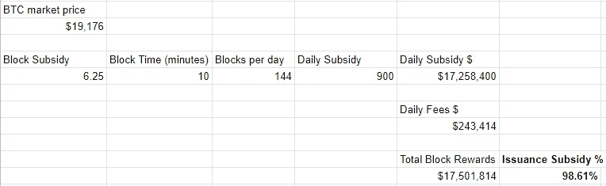

# 谁在控制电力网？

> 原文：<https://medium.com/coinmonks/who-is-in-control-of-pow-networks-bdebdc1ed74?source=collection_archive---------30----------------------->

上周，我发布了一份调查，询问了以下问题:

矿工似乎是显而易见的答案，因为散列权力是由矿工直接控制的。问题在于，矿商受到另一种力量的控制:财务激励。他们不会随意挑选开采哪个链条，他们开采利润最高的链条，因为他们是理性的经济行为者。

# 指挥链

矿工控制着最长的链条，就像汽车的轮子控制着它前进的方向一样。车轮直接控制方向(没有双关语缩进)，但决定车轮转动的是方向盘后面的驾驶员。

开发商呢？Devs 类似于 GPS 系统，因为它们有助于引导驾驶员，但并不处于控制之下。与导航系统的交互始于驾驶员的输入，以确定最终目的地。全球定位系统将提供一个接一个的方向，但司机不会盲目地遵循指示。如果他认为指示是错误的，他可以不遵循指示，并且他可以选择使用完全不同的 GPS 系统。

如果你是一名司机，你的最终目的地是一个海滩，但 GPS 告诉你去内陆，那么你应该能够很快发现 GPS 是错误的，你应该从它告诉你去的地方岔开。同样，如果全球定位系统告诉你驶出道路进入小溪或砖墙，你将停止遵循指示。

司机最终是在控制，但司机是谁？

# 财政激励的来源

矿商追逐营收，那么钱从哪里来？矿工奖励来自三个地方:发行新币、交易费和 MEV(矿工可提取价值)。

发行的收入很大程度上取决于硬币的市场价值。BTC 目前每天发行 900 枚硬币。BTC 每发行 20，000 美元相当于每天收入 1，800 万美元。在上一轮牛市的顶部，BTC 的价格为 69000 美元，相当于每天超过 6200 万美元的矿工奖励。

交易费和 MEV 都是用户活动的结果，但是关于“用户”这个术语有一个很大的警告。用户不仅仅是硬币的持有者，也不仅仅是经常与硬币进行交易的人。如果交易发生在链外，通过托管服务或支付渠道，如闪电网络，那么对 L1 活动的贡献很小或可能为零，而这才是真正产生费用和 MEV 机会的。幸运的是，在 BTC 的案例中，我们不必深究这个话题，因为大约 98-99%的矿商收入来自发行。

发行是矿商的主要收入来源，这意味着发行的硬币数量*市场价格是方向盘，指引着地面上的车轮将转向何处，但谁是司机呢？

# 发行与市场价格

开发商可以实施新的货币政策，但增加发行违背了利益相关者的利益，因为这将降低他们的投资(这就相当于 GPS 告诉想去海滩的司机去爬山)。开发商也可以减少发行，假设这可以在不危及网络安全的情况下完成，这将是一个受利益相关者欢迎的变化，因为较低的发行导致来自矿商的销售压力较低。

发行的变化可能有一个合理的理由，但在 BTC 的情况下，偏离当前的发行时间表将破坏网络的社会契约，它不太可能获得任何支持，除非由于矿工奖励不足而存在迫在眉睫的安全妥协风险。这是一个不同讨论的话题，但足以说明开发商目前无法切实改变发行，但即使他们可以，他们也无法控制其他更重要的东西:资本流动。

# 鲸鱼和富有的持有者控制着

资本流动将决定市场价格，而富有的持有者控制着大部分价格。这是投票的正确答案，但让我们找出确切的原因。

当一个链分裂时，分类账被复制，原始硬币的利益相关者现在将拥有相同数量的“新硬币#1”和“新硬币#2”。假设每个持有人都有一个偏好，即哪个版本最有价值，哪个是“狗屎硬币”，他们将出售其中一个硬币，并用所得购买另一个。资金从一种资产中流出，进入另一种资产；这种资本流动决定了赢家。

请考虑以下情况:

*   中小股东(10 BTC 以下)仅拥有 BTC 15%的供应量。
*   富裕的持有者拥有绝大部分 BTC 供应量。“鲸鱼”(1k 以上 BTC) [拥有惊人的 45.6%](https://decrypt.co/104251/bitcoin-crashes-data-shows-whales-are-buying-the-dip) 。
*   财富的集中意味着资本流动也主要由富有的持有者决定。
*   资本流动决定了哪种硬币最有价值。
*   最有价值的硬币决定了哪个链最有利可图，因为发行构成了战俘矿工奖励的绝大部分。
*   矿工追求利润，他们会开采最有价值的链条，这就变成了最长的链条，这就强化了它是最有价值的。
*   雪上加霜的是，大多数有影响力的人都是富有的持有人，并且/或者富有的持有人能够接触到媒体渠道，帮助推动他们偏好的连锁店的叙事。

降低富裕持有人影响力的最有效方法之一，就是相对于来自发行补贴的奖励，增加来自用户的奖励收入(交易+ MEV)。除非用户有令人信服的理由实际使用网络，否则这种情况不会发生。，又名效用。智能合约和令牌化资产、DeFi 和 NFTs 等工具实际上有助于加密网络的民主化……可惜 BTC 没有这些。

# 支持此内容

如果你喜欢这篇文章或你欣赏，那么请查看[以太坊艺术日报 NFT 收藏](https://foundation.app/collection/ethart-2c59?sortOrder=DEFAULT)。 [EAD](https://www.ethereumartdaily.com/) 是每日 1/1 NFT 系列，以以太坊为主题的艺术自我记录 AI 图像生成的演变！最棒的是，部分收益直接汇入以太坊基金会！

Today’s fresh mint: EAD.40 “Archive”

如果你喜欢 NFTs，但你不想买一个，你也可以通过关注 [@EthArtDaily](https://twitter.com/EthArtDaily) 并喜欢或转发你喜欢的作品来支持我！

> 交易新手？尝试[加密交易机器人](/coinmonks/crypto-trading-bot-c2ffce8acb2a)或[复制交易](/coinmonks/top-10-crypto-copy-trading-platforms-for-beginners-d0c37c7d698c)