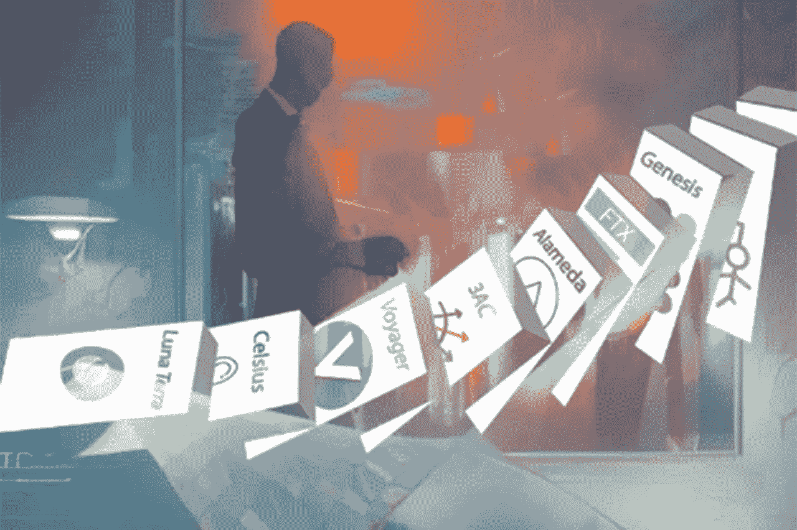
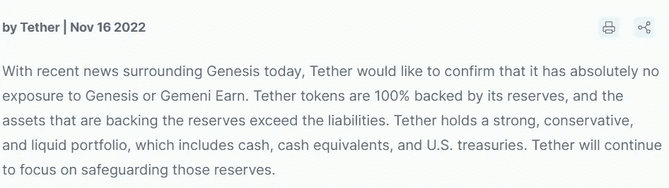

# 下一个是谁？创世纪和 DCG·FUD

> 原文：<https://medium.com/coinmonks/who-is-next-genesis-and-dcg-fud-3f461b670042?source=collection_archive---------4----------------------->

**创世纪全球资本已经遭受了 FTX 的崩溃。对于整个数字货币群体来说，这可能是一个不好的信号。**

创世纪一开始表现得很酷:

然后在 11 月 10 日，创世纪宣布“为了提供透明度”,它在 FTX 交易账户上有大约 1.75 亿美元的锁定资金。

作为回应，创世纪公司的母公司 DCG 给了创世纪公司 1.4 亿美元:

> “虽然我们的贷款和交易业务的运营没有受到最近市场事件的影响，但 Genesis 已经采取措施，通过从我们的母公司 Digital Currency Group 额外注入 1.4 亿美元的股权来加强其资产负债表。

尽管如此，Genesis 还是在 11 月 16 日宣布暂停撤资:

> “今天，创世纪全球资本，创世纪的贷款业务，做出了艰难的决定，暂停赎回和新的贷款发放。这一决定是为了应对 FTX 内爆导致的极端市场混乱和行业信心丧失，”*——Genesis(也是 gray Investment、Foundry、Luno 和 CoinDesk 的母公司)的数字货币集团(DCG)通信和营销副总裁阿曼达·考伊(Amanda Cowie)说。*

尽管管理最大的比特币投资工具 GBTC 的灰度投资公司[表示](https://twitter.com/Grayscale/status/1592882143906111488)*“创世纪全球资本(其姐妹公司)不是任何灰度产品的交易对手或服务提供商，*”这条消息引发了人们对拥有 GBTC 10%股份的整个 DCG 的稳定性的担忧。

据《纽约时报》报道，三位知情人士透露，现在创世全球资本已经聘请投资银行莫里斯公司(Moelis & Company)探索包括潜在破产在内的各种选择。

顺便说一句，DCG 和创世也有一些不明确的公司间贷款，这可能会使情况恶化，尽管公司说这没有错。DCG 首席执行官西尔伯特证实，DCG 对创世纪全球资本有 5.75 亿美元的负债，与创世纪合作的 3AC 的崩溃有关。另外还有一张 11 亿美元的长期期票。

今年夏天，一项关于 DCG 和 3AC 的调查出现在网络上。它表示，DCG 和 3AC 参与了某种从 GBTC 溢价中榨取价值的计划。如果这只是部分事实，DCG 的内部厨房可能并不像他们想让我们相信的那样稳定。

顺便说一下，即使是成熟的公司也不会忽视这种情况，这意味着即使是他们也对此感到担忧。以下是 Tether 最近在其博客上发布的公告:

Tether’s statement about FTX collapse. Source: [tether.to](https://tether.to/en/tether-confirms-zero-exposure-to-genesis/)

如果创世纪破产，这肯定会削弱 DCG。如果发生这种情况，崩溃将是巨大的，因为 DCG 是最大的加密公司之一，拥有超过 165 家公司的股份，包括比特币基地，Ripple 和 Ledger。考虑到这个时期对加密市场来说是多么动荡，我们都应该做好准备…

> 交易新手？试试[加密交易机器人](/coinmonks/crypto-trading-bot-c2ffce8acb2a)或者[复制交易](/coinmonks/top-10-crypto-copy-trading-platforms-for-beginners-d0c37c7d698c)