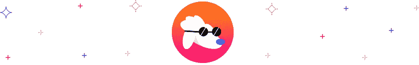

# 谁把狗放出来了:皮特保罗，道格班克，道格达什，弗洛基，普德尔

> 原文：<https://medium.com/coinmonks/who-let-the-dogs-out-pitbull-dogebonk-dogedash-floki-poodl-3a17d32cef1a?source=collection_archive---------42----------------------->

受狗启发的迷因加密货币是 2021 年密码诗中的一个强大叙事。在埃隆·马斯克的神秘推特的推动下，Dogecoin 令人惊讶地惊人运行，激励开发人员试图复制它的成功。因此，数百个以狗为主题的迷因硬币或狗像野生蘑菇一样涌现出来。虽然这些项目大多默默无闻，但其中一些仍然存在，并提供了光明的前景。在这篇文章中，我们将看看你可能想要关注的 5 只狗狗，它们的特点，以及在哪里可以交换或购买狗狗密码。

# 狗狗 Cryptos 有什么特点？

Doggo 硬币或狗加密货币是“以狗为主题”的加密货币，通常以狗的品种命名。他们通常很少或没有真实世界的用例，并依靠病毒式的在线笑话或迷因而茁壮成长。Dogecoin 在 2013 年开创了这一趋势，从那以后已经衍生出了 20 多种衍生硬币。

以下是它们的共同点:

*   忠诚的粉丝群体:狗狗 Cryptos 在忠诚和专注的粉丝群体的支持下茁壮成长。因此，这些热心支持者社区致力于确保各种项目的持续成功。
*   **基于受欢迎的狗品种:**柴犬是一种可爱的日本狗品种，它启发了 Dogecoin 和柴犬。
*   **活跃在社交媒体上:**这些硬币通常有一个直言不讳的粉丝群，他们不断在社交媒体上推广它们。因此，他们的社交媒体渠道，尤其是 Twitter，往往比其他更成熟的加密技术更活跃
*   通过迷因传播:虽然现在开发者们正在快速开发项目以确保这些硬币的可持续性，但它们最初是以在线笑话和病毒迷因的形式出现的。这些模因在互联网上迅速传播，有助于这些硬币保持在公众的视线中。

> 交易新手？尝试[加密交易机器人](/coinmonks/crypto-trading-bot-c2ffce8acb2a)或[复制交易](/coinmonks/top-10-crypto-copy-trading-platforms-for-beginners-d0c37c7d698c)

# 加密狗列表

除了 Dogecoin 和 Shiba Inu 之外，这里还有 5 种 doggo cryptos，你可能要注意了:

# 皮特保罗代币

[皮特保罗 token (PIT)](https://swapzone.io/currencies/pitbull) 是 2021 年 3 月在币安智能链(BSC)上线的一款以狗为主题的 meme token。PIT 是由一个匿名团体作为“独特的社会实验”创建的，但已经完全交给充满活力的用户、开发者、投资者和志愿者社区。皮特保罗令牌在短时间内获得了显著的知名度。它现在在 Twitter 上有超过 10 万名粉丝，在其官方电报频道上有 4 万名粉丝。这种快速的进步证明了一个致力于推动社会区块链发展的社区的力量。

皮特保罗代币具有自动下注机制，该机制从代币进行的交易中向坑持有者奖励费用。PIT 发射时总共供应了 100 万亿个硬币，其中一半被烧掉了。与 PIT 的交易收取交易价值 4%的费用，其中 2%在用户中分配，其余 2%被烧掉。

皮特保罗生态系统非常发达，有几个使用案例，如 PitTracker、PitFarm、PitSwap。这还不是全部。社区已经安排了几个雄心勃勃的项目来进一步提高令牌的可行性。这些项目，其中大部分处于不同的发展阶段，包括游戏赚取游戏，NFTs，电子商务和慈善事业。

# DogeBonk

[dogebank(DOBO)](https://swapzone.io/currencies/dogebonk)是币安智能链(BSC)上的 doggo token，具有通货紧缩和自动下注功能。每笔交易征收 10%的税，5%在 DOBO 持有者之间分享，5%被发送并永久锁定在流动性池中。

在一个典型的狗密码项目的宣传噱头中，作为忠实粉丝的社区，Dogebonkers 将硬币发射到太空，在他们自己的游戏中击败了最强的狗——Dogecoin。Elon Musk 宣布了“Doge-1 太空任务”的计划，这是一项由 Dogecoin 支付的太空任务，将它作为太空中的第一枚 meme coin 发送到太空。然而，DogeBonk 社区发送 DOBO ti 空间更快。

# 狗食

[DogeDash](https://swapzone.io/currencies/doge-dash) 是一款受狗启发的游戏，由币安智能链托管。基于马里奥(流行的 90 款游戏)的侧滚经典风格，游戏设计很简单:尽可能快地冲过游戏关卡，同时避开障碍并沿路收集硬币。如果你成功地通过了 10 关，你积累的硬币将作为奖励直接发送到你的加密地址

# 弗洛基伊努硬币

[Floki Inu (FLOKI)](https://swapzone.io/currencies/floki) 是一款以狗为主题的 meme 币(被其社区称为“一场运动”)，以埃隆·马斯克(Elon Musk)的柴犬命名。该令牌在币安智能链和以太坊区块链上运行。它是由热情的柴犬粉丝创建的，有一个热情的社区，被称为弗洛基维京人。

该社区有雄心将 FLOKI 从其 meme 状态转移到一个更加注重实用的项目。他们的路线图中值得注意的项目包括一个名为 Valhalla 的 NFT 游戏元宇宙，一个名为 Floki Inuversity 的教育资源平台，以及一个名为 FlokiPlaces 的商品市场。

Floki Inu 还通过与 CryptoCart(一个数字市场)和 Curate(或 XCUR，一个 NFT 和实物商品市场)合作来寻求知名度，将看到 Floki 过去在他们的商店购买商品。

# POODL 令牌

POODL token 是一种构建在币安智能连锁网络之上的通货紧缩令牌。这个项目已经存在了一段时间，最初是在区块链以太坊举办的。然而，最初的开发者放弃了这个项目，直到一些热心的粉丝最近重新启用它

像其他 doggo 硬币一样，POODL 主要是由社区驱动的。然而，该社区热衷于超越其迷因币地位，并专注于实用性。他们著名的项目包括 POODL AR 应用程序、POODL 密码学院、3D 增强现实 NFTs 和慈善机构。寻求扩张的 POODL 路线图更有希望。因此，社区计划进军现实世界游戏、地理侵占和 NFT 游戏。

POODL tokenomics 为持有者提供被动收入。每笔交易收取 3%的费用，其中 1%永久烧掉，1%分给持有人，1%在慈善、营销和流动性之间分享。这使得 POODL 越来越稀缺，增加了它的价值，激励用户持有。

# 如何选择最好的密码狗狗品种？

虽然这些以狗为主题的硬币和代币有相似的特点，但它们也有不同之处。在决定买哪一个之前，你必须了解它们的不同之处，以及如何比较。(数据截至 2022 年 2 月 17 日)

# 狗密码是好的投资吗？

那么，doggo 硬币仍然是一种明智的投资吗？看你怎么看了。虽然 Dogecoin 和 Shiba Inu 等公司去年表现出色，但没有理由认为这种趋势不会继续下去。但由于加密货币的不稳定性，很难说这些迷因币是否会继续表现良好，因为它们大多没有任何用途。

然而，这些硬币和代币受到一个受驱动的社区的支持，该社区致力于将它们从互联网迷因转变为具有坚实基础的功能代币。当这些项目成功完成时，这些 doggo 硬币将很有可能变得不那么投机，并提供更多的投资前景。

注意，这不是投资建议。最终，你可以独自决定投资犬类主题的密码是否适合你。但是我们毛茸茸的朋友的未来看起来很光明。

# 如何以最优惠的价格兑换狗狗密码？

这些狗加密货币不容易互换，因为许多主要交易所都没有将它们上市。要进行简单快捷的交换，请访问 Swapzone。Swapzone 列出了超过 600 种加密货币，包括这些 doggo 硬币。让我们看看如何在 Swapzone 上用 BTC 购买这些硬币的例子。好吧，让我们把 [BTC 换成弗洛基](https://swapzone.io/exchange/btc/flokibsc)！

这里有一个简单易懂的教程，教你如何在 [Swapzone](https://swapzone.io/) 上用 BTC 购买 Floki Inu 硬币:

1.  前往 [Swapzone](https://swapzone.io/) 网站。
2.  选择合适的一对(BTC 到弗洛基)。
3.  输入你想用 FLOKI 交换的 BTC 数量，聚合器会为你找到最好的交易。
4.  点击 ***【兑换】*** 按钮，将你带到一个兑换平台，并输入你想要发送弗洛基硬币的地址。
5.  使用生成的 BTC 地址发送您的 BTC 存款。
6.  前往 ***“继续交易”*** ，如果你愿意的话，留下你选择进行交易的网站的评论。
7.  等待存款被处理，你的狗为主题的硬币交换完成。