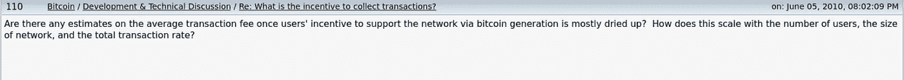
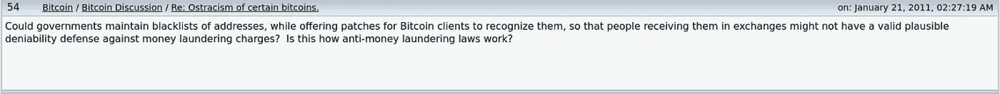
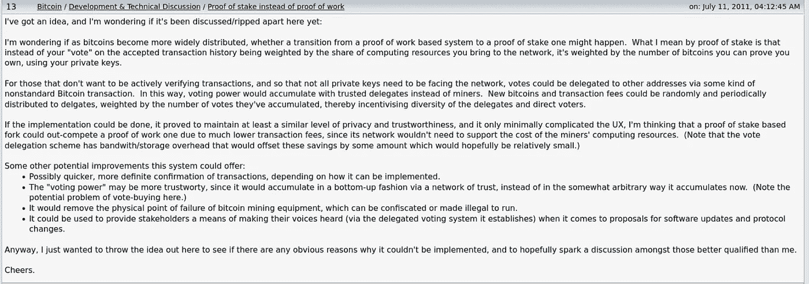
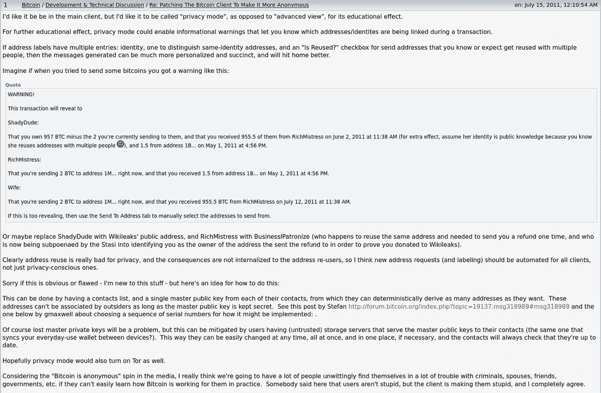

# 这个 2010 年的早期比特币海报是谁——他预测了今天的一些技术特征吗？

> 原文：<https://medium.com/coinmonks/who-was-this-early-bitcoin-poster-of-2010-did-he-predict-some-of-the-technical-features-of-today-4377492e4695?source=collection_archive---------7----------------------->

在比特币的早期，大多数讨论都发生在 Bitcointalk 论坛上。

很多早期的海报技术娴熟，才华横溢。他们分享了他们对该行业未来前景的见解。一个这样的海报是[量子力学](https://bitcointalk.org/index.php?action=profile;u=241;sa=showPosts;start=0)。

这个账号在 2011 年表达的一些想法已经实现了。我们现在将探讨这些想法:

*   当采矿奖励减少到交易费专属网络时，比特币的前景如何
*   地址黑名单(OFAC)
*   PoS 和 dpo
*   确定性钱包和地址重用

# 量子力学简介

___________________________

比特币于 2009 年通过电子邮件简讯向全世界发布。

不久之后，第一个公共留言板诞生了。Bitcointalk.org 很快成为了讨论的中心和分享想法的聚集地。

QuantunMechanic 是早期用户之一。他于 2010 年加入。他的第一条信息讨论了比特币长期可能遇到的一个问题——当矿商激励变得越来越重于交易费时会发生什么？

# 比特币交易费用

___________________________

只会有 2100 万比特币存在。如果条件保持不变，最终奖励将在 2140 年左右被开采。

矿工的工资是集体奖励。这些奖励由比特币和交易费组成。我们处于第四个奖励时代，每个比特币区块奖励向获胜的矿工池释放 6.25 BTC。

奖励时代七将是第一个生产不到一个 BTC 作为奖励的区块。从那时起，奖励将继续减少，直到最后的比特币被开采出来。这是对奖励时代 34 的估计——大约 110 年后的今天。

# 矿工安全补偿

___________________________

比特币网络的价值在于其安全性。矿工传播块，以确保以前的事务是不可逆的。计算能力确保网络和链条向前发展，而且只能向前发展。

那么，一旦比特币的回报变得微不足道，矿工们通过帮助保护网络获得了什么呢？交易费将成为大宗报酬中更大的比例。

这些都不是秘密，也不需要事后去想。这就是比特币的设计和运作方式。

尽管如此，QuantumMechanic 在这个问题上领先于他的时代:

当世界上大多数人还没有听说过比特币，许多人还在思考比特币时，QuantumMechanic 正在评估潜在的规模和安全问题。

那么他这个问题的答案是什么呢？这几年来已经被讨论和分析了很多。一些人认为它行不通，一些人认为到那时就没关系了，另一些人认为一个只收 tx 费的网络可以成功。

我不知道，但[这里有一个链接](https://bitcointalk.org/index.php?topic=165.msg1383#msg1383)到那个早期线程。第一个回答 QuantumMechanic 问题的是**聪** *。*他澄清了一个误解，即随着添加到块中的交易数量的增加，块生产可能会放缓。

总之，以下是比特币长期成功的潜在基础:

这个网络需要保持下去，继续生产比特币的价值。为了让网络继续存在并生产区块，必须有投入资源的激励机制。随着 BTC 报酬减少，交易费在大宗报酬中占据更大比例，这些费用必须增长到足够大的激励水平。交易费用增加主要是块中交易数量的函数。

100 年后比特币会成功吗？请在评论中分享你的想法。

# 地址黑名单(OFAC)

___________________________

你还记得比特币钱包和交易是匿名的吗？

在某些方面，他们可以。但这需要大量的工作。犯了错，你的匿名就没了。将地址连接到一个集中交换的帐户？你匿名了。

与身份相关联的地址并不是唯一的相关问题。用户可能会受到针对其地址采取的措施的影响。黑名单就是一个典型的例子——一种避开地址及其令牌的做法。

DeFi 匿名平台 Tornado Cash 的创始人最近被捕。GitHub 回购被下线(最近又被退回)。Tornado Cash 是代币的“混合器”服务，有助于匿名化交易流程。向合同发送令牌，资产就会被转移到其他地方。链上活动显示进入 Tornado 现金地址的代币是同一地址的许多交易之一。可以对那里的输出进行分析，以帮助估计令牌的来源。但是在源地址和目的地址之间没有直接和明确的联系。

作为龙卷风现金法律干预的一部分，OFAC 将与合同互动的地址列入黑名单。他们还批准了像 Circle (USDC)这样的服务。一些名人甚至因为他们在 NFT 的活动而被屏蔽了他们的地址，如果他们的账户与被制裁的服务有某种联系的话。

钱包地址黑名单并不是一个新概念。至少几年来，比特币地址的加密资产一直被中央服务部门封锁和查封。但在那之前的 2011 年，QuantumMechanic 预见到了潜在的问题。

地址黑名单是一种不会消失的做法。生态系统这一边的进化更多的是监视和控制，即 CBDCs。

# PoS 和 dpo

___________________________

QuantumMechanic 还预见了 PoW 可能出现的问题以及对 PoS 和 DPoS 机制的潜在需求。那些称号在当时并不存在。

在这里，QuantumMechanic 不仅设想了 PoS 和 dpo，而且还暗示它们可能在长期内取代 PoW 网络。

这让你想知道这个账户是谁的。

# 确定性钱包和地址重用

___________________________

今天，你认为加密网络的易用性是理所当然的。还有很长的路要走，但我们也已经走了很长的路。

您可以通过 Metamask 创建一个新的钱包，并点击添加许多帐户，所有帐户都链接到同一个私钥。同时主公钥是保密的。事情并不总是这样。2011 年，QuantumMechanic 描述了确定性钱包的概念。

早期的 Bitcointalk 线程是远见的金矿。

___________________________

就这样吧，但我想听听你的意见。

你浏览过 Bitcointalk 论坛吗？回到过去阅读早期的思想和预测是令人敬畏的。你最喜欢的话题是什么？

# 时事通讯

___________________________

我在我们的生态系统中制作与市场和开发者相关的内容。

这篇文章是我的免费每周时事通讯的一篇专题文章的例子。在那里你还可以找到独家内容，所以一定要注册！

你的邮件不会用于其他任何用途(我甚至都不看它们)。

 [## 每周简讯的加密高潮- Revue

### 每周简讯的加密高潮-可操作的见解&策展的尖端加密，网站 3，NFT，和…

www.getrevue.co](https://www.getrevue.co/profile/thecryptoclimax?element=subscribe-through-revue) 

# 推特

__________________________________

此外，请务必在 Twitter 上关注我的帖子和其他重要内容。

https://twitter.com/TheCryptoClimax

直到下一次，从您的首要加密/Web3 出版物。

麦克斯——隐秘的高潮

**附注**我们正在为 Crypto Climax 制作网站，让它成为一份在线出版物。敬请期待！

> 交易新手？尝试[加密交易机器人](/coinmonks/crypto-trading-bot-c2ffce8acb2a)或[复制交易](/coinmonks/top-10-crypto-copy-trading-platforms-for-beginners-d0c37c7d698c)