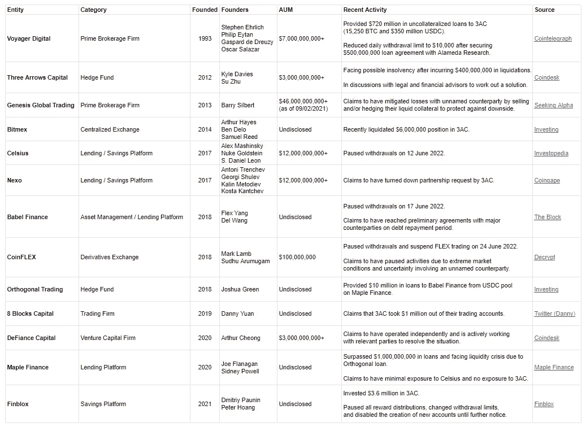

# 谁在火山熔岩池里裸泳？

> 原文：<https://medium.com/coinmonks/whos-swimming-butt-naked-in-the-volcanic-lava-pools-414e593def54?source=collection_archive---------59----------------------->

Everything is burning in crypto land right now.

我们都听说了 Terra/Luna 崩溃的核辐射所造成的破坏。

几十亿瞬间化为乌有。

数百万用户的毕生积蓄、辛苦赚来的现金和充满希望的梦想都在雪崩般的欺骗和失信中破灭了。

是道权吗？

是我们，用户，市场，崇拜者让他成功的吗？

只有他吗？

还有其他人吗？

是贪婪吗？

然后我们开始意识到这只是开始。

Terra/Luna 的崩溃已经开始蔓延。

这种传染病就像毒液中的共生体一样传播开来，感染了所有与跆拳道有联系的公司。

事实证明，Celsius、Voyager Digital、3 Arrows Capital 和其他许多公司一直在 Terra/Luna 的火山熔岩池里裸泳。

Reminds me of the lava in Mt Doom where the Ring was destroyed.

火山熔岩池基本上是在几千度高温的加热污水池中旋转的熔岩。

你真的不想光着屁股穿着它们。

这种传染病将继续蔓延，直到杀死所有过度杠杆化、过度暴露和忽视风险管理的人。

看到将要被解雇的员工，我很难过。

将会受到影响的生命。

接下来的几年将是重建期。

被抢了钱的无辜用户。

我已经能听到有人在喊“你拥有研究吗！”。

是啊，就像你们中的任何人做的研究一样，当先令露娜，吹捧苏柱的伟大，把道权标榜为一个真正的诺贝尔奖获得者。

那么，他们真的没有预料到像 Terraform labs 和 3AC 这样的行业巨头会倒闭吗？

有没有可能他们只是过度暴露，只是在做任何人都会做的事情？

有没有可能认为市场不会影响他们，他们会轻易脱身？

是他们变得贪婪而不在乎吗？

似乎以上都是。

Check out how deep the infection goes.

但我想提醒你，这不是加密或区块链的错。

这不是什么新鲜事。

一次又一次，我们看到这种情况在传统金融界重演。

华尔街的玩家、贪婪的银行家、喜欢冒险的对冲基金经理，甚至是审计员，那些本该监督他们的人！

不要责怪技术或行业。

归咎于人类的贪婪。

只要贪婪存在，它就会存在，人类总会找到一种方法来玩弄系统，以他人为代价获取更多的利润，并超越法律的界限。

只要有钱可赚，你可以打赌贪婪会战胜我们。

所以，让我们控制我们的贪婪，好吗？

像 Terra/Luna 所做的那样，另一个行业中的下一件事会在哪里发生呢？

-

很快会有更多的 web3 公司死掉吗？

-

#创业#商业# startupx #成长#成功#社交媒体#文化#创业#战略# eth #比特币#加密货币#革命# web3 # 3ac #传染#区块链

> 交易新手？试试[加密交易机器人](/coinmonks/crypto-trading-bot-c2ffce8acb2a)或者[复制交易](/coinmonks/top-10-crypto-copy-trading-platforms-for-beginners-d0c37c7d698c)