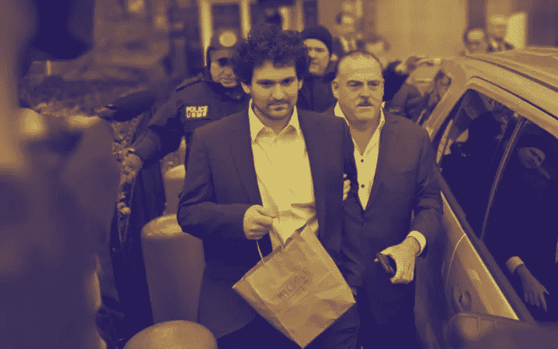
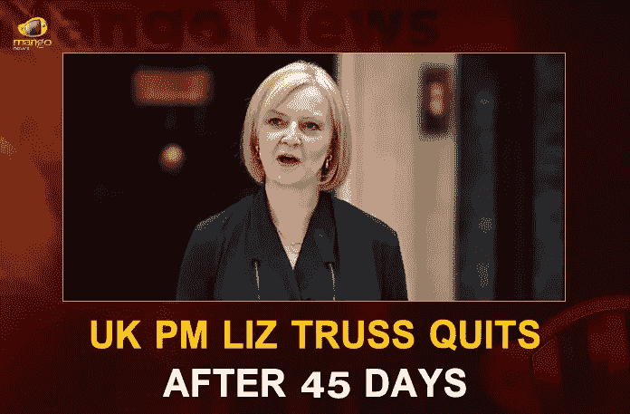
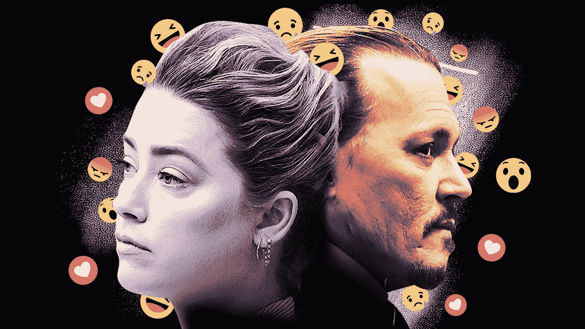

# 2022 年最讨厌的人是谁？

> 原文：<https://medium.com/coinmonks/whos-the-most-hated-person-of-2022-1cc133f010e2?source=collection_archive---------6----------------------->

SBF is now “free” and back in time for Christmas with his family in California after posting $250M bail, a record amount in the history of bail bonds.

> 从顶级交易者那里复制交易机器人。免费试用。

闭上眼睛，深呼吸。

现在试着想一想 2022 年最**讨厌的* *人。

是利兹·特拉斯吗？

埃隆马斯克？

唐纳德·特朗普？

艾梅柏·希尔德？

马丁·什克里里？

山姆·班克曼·弗里德怎么样？

我会说他在那里地位很高。

尽管萨姆造成了戏剧性事件和混乱，他可能只是 2022 年最讨厌的人。

想想他影响的所有人。

损失的金额。

他给信任 FTX 的数百万顾客带来的痛苦和折磨。

这比伯尼·麦道夫还要糟糕。

Liz 45 day tenure as the UK Prime Minister shocked and disappointed many.

至少被伯尼诈骗的人是更富有的精英，而不是普通的乔，他们投入了毕生的积蓄和任何他们必须使用的密码交换。

这是有史以来最卑鄙、最可悲的一击。

这就像用一辆公共汽车…全速…撞某人的腹股沟…然后再次倒车以确保安全。

可以理解为什么他可能是 2022 年最讨厌的人。

SBF 在几天内从英雄变成了小人物。

他的净资产在创纪录的时间内从数十亿美元增加到 10 万美元。

事实上，它可能已经创造了财富下降最快的新纪录。

当记者们得知此事并开始报道新闻时，他的净资产像 FTT 代币价值一样下跌，现在只有 0.914188 美元。

No one garnered more hate than Amber Heard, for the fiasco she put Johnny Depp through.

巅峰时期:

FTX，密码交易所价值约 320 亿美元。

FTT 大约值 25 美元。

而 SBF，这个神奇小子的身价约为 160 万美元。

FTX 有 100 亿美元的客户存款。

根据他们的条款和条件，未经客户同意，FTX 不得将客户的存款用于任何其他目的。

接受挑战。

实际上，SBF 让他的工程师们建了一个后门，直接把客户的资金输送到阿拉米达研究公司。

从很多层面来看，这都是公然的犯罪和错误。

他共同拥有的阿拉米达研究公司，继续像拉斯维加斯赌场里喝醉的兄弟会成员一样赌博输掉资金。

哦，我有没有提到阿拉米达研究所是由他的前女友经营的？

Caroline, CEO of Alameda Research and self-proclaimed Ravenclaw, was quite a character herself.

就这样，数十亿顾客的钱蒸发了，多米诺骨牌倒了，他们摔得很惨。

花了 3.5 年时间将 FTX 打造成了现在这个庞然大物。

只花了不到一天的时间，所有的事情都过去了。

投资者、分析师、专家、有影响力的人和媒体怎么会忽略这一点呢？

承诺的尽职调查呢？

难道我们没有从 3AC，道权，Celsius，Blockfi，伯尼·麦道夫，Theranos，亚当·诺依曼身上学到什么吗？

为什么这样的事情在 crypto 中不断发生？

也许这是一件好事。

我们越早清除这些不良行为者，市场就能越早恢复、重建并再次繁荣。

-

山姆·班克曼-弗里德是 2022 年最讨厌的人吗？

-

# startups # business # startupx # growth # success # social media # culture # entrepreneurs # strategy # eth # BTC # crypto # sbf # sambankmanfried # hated person 2022 # ftx # scam # ftt

> 加入 Coinmonks [电报频道](https://t.me/coincodecap)和 [Youtube 频道](https://www.youtube.com/c/coinmonks/videos)了解加密交易和投资

# 另外，阅读

*   [BlockFi vs 摄氏](/coinmonks/blockfi-vs-celsius-vs-hodlnaut-8a1cc8c26630) | [Hodlnaut 点评](/coinmonks/hodlnaut-review-best-way-to-hodl-is-to-earn-interest-on-your-bitcoin-6658a8c19edf) | [KuCoin 点评](https://coincodecap.com/kucoin-review)
*   [Bitsgap 审查](/coinmonks/bitsgap-review-a-crypto-trading-bot-that-makes-easy-money-a5d88a336df2) | [Quadency 审查](/coinmonks/quadency-review-a-crypto-trading-automation-platform-3068eaa374e1) | [Bitbns 审查](/coinmonks/bitbns-review-38256a07e161)
*   [密码本交易平台](/coinmonks/top-10-crypto-copy-trading-platforms-for-beginners-d0c37c7d698c) | [Coinmama 审核](/coinmonks/coinmama-review-ace5641bde6e)
*   [印度的加密交易所](/coinmonks/bitcoin-exchange-in-india-7f1fe79715c9) | [比特币储蓄账户](/coinmonks/bitcoin-savings-account-e65b13f92451)
*   [OKEx vs KuCoin](https://coincodecap.com/okex-kucoin) | [摄氏替代品](https://coincodecap.com/celsius-alternatives) | [如何购买 VeChain](https://coincodecap.com/buy-vechain)