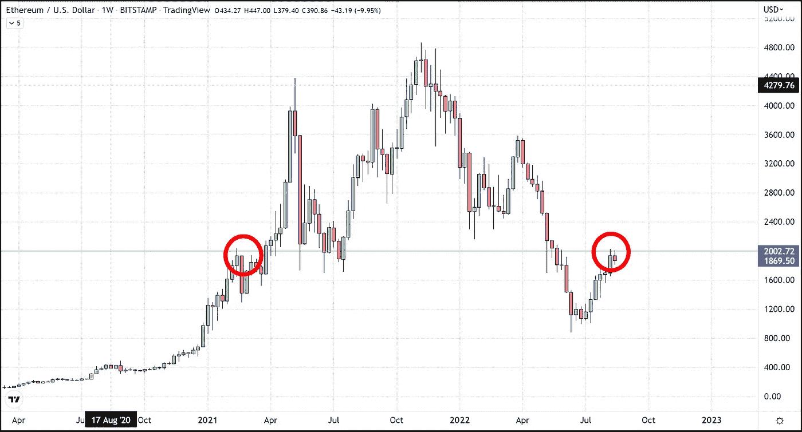
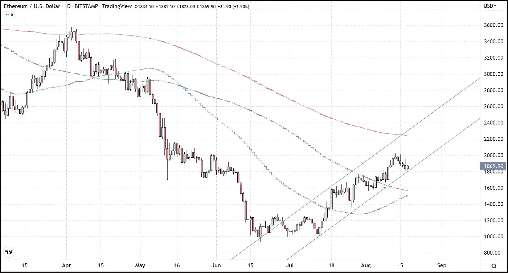

# 为什么 2000 美元对以太坊(2.0)来说是最重要的水平

> 原文：<https://medium.com/coinmonks/why-2-000-is-the-most-significant-level-for-ethereum-2-0-5fcc6080b541?source=collection_archive---------58----------------------->

以太坊在周六和周日(14 年 8 月 13 日)创下了超过 2000 美元的日内高点，但这两次突破都非常短暂，再次确认了 2000 美元不仅仅是一个心理阻力。在这篇文章中，我将概述以太坊当前主要阻力水平 2000 美元的技术意义，但更重要的是其历史意义。

以太坊的 2000 美元水平与比特币的 20000 美元水平一样重要，这些水平代表了这些市场的前期上限，当突破 2000 美元时，紧随其后的是抛物线反弹。

早在 2021 年 2 月，以太坊曾试图达到 2000 美元，但很快遭到拒绝，并在第二周跌至 1300 美元以下。在 2021 年 3 月初，以太坊又一次试图以令人信服的(每周)2000 美元收盘，但失败了。然而，在同一个月底，以太坊最终突破了 2000 美元的上限，随之而来的是价格在大约 2 个月内上涨了两倍以上。

截至美国东部时间下午 6 点，以太坊的交易价格约为 1，870 美元，本周首次上涨 1.79%。以太坊处于自 7 月初以来一直交易的上升趋势通道的底部。我打赌以太坊将保持上升趋势，因此，我们不应该看到更多的下降，如果有任何明天和周末。

对于任何对我们致力于比特币交易和加密货币选择的免费服务感兴趣的人，只需点击此[链接](https://www.thegoldforecast.com/bitcoin)。

> 交易新手？试试[密码交易机器人](/coinmonks/crypto-trading-bot-c2ffce8acb2a)或者[复制交易](/coinmonks/top-10-crypto-copy-trading-platforms-for-beginners-d0c37c7d698c)