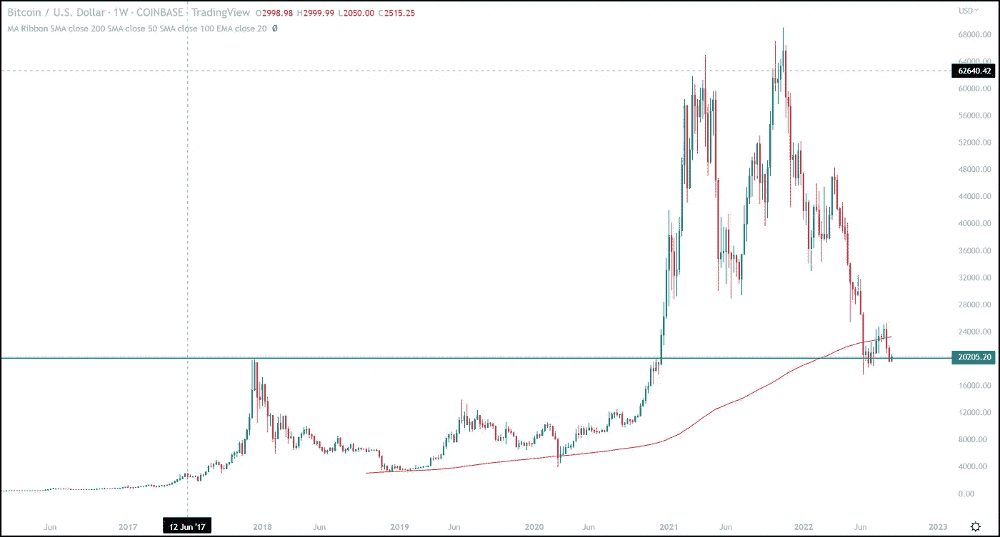
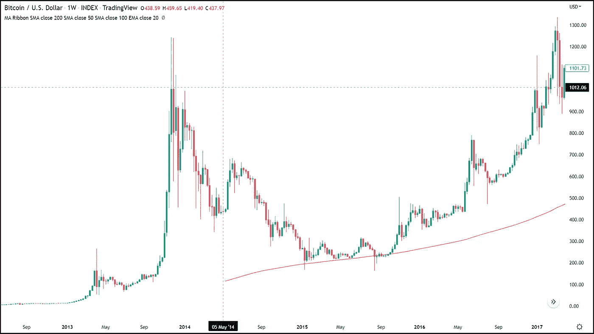
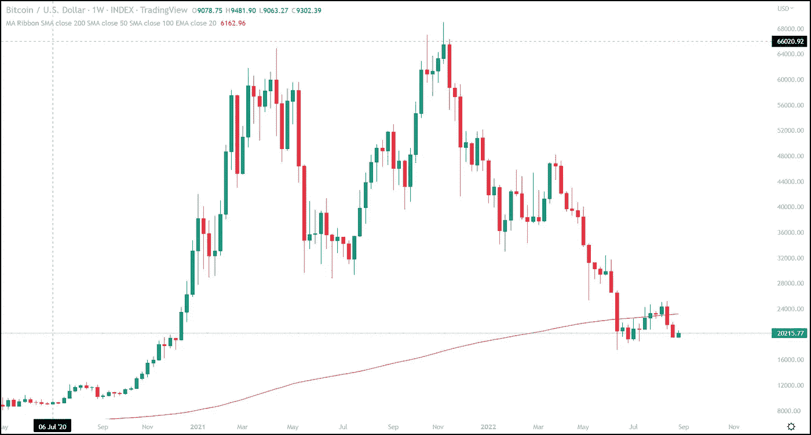

# 为什么 20，000 美元对比特币多头来说是一个关键水平

> 原文：<https://medium.com/coinmonks/why-20-000-is-a-critical-level-for-bitcoin-bulls-b9cf5a610305?source=collection_archive---------50----------------------->

这是 2017 年反弹的顶部，使[比特币](https://www.fxempire.com/crypto/btc)成为主流焦点，这是 2020 年的天花板，当在 2020 年 12 月中旬取出时，表明 moonshot 正在进行中，在不到 3 个月的时间里突破了难以捉摸的 2 万美元。

# 比特币历史模式

我在“ [*比特币的三个牢不可破的真理*](https://www.fxempire.com/forecasts/article/bitcoins-three-unbreakable-truths-908103)*中提到的三个不变的真理之一是“……每一个新的抛物线移动都会产生比前一个更高的低点”。当在收盘时使用月蜡烛线时，比特币牛市的租户是正确的，但现在命悬一线。如果我们在 8 月份收盘时跌破 19，749 美元，这个持续了几十年的常数将被打破。*

*如果 20，000 美元在这里没有起到有效的支撑作用，并且我们明显跌破它，那么 14，000 美元的水平就会重新发挥作用。这将标志着短期持有人的情绪又一次大规模崩溃，并标志着又一次长期下跌。*

*在我上面提到的前一篇文章中，我注意到比特币的每一次抛物线运动都伴随着 78% — 96%的回撤。我们正处于比特币抛物线周期的第五次迭代中，这个周期由三部分组成:反弹、回撤、巩固。*

*回到今年 7 月，我们在日内交易中曾短暂触及最低回撤水平(78%)。然而，如果我们跌破 20，000 美元，那么我们可能会看到一个“真正的”78%回撤或更低的水平。使用的回撤从 3880 美元到 69000 美元。*

*如果这种情况真的发生，那么比特币就不再有更高的低点，交易价格永远不会低于前一个顶部。这是比特币看涨的基石，如果被证明是错误的，对信心的影响可能大于价格。*

# *比特币牛市开始瓦解*

*比特币技术图表数据中另一个面临严重失效风险的长期主题是价格和 200 周简单移动平均线之间的关系。自 2015 年初开始以来，200 周的 SMA 一直是比特币面临的每次重大调整的有效底部。*

**

*尽管在 2015 年和 2020 年 Covid 崩盘期间，定价确实两次跌破该指标，但跌破 200 周 SMA 的时间非常短暂，直到今年，只有两次周收盘低于该重要移动平均线。*

*这种说法最近发生了变化，因为我们现在正处于自 6 月中旬以来第 9 次周收盘低于 200 周均线的过程中。比这一 7 年支撑位不再存在更令人担忧的是，这次价格对这一支撑位的反应。自从历史上第三次跌破这个平均线(以周线为基础)以来，200 周的 SMA 实际上自 6 月中旬以来已经多次充当阻力。*

**

*比特币价格走势的这些防弹看涨特征的崩溃可能预示着加密货币的进一步下跌。价格可能会回升，我相信在某个时候肯定会回升，但比特币声誉受到的损害更令人担忧，因为它永远无法真正恢复或重拾过去几个月失去的看涨观点。*

**

*任何对我们致力于比特币交易的免费服务感兴趣的人，只需点击这个[链接](https://www.thegoldforecast.com/bitcoin)。*

**最初发表于*[T5【https://www.fxempire.com】](https://www.fxempire.com/forecasts/article/why-20000-is-a-critical-level-for-bitcoin-bulls-1112794)*。**

> *交易新手？尝试[加密交易机器人](/coinmonks/crypto-trading-bot-c2ffce8acb2a)或[复制交易](/coinmonks/top-10-crypto-copy-trading-platforms-for-beginners-d0c37c7d698c)*