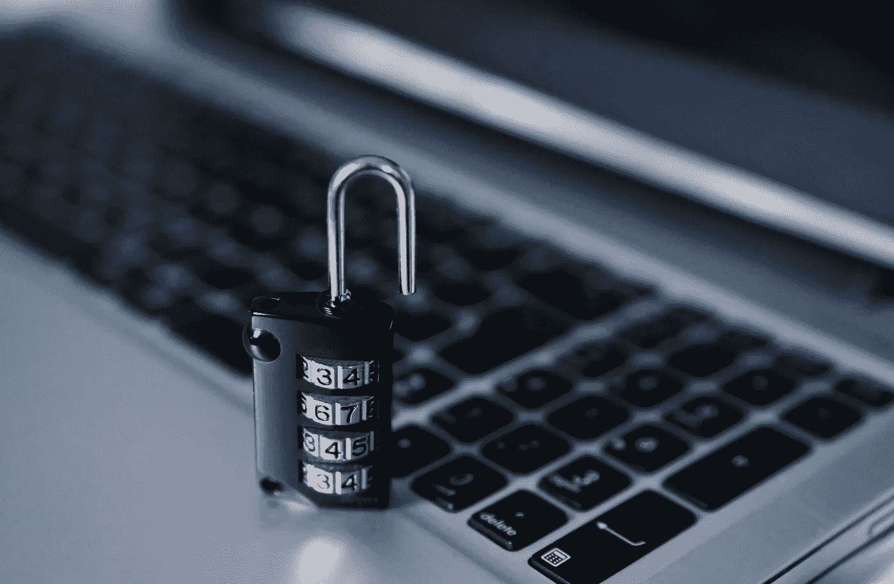

# 为什么气隙钱包是管理密码最安全的方式

> 原文：<https://medium.com/coinmonks/why-air-gapped-wallets-are-the-most-secure-way-to-manage-your-crypto-d50dd83b7529?source=collection_archive---------10----------------------->

*简要概述不同类型的加密钱包，重点关注潜在风险*

**TLDR** :气隙钱包提供了最好的安全性，同时也很容易使用。他们把你的私人密钥保存在一个独立的设备上，这个设备永远不会连接到互联网。用户友好的解决方案包括免费的 [AirGap](https://airgap.it/) 解决方案或专用硬件，如起价 139.00 美元的 Ellipial Titan。

# 什么是加密钱包？

加密货币钱包存储您的公钥和私钥。签署交易需要私钥，但最好把它想象成你所有账户的主密码。任何能接触到你的私钥的人，都可以窃取你所有的密码。因此，保持私钥的秘密和安全是非常重要的。

目前，存在各种各样的加密钱包，每个钱包具有不同的功能，支持不同的加密货币，并使用不同的安全方法。正因为如此，挑选合适的钱包可能是一项艰巨的任务。

# 不同类型的钱包

## 保管钱包

例子:比特币基地、北海巨妖、币安

保管钱包由保管人(例如比特币基地)管理，类似于传统的银行账户:就像银行负责保管你的钱一样，保管人负责保管你的密码。保管人持有你的私钥，因此可以完全访问你的密码。为了传输加密，您只需使用用户名和密码登录网站。虽然这是一种非常用户友好的方法，但它带来了严重的信任和安全问题。

保管钱包的主要问题是，私钥不是由你持有，而是由保管人持有。因此，您会面临多种风险:

*   [托管人可能被黑](https://en.wikipedia.org/wiki/2016_Bitfinex_hack)
*   [保管人可能会欺诈并窃取您的密码](https://en.wikipedia.org/wiki/Quadriga_Fintech_Solutions#Ponzi_Scheme)
*   保管人可能会破产，你的密码将成为破产财产的一部分。)
*   [有人获得了您的登录凭证并窃取了您的密码](https://www.coinbase.com/security/phishing-attacks)

## 热门(软件)钱包

**例子**:军械库，银金矿，金属面具，比特币基地钱包

热钱包将您的私钥保存在您自己的设备上。因此，只有你可以使用你的密码。但是伴随着强大的能力而来的是巨大的责任:你和你自己有责任保护你的设备和你的私人密钥的安全。

热钱包可以安装在您的电脑、移动设备上，也可以直接在浏览器中运行。热钱包的主要问题是它们需要互联网接入来传输密码。这使您的私钥面临几个风险:

*   您的设备感染了[“cryware”或其他窃取您私钥的恶意软件](https://www.microsoft.com/en-us/security/blog/2022/05/17/in-hot-pursuit-of-cryware-defending-hot-wallets-from-attacks/)
*   钱包软件的一个漏洞被利用[黑掉你的钱包](https://decrypt.co/106649/solana-wallet-hack-what-we-know-so-far)
*   [一个“恶意钱包”伪装成合法钱包，窃取你的私人密钥](https://www.androidpolice.com/malware-cryptocurrency-wallets-steal-from-ios-and-android-users/)
*   使用浏览器钱包，恶意网站会利用[浏览器或钱包漏洞窃取您的私钥](https://bloom.co/blog/6-ways-a-site-can-attack-your-metamask/)

**旁注**:一些热门钱包为你提供了[离线签署交易](https://bitcoin.org/en/secure-your-wallet#offline)的可能性。这样，您可以将私钥保存在一个独立的设备上，与互联网断开连接。虽然这是一种更安全的方法，但没有多少钱包支持这一功能，它不是非常用户友好，并且交易仍然需要在两个设备之间转移(潜在的安全风险)。

## 冷钱包

**示例**:纸质钱包、硬件钱包(ledger、trezor 等。)

冷钱包是一种在与互联网完全断开的设备上保持您的私钥离线的钱包。常见的例子有纸质钱包(只需在一张纸上写下你的私人密钥)和硬件钱包(如 u 盘)。

虽然冷钱包比热钱包更安全，但仍然存在风险:

*   你的纸质/硬件钱包被破坏或丢失。请务必准备好备份！
*   您的硬件钱包被盗(通常硬件是受密码保护的，所以攻击者也需要密码来访问您的加密)
*   [硬件钱包是假的](https://www.coindesk.com/tech/2021/06/17/scammers-are-sending-ledger-users-fake-hardware-wallets/)，包含恶意代码或被[黑客攻击](https://cointelegraph.com/news/engineer-hacks-trezor-wallet-recovers-2m-in-lost-crypto)
*   如果您使用的是硬件钱包，并希望签署交易，您仍然需要将其连接到支持互联网的设备(可能会感染恶意软件)
*   如果您使用纸质钱包并希望签署交易，您仍然需要将您的私钥导入热门软件钱包。这伴随着使用热钱包的所有风险

## 气隙钱包

**示例** : [气隙](https://airgap.it/)(自由)，椭圆，梯形

气隙钱包使用两个独立的装置:

*   设备 A 包含您的私钥，并且完全与互联网断开连接。私钥永远不会离开这个设备。此设备永远不会连接到另一台设备或互联网
*   设备 B 用于创建和发布事务。为了对交易进行签名，设备 B 需要在不使用互联网的情况下与设备 A 进行通信，例如，这可以通过扫描 QR 码来完成

因为设备 A 持有你的私人密钥，并且从来没有连接到互联网，这种方法可以避免其他钱包带来的大部分风险。虽然比其他类型的钱包更安全，但气隙钱包也不是没有风险:

*   和所有的冷钱包一样，装有你的私人钥匙的设备可能会丢失、损坏或被盗。永远保留一份备份！
*   与所有其他钱包一样，[网络钓鱼](https://cointelegraph.com/blockchain-for-beginners/what-is-a-phishing-attack-in-crypto-and-how-to-prevent-it)始终是一个风险。永远不要共享您的私钥或种子短语
*   甚至可以从离线设备中提取数据，例如[通过噪音、光线和磁铁](https://www.wired.com/story/air-gap-researcher-mordechai-guri/)

# 结论

就我个人而言，我相信流行的说法“不是你的钥匙，不是你的硬币”，我希望对我的私人钥匙拥有完全的所有权。我也不相信我的联网设备，也不相信我自己能让它们远离恶意软件。因此，我选择了气隙钱包解决方案，它结合了所有世界的最佳:

*   您的私钥存储在脱机设备上，永远不会离开
*   您不依赖任何第三方服务/托管人
*   使用两个通过扫描 QR 码进行通信的设备是一个用户友好的解决方案，没有太多的开销
*   使用气隙，你可以重复使用旧手机，而不需要购买昂贵的硬件

如果你有兴趣将旧设备重新用作气隙钱包，请查看本教程:[使用 AirGap 免费设置你自己的气隙钱包。](/@a.a.lechner/tutorial-set-up-your-own-air-gapped-wallet-for-free-with-airgap-7ef4d7b7b0cc)

> 交易新手？试试[密码交易机器人](/coinmonks/crypto-trading-bot-c2ffce8acb2a)或者[复制交易](/coinmonks/top-10-crypto-copy-trading-platforms-for-beginners-d0c37c7d698c)