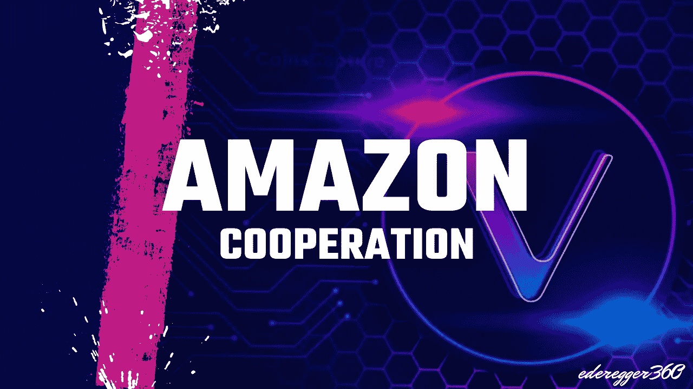

# 亚马逊为何与 VeChain (VET)合作

> 原文：<https://medium.com/coinmonks/why-amazon-cooperates-with-vechain-vet-9479875bbc67?source=collection_archive---------8----------------------->

## 在当前的危机之后，这可能会使兽医价格飙升至 0.50 美元。

Thumbnail made by [Günter Ederegger](https://medium.com/u/4f0c50d16421?source=post_page-----9479875bbc67--------------------------------)

区块链技术有助于实时跟踪和分析能耗。今年早些时候，VeChain 基金会和亚马逊网络服务合作开发了一个碳中和数字基础设施，使企业能够管理他们的碳足迹，满足他们的…