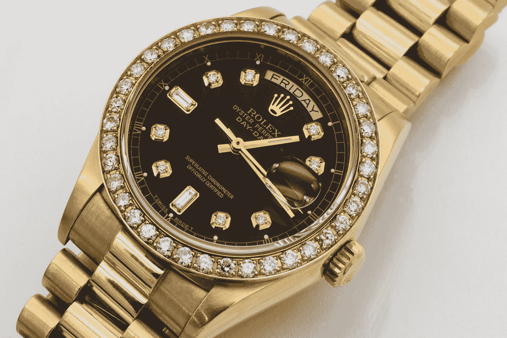

# 为什么劳力士和 NFTs 之间的任何比较都是垃圾

> 原文：<https://medium.com/coinmonks/why-any-comparison-between-rolex-and-nfts-is-rubbish-cf9042fe5206?source=collection_archive---------10----------------------->

## 我是作为一个 NFT 的超级粉丝这么说的

Photo by [Sabrianna](https://unsplash.com/@sabrinnaringquist?utm_source=medium&utm_medium=referral) on [Unsplash](https://unsplash.com?utm_source=medium&utm_medium=referral)

这是一块价值 5 万美元的手表的样子。这是令人愤慨的，甚至打出它的价格，这是一个劳力士手表较低的规模。有的去几百万！这个数字并没有引起我太多的兴趣。我更感兴趣的是，为什么人们愿意花那么多钱买一块手表，劳力士是如何说服他们花这么多钱的。一个品牌如何成为奢侈品牌？仅仅说我们是奢侈品牌就能让你如此吗？

为了了解我们在哪里，我们总是需要知道我们是如何到达那里的。我今天就是这么做的。我研究了劳力士是如何成为劳力士的。剧透:在它们存在的大部分时间里，它们都不是奢侈品牌。

汉斯·威尔斯多夫在 1905 年创立了劳力士，他有一个简单的想法——他想让男士手表变得很酷。是的，历史上曾经有一段时间，手表主要是女性作为珠宝佩戴，被认为不适合男性佩戴。男人更喜欢怀表，因为怀表更大，看起来更有男子气概。(几个世纪以来，我们一直在过度补偿尺寸。)这种偏好的另一个主要原因是怀表更准确、更可靠。每个人都认为，由于尺寸小，不可能制造出精确的腕表。

> 你的伙计汉斯说，“拿着我的啤酒”。他没有真的这么说，但我猜他是德国人，喝了很多啤酒。

他有一个清晰的愿景，并不知疲倦地工作，直到他把它变成现实。他做了不可能的事。他发明了一种精确、可靠、方便的手表。俗话说，“幸运偏爱勇敢的人。”幸运之神在第一次世界大战中帮了他大忙。突然间，所有的士兵都需要一块准确、可靠、方便的手表。头奖！

当所有其他手表公司都在苦苦挣扎时，劳力士却一飞冲天，从欧洲主要手表制造商手中夺走了市场份额。汉斯并没有就此止步。他本质上是一个革新者，而不是商人。他接着创造了世界上第一块防水腕表，第一块防水自动上链腕表，第一块防水自动上链腕表，它还能显示月份。(是的，劳力士也是这么做的！)

在这些创新中加入天才营销，你就拥有了一个庞大的品牌。他远远领先于他的时代，在 1927 年使用了“影响者营销”。当他听说一位名叫 Mercedes Gleitze 的女子试图横渡英吉利海峡时，他立即联系了她，并说服她在游泳时戴上一块劳力士手表。她尝试失败了，在冰冷的水中激烈地游了 10 个小时后才获救。她的失败变成了劳力士的一次重大成功，因为令全世界惊讶的是，即使在冰水中浸泡了 10 个小时，劳力士手表仍毫发无损。

这就是劳力士成为劳力士的原因。通过不断创新和天才营销。(让我想起了苹果和史蒂夫·乔布斯)劳力士代表了一些东西。它因质量和创新而成为家喻户晓的名字。这就是赋予它品牌价值的东西，这反过来又让它成为一个奢侈品牌。所有人都想要，但只有少数人能得到。

这就是 NFT 所缺少的。他们不是所有人都想要的。它们数量稀少，但如果没有足够的持续需求，这种稀少就毫无意义。东西不会因为贵就变成柔性的。为了保值，它们的“昂贵”必须是合理的。没有任何项目有任何突破性的创新，也没有任何项目解决了一个重大问题。我一直在读这个:

> 人们花 50000 美元买一块劳力士只是为了放松一下。为什么他们不花 10 万美元买一张动物图片作为 flex？

如果这家动物图片公司能像劳力士那样做出非凡的事情，他们会的。否则庞氏骗局会继续慢慢崩塌。随着时间的推移，一个没有任何潜在价值的为自身利益而伸缩的基金会继续亏损。我希望 NFT 项目不要看劳力士今天在哪里，并试图模仿它，而是深入挖掘它的历史，并从它如何来到这里获得灵感！

干杯，

NFT 水果

> 交易新手？试试[加密交易机器人](/coinmonks/crypto-trading-bot-c2ffce8acb2a)或者[复制交易](/coinmonks/top-10-crypto-copy-trading-platforms-for-beginners-d0c37c7d698c)