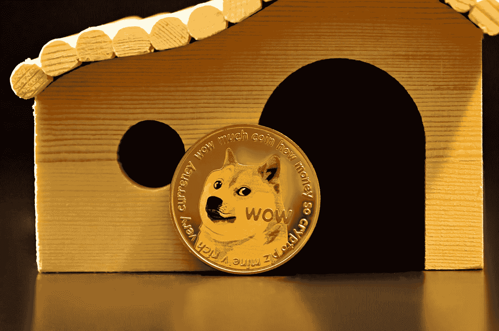

# 为什么迷因币这么受欢迎？

> 原文：<https://medium.com/coinmonks/why-are-meme-coins-so-popular-838ff37e038a?source=collection_archive---------34----------------------->

你有没有停下来想一想，为什么有些迷因币这么受欢迎，尤其是狗币？他们不像猫，以独立和冷漠著称。众所周知，狗忠诚友好，这可能是我们在各种商品上看到它们的原因。那么是什么让迷因币如此独特呢？让我们仔细看看！。

## 迷因硬币创造联系

迷因币受欢迎的主要原因之一是，它们为对加密货币感兴趣的人提供了一种联系和社区感。这些硬币为人们提供了一种与分享他们的幽默感和对模因文化的热爱的人联系的方式。对于许多人来说，这些硬币是一种与志同道合的人联系并建立社区意识的方式。他们可以建立社区，创造社会品牌。这些硬币为人们提供了一种与分享他们的幽默感和对模因文化的热爱的人联系的方式。

其次，迷因币之所以受欢迎，是因为它们可以用来创造社会纽带。这些硬币为人们提供了一种与分享他们的幽默感和对模因文化的热爱的人联系的方式。通过围绕这些硬币建立一个社区，meme 硬币用户可以创建可以持续一生的社交纽带。

> 交易新手？试试[加密交易机器人](/coinmonks/crypto-trading-bot-c2ffce8acb2a)或者[复制交易](/coinmonks/top-10-crypto-copy-trading-platforms-for-beginners-d0c37c7d698c)

## 去他妈的本杰明

最后，迷因币之所以受欢迎，是因为它们可以被视为对传统金融体系的反叛。对许多人来说，这些硬币是与分享他们幽默感和对迷因文化的热爱的人联系的一种方式。通过投资迷因币，人们反抗传统的金融体系。

那么，结论是什么？迷因币是一时的时尚，还是会一直存在下去？在我看来，这些硬币有持久力。它们为许多人提供了社区感和归属感，它们可以建立社会品牌，它们可以被视为对传统金融体系的一种反叛。

所以，下次你看到迷因币时，不要把它当成另一种无用的加密货币。这些硬币有能力创造社区和社会品牌。谁知道呢？它们甚至可能是一场金融革命的开端。

如果您的组织需要帮助来参与加密货币和区块链热潮，请告诉我。我有为这个令人兴奋的新行业创作内容的经验。[点击此处了解更多信息！](https://www.fiverr.com/share/ke1mAy)