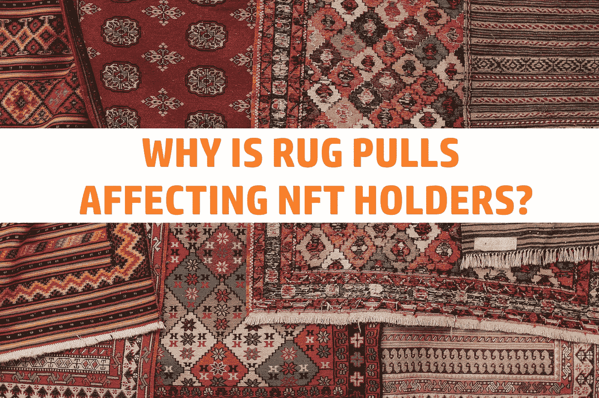
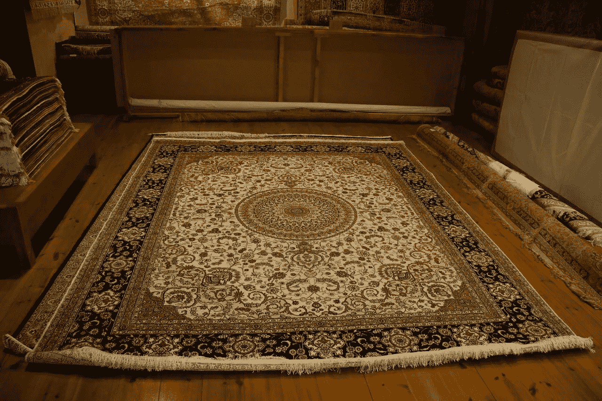
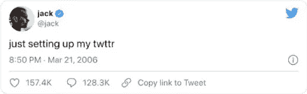

# 为什么 NFT 持有者对地毯拉手感到不安？

> 原文：<https://medium.com/coinmonks/why-are-nft-holders-upset-over-rug-pulls-9e51043bc5b3?source=collection_archive---------28----------------------->

我一直着迷于密码市场和 NFT 市场的诈骗方面。我首先努力教育自己。所以我可以尽量减少这类项目的风险。但我也发现人类的状况是一件迷人的事情。有些人可以故意对其他人这样做。甚至能够向自己和他人证明这一点。但是让我们来谈谈地毯拉手。

首先，我想说，如果我在这里做错了，请告诉我它实际上是如何工作的。其次，我并不是想尽量减少受影响的人。我只是想更好地理解事情，而我做到这一点的方法之一就是提出自己的观点。有时甚至不是我自己的。只是为了得到回应。这可以让我更好地理解和学习。但也可以是让人们思考，然后更好地理解他们的想法和原因。或者它只是我和某人讨论的一种方式。然而，在这种情况下，我试图学习和更好地理解事物是如何工作的。

# 什么是地毯拉手？

据我所知，地毯拉，据我所知。是一个退出骗局的版本。这就是一家公司突然停止提供服务、运输订单或他们做的任何事情。但他们还是继续卖，拿顾客的钱。然后，当人们开始注意到他们没有得到他们所支付的东西时，他们会带着所有的钱离开。

*Sir, kindly step aside, I am about to pull this rug.*

所以我认为拉地毯是这个的加密版本。或者至少这是我所理解的。管理项目的人基本上从项目中取出所有的流动资金或资产。使其没有价值或价值很小。

就我个人而言，我觉得这个词太随意了。人们更多地把它作为一个糟糕项目的同义词，而不是一个真正的骗局。一旦一个项目开始跌价，留言板通常会立刻收到一些评论。

# 非功能性测试，他们如何适应这种情况？

从某种程度上来说，非功能性测试至少从一开始就有所改变。最初，它们是艺术家将他们的数字艺术作为独特的数字艺术进行销售的一种方式。然后，他们将能够将一件艺术品制作成一系列 NFT，就像艺术家将他们的一件艺术品制作成一系列限量版一样。或者他们可以将艺术品作为原件出售，因为它只有一件。

现在情况依然如此。当人们现在谈论 NFT 时，我敢打赌他们会想到猿和类似的 NFT 系列。我要说的是，使这些不同的是，它们是自动生成的预制变量的子集。从某种意义上说，它是算法艺术，而不是人类艺术家的艺术品。

这真的重要吗，不，不是真正独特的艺术作品仍然是独特的艺术作品。我想做的唯一区别是，它们不是独特的，就像一系列艺术作品中的一件艺术作品不好看一样。它们属于收藏的一部分。当然，它们都是独一无二的艺术品，但它们也属于收藏品。

# 我不明白的部分

我读过几个被称为“地毯拉”的 NFT 项目。举个例子，有一个著名的色情明星拍了一部电影，她决定拿钱走人。然后是迪克·NFT 项目，它是由互联网上最大的迪克之一发起的。以同样的方式，他决定他不再想要它的任何部分，拿了钱，回家了。

这就是我不明白的地方。如果 NFT 是因为它是一件独特的艺术品而有价值，为什么当艺术家或创作者带着他们赚的钱离开时，人们会感到不安？

我没有看到任何人因为比尔花掉了他卖《每天:NFT 的前 5000 天》赚来的 6900 万美元而生气。是什么让 NFT 与众不同呢？创作者拿了钱走了，怎么会让人生气？他们还保留着他们的 NFT 或者他们买的任何东西。

如果造物主拿走了他们的钱，离开了，那应该对 NFT 没有任何影响。这就是 crypto 和 NFTs 之间的区别，如果你看看 crypto，你会发现它们在技术上只值流动性资金。因为如果你收集了所有的代币并想同时交易它们，那是你唯一能得到的钱。

*What would you be willing to pay to own this part of history?*

但是如果你想卖 NFT，它的价值来自于人们愿意为它支付的价格。就像任何类型的艺术品一样。有一个著名的例子可以说明这是如何伤害投资者的。花 290 万英镑买下第一条推特 NFT 的人最近试图将它转手套现。但 NFT 最终只卖了 0.09 ETH，约合 277 美元。

我没有看到他抱怨它们变得粗糙，现在他的 NFT 一文不值。

那么，为什么 NFT 的项目会发生这样的事情，为什么非功能性测试在测试结束后变得一文不值，不管人们愿意为它们支付多少钱，它们都应该是有价值的，对吗？还是我错过了什么？当然，如果一个项目上了不好的头条，人们可能会倾向于花更少的钱来买这个收藏中的一个 NFT。但同样可以说的是，如果一个艺术家得到了负面的头条新闻，他们的作品很可能会卖得比以前更低。

在我看来，越来越多的人实际上是在为“酷”的因素买单，或者是能在午餐时坐在酷孩子的桌子旁。他们感到不安的是当“通过关联变酷”的部分消失时。

请告诉我我认为我可能错过的部分，或者我没有错过什么？或者分享你对整个 Rug Pull 用法的其他想法，这个短语开始改变它的意思了吗？请在下面的评论区发表评论。

我希望你已经发现这篇文章是有趣和发人深省的。=)如果你有，请考虑关注我，或者阅读我的其他帖子，或者为什么不两者都做呢？

网络上见！

图片提供:[https://pixabay.com/](https://pixabay.com/)，[https://unsplash.com/](https://unsplash.com/)

资源

1.  [https://news . artnet . com/market/attempt-to-flip-NFT-first-tweet-flops-2099 625](https://news.artnet.com/market/attempt-to-flip-nft-first-tweet-flops-2099625)

> 交易新手？尝试[加密交易机器人](/coinmonks/crypto-trading-bot-c2ffce8acb2a)或[复制交易](/coinmonks/top-10-crypto-copy-trading-platforms-for-beginners-d0c37c7d698c)