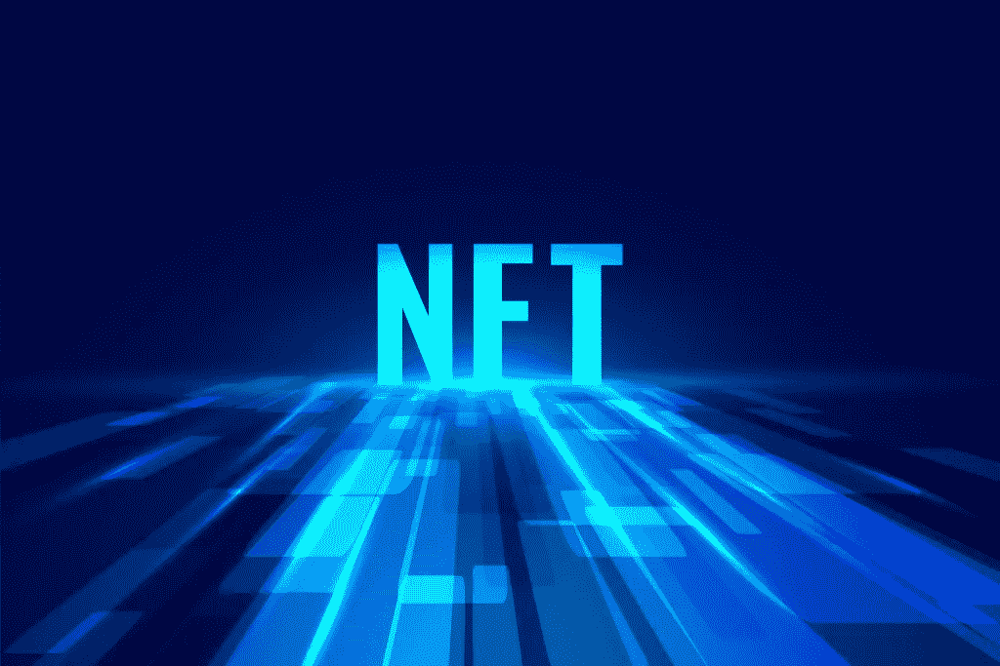
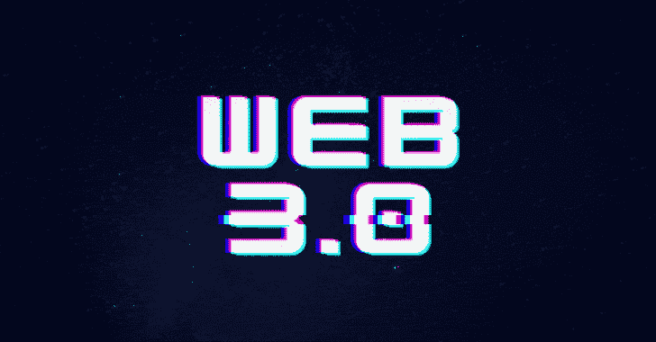

# 为什么 NFT 市场发展解决方案值得一个有抱负的 Web3 企业家花费？

> 原文：<https://medium.com/coinmonks/why-are-nft-marketplace-development-solutions-worth-the-expenses-for-an-aspiring-web3-entrepreneur-737c96116217?source=collection_archive---------31----------------------->

“Web3”由于其背后的技术与未来元素相关联，已经成为最近的流行语。Web3 技术是各种新兴技术的聚合，如区块链、虚拟现实(VR)、增强现实(AR)、物联网(IoT)、人工智能(AI)和机器学习(ML)等。尽管 Web3 保护伞下的所有技术都是独立发展的，但它们的集成创造“理想的数字世界”还没有实现，尽管一瞥令人鼓舞。区块链在 Web3 元素中多元化发展，出现了前所未见的应用，如加密货币、不可替代代币(NFT)和去中心化金融(DeFi)。由于各种 NFT 市场开发解决方案引发的巨大变革，NFTs 已经成为最受欢迎的区块链应用程序之一，我们将在后面详细阐述。

 [## Web 3.0 开发| Web 3.0 开发公司

### 区块链应用工厂凭借其在区块链技术方面的丰富经验，在 Web 3.0 软件开发方面表现出色…

bit.ly](https://bit.ly/3Oclo16) 

## NFT 市场发展方案简介

NFT 市场开发解决方案是一个平台，允许人们购买、销售和交易由不可替代的代币支持的产品(数字/实物)。这些平台通常是 NFT 新手用户的入口，类似于加密货币交易所如何为 Web3 新手用户服务。这些解决方案可以基于水平(通用)交易或垂直(利基)交易类型，两者都有好处和缺点。他们出售许多物品，包括艺术品、音乐、视频剪辑、游戏中的物品、实物资产、元宇宙土地和古董收藏品。主要的 NFT 市场包括 OpenSea、LooksRare、Solsea、Foundation、NBA Top Shot、FanCraze、Axie Infinity、The Sandbox 和 Nifty Gateway。今天，有数百个 NFT 市场存在，为 Web3 社区服务，更多的正在涌现，试图通过他们的商业模式成为革命性的。

## 对 NFT 市场商业平台的需求

[**NFT 市场开发**](https://bit.ly/3RWAknl) 由于各种最终用户的需求，解决方案已成为当今时代的一种常见商业模式。以稍微不同的方式看待 NFT 的收藏家和投机者需要这些平台在炫耀或投机它们之前获得它们的 NFT。游戏玩家需要这些平台来购买和交易他们喜爱的 Web3 游戏中的游戏资产。品牌需要 NFT 市场来确保他们为他们尊贵的顾客提供真实的产品和体验。创作者需要这些解决方案，这样他们就可以用真正的收藏品向更多的观众展示他们的才华。慈善机构和资金筹集者将 NFT 市场视为轻松实现其崇高目标的来源。未来，随着用例的增加，预计会有更多的最终用户通过 NFT 市场进入 Web3 领域。

> 交易新手？试试[密码交易机器人](/coinmonks/crypto-trading-bot-c2ffce8acb2a)或[复制交易](/coinmonks/top-10-crypto-copy-trading-platforms-for-beginners-d0c37c7d698c)

## NFT 市场平台的特征

就像任何其他平台一样，NFT 市场开发解决方案没有必须的功能蓝图。但是，有些特性在所有这些平台上都是通用的。

 [## NFT 市场开发|不可替代代币市场|白标 NFT 市场|…

### NFT 市场的发展正在塑造即将到来的创业公司的未来，以在竞争中胜出。构建您自己的…

bit.ly](https://bit.ly/3RWAknl) 

*以下是 NFT 市场中可能出现的功能列表(包括那些日常常见的功能):*

*   多因素身份认证(MFA)
*   登录/注册
*   用户概要
*   主页
*   搜索引擎
*   店面
*   特定于产品的页面
*   电子购物车
*   多模式支付网关
*   通知
*   智能合同
*   卖家仪表板
*   铸造门户
*   列表门户
*   管理仪表板
*   过滤器选项
*   排序选项
*   拍卖门户
*   集成加密货币钱包
*   评级和评论
*   P2P(点对点)交易的私人列表
*   分数 NFT 交易的规定

# NFT 市场解决方案的特征

*   NFT 市场开发解决方案允许 NFT 资产在区块链的多种数字商业环境中出售，这增强了 Web3 世界的可交易性。
*   这些平台还使用基于区块链的多令牌标准实现了可收藏的 NFT 产品的标准化，以确保 Web3 交易流程顺利进行。
*   让非金融资产通过 NFT 市场交易变得非常容易，将确保这些资产的流动性非常大。在一些 NFT 市场，NFT 持有者可以非常容易地抵押 NFT 进行法定或加密投标，因为当前的 NFT 市场由巨大的流动性池组成。
*   NFT 市场有时也允许 NFT 进行二级交易，比如多个流行的 Web3 游戏平台。在 Axie Infinity 或分散的土地等游戏中，游戏中的 NFT 物品可以在 OpenSea 平台上出售。
*   可控性在 NFT 市场中发挥着重要作用，因为这些平台通过智能合约和人工监管(在利基平台的情况下)来控制 NFT 交易的流动。
*   稀缺性在 NFT 市场的运作中也有着至关重要的作用，因为这一特征为更多的交易提供了空间，从而提升了平台的业务流量。

## NFT 市场平台提供的显著优势

*   NFT 市场提高了安全级别，使交易免受 NFT 损失和额外支出的影响。
*   NFT 市场开发解决方案允许区块链网络上的用户查看和验证在该网络内进行的 NFT 交易，这显示了其透明度，而不会泄露重要的用户信息。
*   由于智能合约可以在满足预设条件时自动执行以完成 NFT 交易，因此可以放弃第三方参与。
*   NFT 市场平台允许基于点对点(P2P)交易的分散交易，这对双方来说都是快速高效的。
*   这些平台还拥有多个支付网关，以闪电般的速度处理密码、稳定货币和法定货币交易。
*   除此之外，NFT 市场平台还可以整合分散金融(DeFi)运营、分散自治组织(DAOs)、首次公开募股和启动平台等功能。

## 一些最后的想法

因此，我们可以说，由于上述原因，NFT 市场开发解决方案是商业投资的理想选择，无论花费多少。构建这样一个平台的成本取决于项目所有者的业务需求，以及用于从头开发和现成解决方案的技术。然而，NFT 市场的成功取决于企业的商业模式和业务流程，这可以通过有效管理平台来管理。如果你想建立一个吸引人的 [**NFT 市场平台**](https://bit.ly/3RWAknl) 成为一个成功的 Web3 企业，考虑与一家经验丰富的 NFT 市场开发公司合作吧！