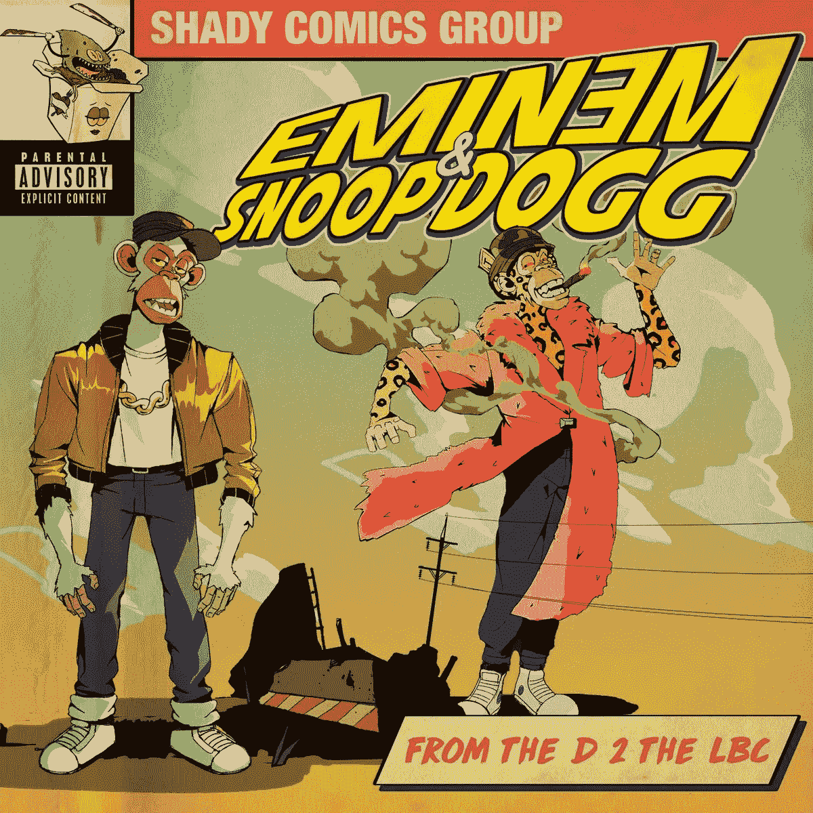

# 为什么这些老文物在说唱猴子？

> 原文：<https://medium.com/coinmonks/why-are-these-old-relics-rapping-about-monkeys-dbe0b2aebf9b?source=collection_archive---------47----------------------->

I wonder how much Yuga Labs paid for these hip hop legends for this.

当我看到音乐录影带时，我差点从椅子上掉下来。

阿姆和史努比·道格为 BAYC 制作了一部新的音乐录影带。

它在 NFT 首次亮相。几个月前的纽约，但这是新鲜的。

他们真的变成了 BAYC 的角色，说唱 NFTs，元宇宙，杂草和长滩。

旧的，但仍然保持其相关性。

仍能获得关注和眼球的嘻哈传奇人物。

Em 和 Snoop 加起来已经有将近一个世纪的历史了。

他们经历了整个东海岸对西海岸，毒品和持枪，黑帮说唱时代，仍然在周一早上新鲜出炉。

在 49 岁和 50 岁的时候，他们不可能像过去那样和抖音的新时代说唱歌手一起摇滚，四处游荡，对吗？

不对。

他们不 twerk，但他们确实吐槽一些惊人的押韵，知道社会如何运作。

从我们这一代最伟大的说唱歌手身上学到的一些东西。

If you need to know, Eminem is 49 and Snoop is 50 years old.

保持真实。

他们不会假装自己不是谁。

他们坚持自己所知所爱。

史努比和他的大麻还有他令人惊讶的冷漠态度。

Em 和他火热的押韵和高质量的作品。

对于那些关注 Em 和 Snoop 的人来说，这是一种认可。

来自他们偶像的信任票，NFT 将会继续存在。

这是不是意味着你必须买一只无聊的猩猩才能显得有意义和酷？

那鸿

至少知道发生了什么，看看这些年来 NFT 是如何发展的。

我不知道他们是否为此得到了报酬，但我知道这对 NFTs 意味着什么。

它正在成为主流并渗透到说唱文化中。

会粘住吗？

有关系吗？

重要的是，来自不同行业、流派、各行各业的人们现在都在拥抱和接触 NFT 文化。

他们为什么要这么做？

也许他们拥有一些 NFT，并喜欢为此创作一首歌。

也许他们因此得到了丰厚的报酬。

也许是他们的孩子说服他们这么做的。

暂时忘掉 NFT 世界的骗局、诡计和恐慌。

让我们感谢 NFTs 所做的一切。

Snoop Dogg and Eminem will bring their Bored Ape Yacht Club (BAYC) NFTs to the VMAs this Sunday, performing from inside Yuga Labs’ upcoming metaverse game “Otherside.”

这将密码、区块链、艺术、在线模因文化和元宇宙带给了普通人，否则他们可能从未听说过。

对于任何值得成长和开花的东西，你需要最初的炒作、眼球、兴趣和关注，然后才能和创造力才会发挥作用，并真正将其带到下一个层次。

说唱有它的文化。

舞蹈有它的文化。

电动汽车有 it 文化。

那么为什么不是 NFTs 呢？

现在可能是熊市，NFT 的销售肯定萎缩了。

但让我们看看 NFT 文化在未来会走向何方。

-

你相信 NFT 文化吗？

-

# startups # business # startupx # growth # success # social media # culture # entrepreneur # strategy # eth #比特币#加密货币# bayc # NFT # airdrop # branding # master card # Eminem # snoop dogg # web 3

> 交易新手？试试[加密交易机器人](/coinmonks/crypto-trading-bot-c2ffce8acb2a)或者[复制交易](/coinmonks/top-10-crypto-copy-trading-platforms-for-beginners-d0c37c7d698c)