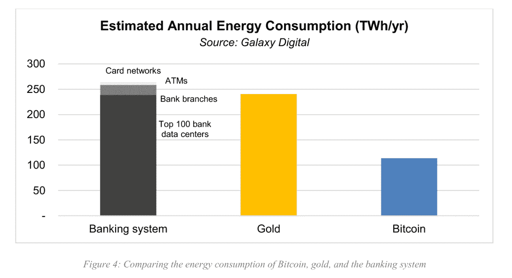
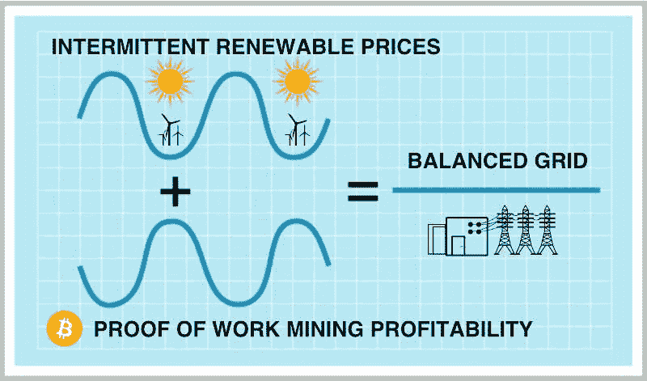
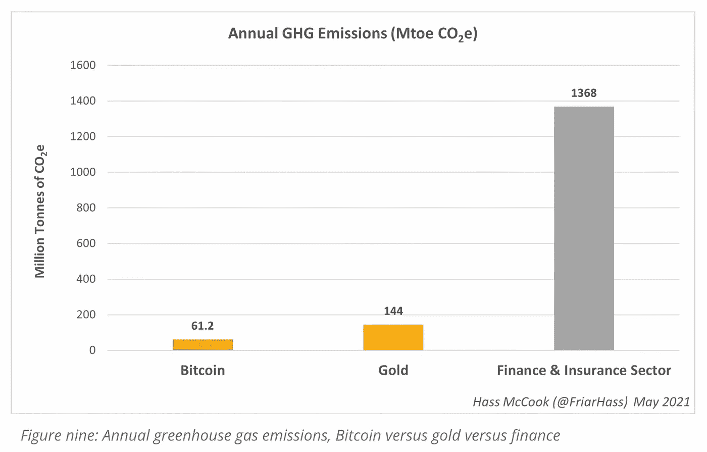

# 为什么比特币对环境有益

> 原文：<https://medium.com/coinmonks/why-bitcoin-is-good-for-the-environment-d6a9341cef7f?source=collection_archive---------10----------------------->

有一种误解认为比特币“对环境有害”，并且使用了过多的能源。这是因为主流媒体大大低估了比特币的影响和意义。

比特币被设计成一个独立的支付网络和可扩展的价值储存手段。比特币网络有潜力取代现有金融遗产系统的大部分。因此，它的能源使用应该与现有的金融遗产系统进行比较，后者远高于比特币，如[银河数码关于比特币能源消耗的报告](https://docsend.com/view/adwmdeeyfvqwecj2)所示。一旦理解了这一点，比特币的能源消耗就变得清晰起来，既不过度，也不浪费。

尽管主流媒体认为比特币对环境的影响远大于黄金和现有银行，但这并不正确。实际情况恰恰相反。黄金和银行业的环境影响远远大于比特币，如下图所示。

Source: [Galaxy Digital](https://docsend.com/view/adwmdeeyfvqwecj2)

## **比特币开采&电网效率**

事实上，比特币将使我们能够更有效地利用能源，并与我们的环境建立更健康的关系。据估计，在发电、输电和配电过程中，高达 30%的能源被浪费掉了。比特币矿工试图捕捉这种能量，因为他们有动力寻找廉价能源来降低成本结构。例如，像 Great American Mining [这样的公司使用石油生产释放的多余气体](https://bitcoinmagazine.com/.amp/business/great-american-bitcoin-mining-solves-energy)来开采比特币。

由于石油钻探在远离居民区的地方进行，释放的气体只能在现场使用。储存气体并将其带到居民区非常困难，因此大部分气体被燃烧(气体的燃烧被称为燃烧)。比特币挖矿不依赖居民区；它可以在任何地方发生。伟大的美国矿业公司利用这一点，捕捉多余的气体，否则这些气体会燃烧和污染，以开采比特币。

有各种各样的比特币矿工利用过剩的能源，例如，通过从海上风力发电场获取未使用的电力来为比特币采矿设备供电。风力发电场通常远离居民区。能量难以运输和传输。随着越来越多的美国公民支持可再生能源，以及更多的风力和太阳能发电场的建设，比特币矿工作为这些来源和电网之间缓冲的需求可能会增加。

采矿可以用来将能源货币化，否则这些能源将永远无法货币化。比特币采矿为任何低成本的能源提供了买家——浪费的、搁浅的、缩减的、剩余的或未充分利用的([戈亚尔，p .斯托达德，T](https://bitcoinmagazine.com/business/bitcoin-mining-at-nuclear-power-plants?utm_source=Bitcoin+Magazine&utm_campaign=3d3fdb8fb8-&utm_medium=email&utm_term=0_f7d45fbb67-3d3fdb8fb8-51848513&mc_cid=3d3fdb8fb8&mc_eid=17de2b401b) )。)作为一种将能源货币化的技术，比特币的实用性与现代能源网络的需求响应完美融合。来自电网运营商的信号立即被比特币矿工感知，使它们像能源电网的噪音消除技术([39 级](https://twitter.com/level39/status/1548550328999907330?s=21&t=luVxcqZn9vIZGRFuJ2rwBA))。

Image Source (Twitter):[Level 39](https://twitter.com/level39/status/1548550328999907330?s=21&t=luVxcqZn9vIZGRFuJ2rwBA)

## **比特币开采&可再生能源**

对于比特币目前的能源组合有不同的估计，其中包括 29%至 39%的可再生能源([剑桥替代金融中心](https://ccaf.io/cbeci/index))和 73%的可再生能源( [CoinShares](https://coinshares.com/research/bitcoin-mining-network-2022) )。世界其他地区则不同，29%的电网和 17%的能源消耗来自可再生资源(比特币与金融部门能源使用的对比)。

可再生能源是最便宜的能源之一。这使得它们的使用对比特币矿工非常有吸引力，他们反过来帮助提高可再生能源的使用效率，从而创新整个可再生能源市场([美国最古老的水电站之一正在开采比特币](https://bitcoinmagazine.com/business/mechanicville-plant-mining-bitcoin?mc_cid=0bf0f174bc&mc_eid=17de2b401b))。

幸运的是，也许是有意的，我们正在走向一个拥有丰富的低成本可再生能源的社会，以支持我们新的数字货币供应。在未来几十年，比特币矿工将继续利用低价值的剩余可再生能源来开采剩余的 240 万个比特币，并从 21 世纪后期及以后的经济中争夺交易费。”
(特别报道:能源支持资金)

## **比特币挖矿；碳排放**

剑桥比特币电力消耗指数(CBECI)显示，整个比特币网络的电力消耗为每年 133.7 太瓦时。如果我们估计比特币的能源组合是 34%的可再生能源(低估计)，基于剑桥替代金融中心估计的平均 29%至 39%的可再生能源，那比特币的碳强度为 458 千克(kg)二氧化碳当量/兆瓦小时。这意味着比特币排放 6120 万吨二氧化碳，不到金融服务业的 5%。在全球二氧化碳当量排放的方案中，这只是 0.12% ( [比特币 vs 金融部门能源使用](https://bitcoinmagazine.com/business/bitcoin-vs-financial-sector-energy-use?mc_cid=58b90350eb&mc_eid=17de2b401b))。

## **结论**

如果比特币实现了它的承诺，它将是世界历史上最伟大的货币进化，并将永远改变经济范式。对于一项革命性的新技术来说，它的碳排放量非常低，这项技术可能会改善许多人的生活，并颠覆整个全球电力结构。虽然比特币网络消耗的能源与瑞典一样多，但在 2021 年夏天的最近一次高峰期间，它还存储了几乎两倍于瑞典年度 GDP 的资本。事实上，比特币在未来可能储存的价值几乎不会消耗能源。考虑到比特币在未来十年可能会增长，并可能储存 20 万亿美元的世界财富，甚至可能是 50 万亿或 100 万亿美元，这是一大笔需要安全保护的货币能量。)

比特币网络的能源使用正变得越来越少。比特币的伸缩方式是，随着时间的推移，它消耗的能源占其市值的比例越来越小。绝对市值的增长速度快于能源消耗。比特币的能源使用将继续增长，但其碳强度明显呈下降趋势。关于全球碳排放，这将永远是一个舍入误差。

总之，在推动能源效率创新方面，比特币矿工将成为蓬勃发展的动力之一。矿业企业家正在石油和天然气领域进行创新，地球上的废弃甲烷足以为比特币提供数倍的能量。比特币不仅仅是完全没有排放，它实际上可以成为一种减排工具。Aker Group(及其比特币专用子公司 SeeTee.io)等大型老牌公司在给股东的信中表达了他们对这条道路的承诺([比特币与金融部门能源使用](https://bitcoinmagazine.com/business/bitcoin-vs-financial-sector-energy-use?mc_cid=58b90350eb&mc_eid=17de2b401b))。

比特币是一项创新，将成为未来许多其他社会创新的基础，包括能源市场、银行、商业等。有趣的是，现有金融遗产体系中的利益相关者经常对比特币的能源消耗提出批评。虽然现有金融体系的能耗比比特币大很多。

此外，黄金和银行业的历史充满了不道德行为。黄金和财富的开采导致了抢劫、盗窃、谋杀和整个民族的灭绝。似乎很多批评者是被雇来传播关于比特币的错误信息的，他们的动机不是环保而是个人利益([比特币杂志](https://bitcoinmagazine.com/business/questionable-ethics-of-bitcoin-esg))。非常需要一种替代系统。我们当前的金融体系已被一群经济学家劫持，他们认为增长和消费是社会福祉最重要的变量。在一个资源有限的世界里，增长不是一个好主意。相反，我们应该问自己:我们如何从最少的东西中获得最多的东西？我们怎样才能事半功倍？生产率是一个比增长重要得多的变量。这是通货紧缩心态的一部分。这与比特币完全吻合，因为比特币是一种反通胀资产。

随着时间的推移，供给减少，需求增加，价格上涨。这有积极的副作用。它鼓励储蓄，而储蓄鼓励减少消费和更好地利用我们的资源。我们会把钱和时间花在我们真正想要的东西上。想象一个你的钱随着时间变得更有价值的世界。我知道这与我们习惯的不同，但它会让世界变得更美好。

## **其他资源**

*   **比特币挖矿** [迈克尔·塞勒关于比特币环境的论证](https://m.youtube.com/watch?v=TeVvtSCfcQ4)
    [银河数字挖矿关于比特币能源消耗](https://docsend.com/view/adwmdeeyfvqwecj2)
*   **比特币 vs 遗留系统** [揭开石油美元的隐性成本(比特币杂志)](https://bitcoinmagazine.com/culture/the-hidden-costs-of-the-petrodollar)
    [比特币与黄金和银行业的环境影响对比](https://bitcoinmagazine.com/culture/comparison-of-bitcoins-environmental-impact)
    [比特币排放的碳不到全球军工复合体碳排放量的 2](https://bitcoinmagazine.com/culture/bitcoin-vs-world-military-emissions?mc_cid=27c56baf8e&mc_eid=17de2b401b)
    [比特币 vs 金融业能源使用](https://bitcoinmagazine.com/business/bitcoin-vs-financial-sector-energy-use?mc_cid=58b90350eb&mc_eid=17de2b401b)
*   **播客** [哈里·苏多克关于比特币能量的真相——比特币做了什么#361](https://open.spotify.com/episode/6dolYqDVgbPZJswwhgS27w?si=paBrs2dAQduuKH_aXuPJvA&dl_branch=1&nd=1)
    [ESG、特斯拉和能源 FUD 与林恩·奥尔登——比特币做了什么播客#355](https://open.spotify.com/episode/4PrYJQxqXL69siBWbulvL1?si=eRcuC4ZVQ7Kyltbv93JDSA)

[这篇文章摘自我的文章《比特币的智慧来自古代文明吗？—原载于《比特币》杂志 2022 年 6 月 28 日。](https://bitcoinmagazine.com/culture/bitcoin-is-wisdom-from-an-ancient-civilization)

如果你喜欢这篇文章，你可以在 [Twitter](https://twitter.com/leonamschel) 上关注我，访问我的[主页](http://www.asystemofrules.org/)或者给我发一些 sat:[law@getalby.com](/coinmonks/law@getalby.com)