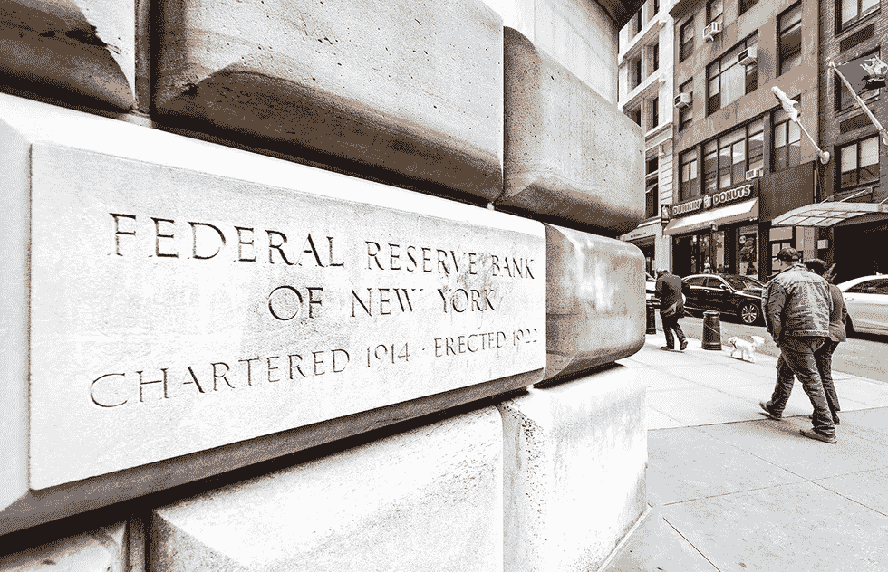

# 为什么比特币不是货币。

> 原文：<https://medium.com/coinmonks/why-bitcoin-is-not-a-currency-6de48e8811ee?source=collection_archive---------50----------------------->

## 密码学导论

Mathieu Stern

加密货币、比特币或区块链这些术语已经在世界各地流行了相当一段时间，但它们的确切含义或定义大多数人都不清楚。你甚至可能听说过比特币被错误地描述为不是货币的各种原因，认为它不是价值储存手段，不是有效的会计单位，也不是交易媒介。我很遗憾地告诉你，所有这些要么是错误的，要么是有争议的。

在与密码爱好者 Oama Richson 的炉边谈话中，术语变得容易理解，特别是对于那些几乎不熟悉金融部门和 IT 的人。一次迷人的、激动人心的、有见地的、有教育意义的谈话。

(*德语采访，带自动翻译观看。)*

## “加密货币”很容易解释:奥玛·理查森

这就是为什么比特币不是一种货币的**的一个简单原因**:

> 货币由政府发行，由国家银行或私人银行印制。
> 
> 句号。

在撰写本文时，世界上最强的货币是美元，而讽刺的是，美国美联储银行就像联邦快递一样“联邦化”。那么，如果一个开源协议在技术上是防篡改的，具有内置的假名和最佳的透明性，那么它为什么不能适合这只鞋呢？仅仅这个事实就应该引发你对货币创造和货币循环如何运作的兴趣。如果你想了解更多关于金融和加密货币的知识，我推荐 Coursera 关于这个主题的课程。更多建议将在下面的评论中提供！

*Andriy Blokhin / Shutterstock.com*

该采访还于 2019 年 9 月 19 日在私人电视频道 Okto 播出，可在此处找到:【https://www.okto.tv/de/oktothek/episode/21588

大家好，我是 Oama Richson，你最喜欢的关于区块链、隐私和预防性医疗保健的作家。一定要留下来。

谢谢你。

> 交易新手？尝试[加密交易机器人](/coinmonks/crypto-trading-bot-c2ffce8acb2a)或[复制交易](/coinmonks/top-10-crypto-copy-trading-platforms-for-beginners-d0c37c7d698c)