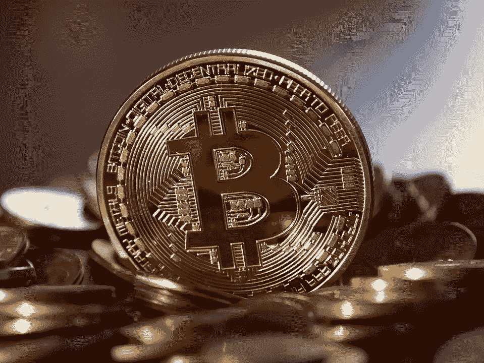
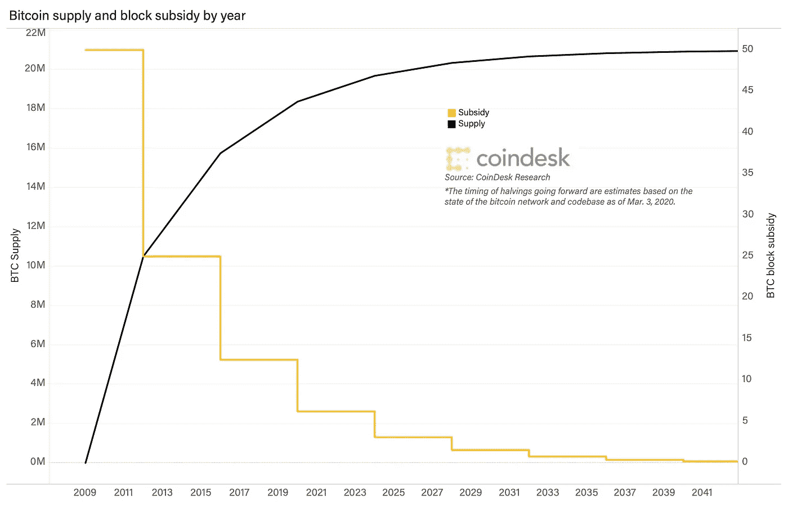

# 比特币为什么有价值。

> 原文：<https://medium.com/coinmonks/why-bitcoin-is-valuable-6811b20617ac?source=collection_archive---------55----------------------->

这篇博文试图回答以下问题:

*   比特币有什么支撑吗？如果有，是什么？

作为一名价值投资者和比特币的支持者，我觉得有义务解决许多合格投资者对比特币的古老批评，包括价值投资传奇人物沃伦·巴菲特和查理·芒格。

我所指的批评是对比特币“内在价值”的批评，无论比特币本质上是否有价值。

> 从顶级交易者那里复制交易机器人。免费试用。

首先，我想说明资产被某物“支持”意味着什么。我将举一个简单的例子来说明这一点。苹果股票是由公司拥有的资产产生的现金流“支撑”的；因此，市场根据这些预测的未来现金流来证明其股票市场估值的合理性。

当有人问比特币有什么支持时，他们实际上是在问，

*为什么它有价值，它值多少钱？*”。

在深入研究比特币之后，我得出了以下结论:

比特币无法通过“内在”估值指标进行估值，如贴现现金流模型，因为它不是一项有现金流的业务，而是一种**数字商品**。它的价值取决于其使用案例和供需动态——这是市场对黄金(一种大宗商品)的估值，也是我在以下几点中决定比特币支持什么的原因:

*   比特币得到了矿工和节点网络的支持，这些网络提供了无与伦比的可靠性和安全性，允许用户廉价、即时和数字化地转移价值，而无需中介。

美元之所以有价值，是因为由世界上最强大的国家发行和保护的美元具有安全性。类似地，比特币之所以有价值，是因为它受到现存最安全、最广泛的价值转移网络的保护，不需要第三方。它通过创建一个不需要信任的价值转移系统来实现这一点，比特币的供应进一步强调了这一点:

*   透明供应。

比特币的供应动态是完全可以预测的，因为它们已经根植于代码之中。从历史上看，最可预测的资产/货币是最可信的，因此也是最有价值的。从逻辑上讲，这是有道理的，人们不想持有以不可预测的速度膨胀的货币；因此，为什么越来越多货币不稳定的国家在政府眼皮底下接受美元，现在越来越多的国家接受比特币。比特币也部分受到以下因素的支持:

*   网络为矿工创造的奖励激励，矿工反过来投资于维护网络的能源和硬件。

你可能会想:

*“采矿设备和能源成本的价值与比特币的市值相差甚远”。*

你是对的。

然而，黄金开采也是如此，设备的价值远不及最终产品的价值，否则就不会有太多的动力继续开采黄金和比特币，这使得这些资产得以存在。

总的来说，比特币不需要有现金流的资产或政府来“支持”。在接下来的时间里，它将继续发挥作用。比特币不在乎。

下次见。

保持警惕。

~维克多

> 加入 Coinmonks [电报频道](https://t.me/coincodecap)和 [Youtube 频道](https://www.youtube.com/c/coinmonks/videos)了解加密交易和投资

# 另外，阅读

*   [BlockFi vs 摄氏](/coinmonks/blockfi-vs-celsius-vs-hodlnaut-8a1cc8c26630) | [Hodlnaut 点评](/coinmonks/hodlnaut-review-best-way-to-hodl-is-to-earn-interest-on-your-bitcoin-6658a8c19edf) | [KuCoin 点评](https://coincodecap.com/kucoin-review)
*   [Bitsgap 审查](/coinmonks/bitsgap-review-a-crypto-trading-bot-that-makes-easy-money-a5d88a336df2) | [Quadency 审查](/coinmonks/quadency-review-a-crypto-trading-automation-platform-3068eaa374e1) | [Bitbns 审查](/coinmonks/bitbns-review-38256a07e161)
*   [密码本交易平台](/coinmonks/top-10-crypto-copy-trading-platforms-for-beginners-d0c37c7d698c) | [Coinmama 审核](/coinmonks/coinmama-review-ace5641bde6e)
*   [印度的加密交易所](/coinmonks/bitcoin-exchange-in-india-7f1fe79715c9) | [比特币储蓄账户](/coinmonks/bitcoin-savings-account-e65b13f92451)
*   [OKEx vs KuCoin](https://coincodecap.com/okex-kucoin) | [摄氏替代品](https://coincodecap.com/celsius-alternatives) | [如何购买 VeChain](https://coincodecap.com/buy-vechain)