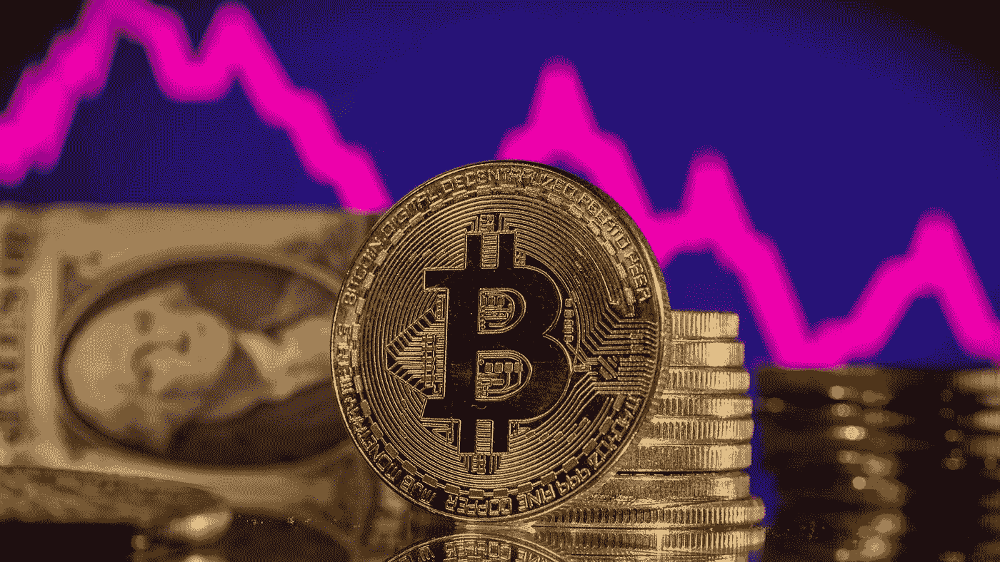

# 为什么比特币最大化主义者在崩溃后依然不动摇

> 原文：<https://medium.com/coinmonks/why-bitcoin-maximalists-remain-unshaken-despite-the-collapse-9ba194cbbaef?source=collection_archive---------30----------------------->

虚拟货币。数字黄金。通货膨胀保护和分散财富的来源。比特币的支持者曾用这些词语来描述加密货币的优势。

如今，这些表达已经被组合成更简单、更普遍的东西:“一个比特币等于一个比特币”。

在这种加密货币价值暴跌之际，这种说法主导了投资者和分析师的推特帖子，突显了比特币的价值无关紧要的观点。

**他们认为，鉴于其有限的供应量，加密货币的价格将在长期内保持高位。**

> “比特币最大化主义者的‘1 个 BTC = 1 个 BTC’的表达在价值下跌时是一种止痛剂，”前创世纪交易高管**乔舒亚·林**指出，强调“这些投资者依赖于 BTC 将变成一个价值单位的想法，所以用户应该只关注他们有多少比特币可用。”

加密货币市场分析师非常清楚比特币近年来采取的不同“形式”。

在“痛苦的加密 2022”之前，数字货币倡导者强调比特币将取代黄金，并提供抵御通胀的避风港。

随着加密货币的价值和央行货币政策的收紧，这些叙事大多在今年崩溃了。

值得注意的是，比特币今年已经损失了约 60%的价值，目前从 2021 年的近 69，000 美元徘徊在 19，000 美元左右。

在疫情之初，加密货币市场的投资者依赖于这样一种观点，即供应量有限的比特币可以对冲价格上涨。

然而，事实证明，通货膨胀是永久性的，而不是短暂的，而加密货币大多已经崩溃。

投资者现在正试图为这个数字市场发明一种新的叙事，称之为“1 个 BTC = 1 个 BTC”。

Tagus Capital 的 Ilan Solot 指出，许多用户和投资者误解了比特币的作用:

> " BTC 是针对央行不负责任的印钞行为的对冲，而不是通胀."

然而，“硬核”加密倡导者仍然没有被吓倒，因为根据 FRNT 金融公司的数据，投资者手中未在市场上流通的比特币比例达到了 8 年来的最高水平 68%。

正如 FRNT 首席执行官**斯特凡·韦莱特**所说:

> “这种叙事通常是由市场波动造成的。不打算出售加密货币并将继续使用加密货币进行交易的比特币投资者的比例将继续增长。在某个时候，BTC 将开始做出与其他投资资产不同的反应。”

最后，据创意策划总裁 **Peter Maluk** :

> “现在很清楚，加密货币不是对冲通胀的工具，任何此类举措都源于投机倾向。”

*原载于 2022 年 9 月 30 日*[*【https://bitnewsbot.com】*](https://bitnewsbot.com/why-bitcoin-maximalists-remain-unshaken-despite-the-collapse/)*。*

> 交易新手？尝试[加密交易机器人](/coinmonks/crypto-trading-bot-c2ffce8acb2a)或[复制交易](/coinmonks/top-10-crypto-copy-trading-platforms-for-beginners-d0c37c7d698c)