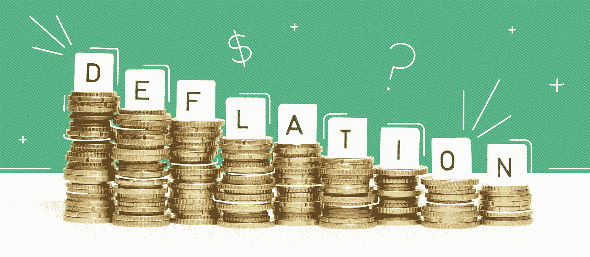
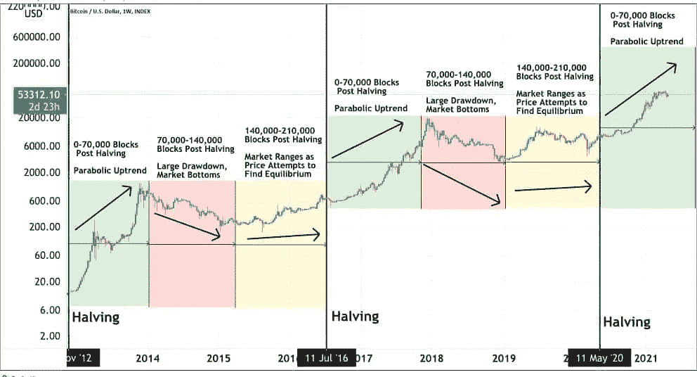
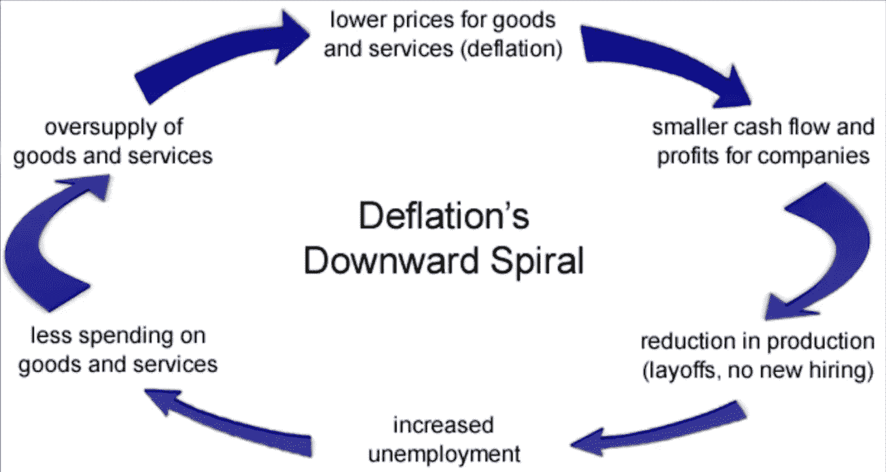

# 为什么比特币永远不会成为真正的货币……

> 原文：<https://medium.com/coinmonks/why-bitcoin-will-never-be-a-real-currency-bbd9d6e0a7ae?source=collection_archive---------21----------------------->

众所周知，比特币是一种非常流行的加密货币，近几年它的流行程度越来越高。最近，比特币开始被用于支付、电子商务等领域。但尽管如此，仍有许多人会说，鉴于比特币的通缩特性，它永远不会被用作真正的货币。

# 首先，我们需要理解什么是通货紧缩。

通货膨胀和 T2 通缩都是可怕的词汇。但这并不难理解。

[维基百科](https://en.wikipedia.org/wiki/Deflation)给了我们对*通缩*的定义:

> 在经济学中，通货紧缩是指商品和服务的总体价格水平下降。通货紧缩发生在通货膨胀率降到 0%以下的时候。
> 
> 随着时间的推移，通货膨胀会降低货币价值，但突然的通货紧缩会增加货币价值。这使得更多的商品和服务，以购买比以前更多的相同数额的货币。

好的，那么**通货紧缩增加了货币**的价值。现在，我们站在同一战线上，我可以开始解释一下比特币的通缩本质了。

# 比特币怎么会成为通缩资产？

每四年，提供给加密货币挖矿者的比特币数量会减半，这一过程也被称为比特币减半。

原因和过程如下。

## 比特币的供给极限

要理解比特币减半，我们必须首先理解其供应背后的理论。

比特币的发明者相信稀缺性可以创造出前所未有的价值。毕竟，《蒙娜丽莎》只有一个版本，毕加索的作品也只有这么多，所以说地球上的黄金供应是有限的。

比特币的革命性在于，它可以首次让数字产品变得稀缺——未来只会有 2100 万枚比特币。

## 比特币减半进程

矿工们负责维护和保障网络安全，获得的奖励是新铸造的比特币。

然而，大约每四年，开采带来的收益就会减半，每减半就会降低比特币的新供应量，这个过程可能会持续到 2140 年。

截至本报告撰写之时，还有 *89，861 个*区块，将一直保留到下一次减半。看看[比特币时钟](https://buybitcoinworldwide.com/bitcoin-clock/)就知道还剩多少时间了。

## **减半对股价的影响**

比特币减半会减少每个区块产生的新比特币数量，从而降低新比特币的供应量，从而提高比特币的购买价格。

根据经济学的一般规则——在需求稳定的情况下，较低的供给应该会导致较高的价格。减半通常出现在一些比特币最大的牛市之前，因为它减少了新比特币的供应，而需求保持稳定。

Bitcoin’s post-halving giant bull runs.

# 那么，为什么比特币不能作为真正的货币使用呢？

**一种真正的货币有一个建立在它之上的经济。**

一方面，美元依附于美国经济。欧元附属于欧洲经济。甚至以太坊、索拉纳或卡尔达诺都有完整的 DeFi 生态系统和经济。

另一方面，**比特币** **没有任何附加值**。多用于**投机**。

尽管如此，许多人可能会认为 [**闪电网络**](https://lightning.network/) 将允许在未来创建一个可与以太坊或索拉纳相媲美的生态系统。

## 为什么围绕 BTC 创造经济是个坏主意？

还记得维基百科通缩定义的第一句话吗？

> 在经济学中，通货紧缩是指商品和服务总体价格水平的下降

**这意味着通缩资产背后的经济失去了价值！**

如果比特币碰巧被用作一种真实的货币，那么由于减半的过程，它所附带的一切都会每 4 年失去一些价值。

## 通货紧缩螺旋式下降

想象你拥有一些比特币。你知道**在下一个减半周期，你的比特币价值将会增加**。

**你为什么会花这笔钱？你为什么要花将来会更有价值的东西呢？**

简单的回答是:你不会。

如果没有人愿意花钱，这意味着没有足够的需求，经济就会崩溃。

***没有需求=没有经济***

当你知道它的价值会在下一次减半时增加，为什么你现在要花掉它呢？

这被称为通货紧缩的螺旋式下降。

Deflation’s Downward Spiral.

# 结论

综上所述，比特币由于通货紧缩的性质，不能作为真正的货币使用。从长远来看，由通货紧缩驱动的经济是不健康和不可持续的。

尽管如此，这并不意味着比特币将会消亡或无法创造新的创新用例。将来，新技术肯定会通过实现新的解决方案来解决这个问题。

目前，其他加密货币更有可能成为真正的货币。以太坊、索拉纳和许多其他密码已经是这种情况，它们都有完整的生态系统建立在它们的基础上。

**感谢阅读！**如果你喜欢我的内容，请关注并查看我的[推特](https://twitter.com/johannbuscail)。我在*网站 3* 和*创业*上发布每日内容。

> 交易新手？尝试[加密交易机器人](/coinmonks/crypto-trading-bot-c2ffce8acb2a)或[复制交易](/coinmonks/top-10-crypto-copy-trading-platforms-for-beginners-d0c37c7d698c)