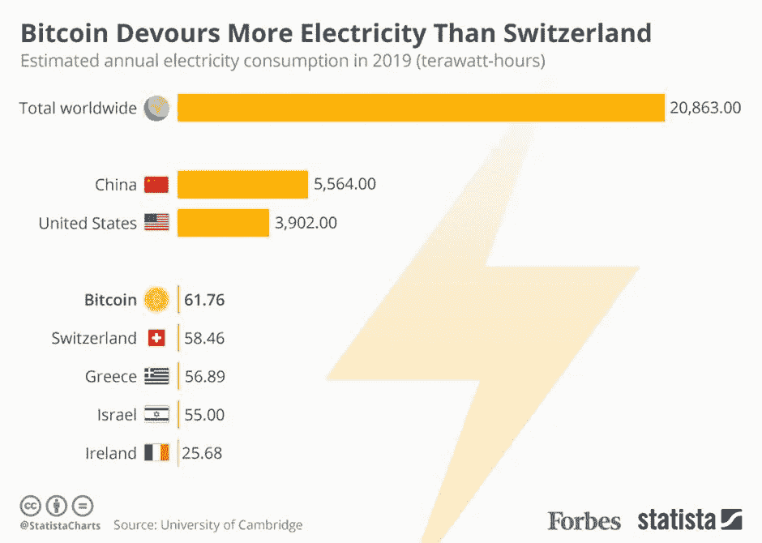
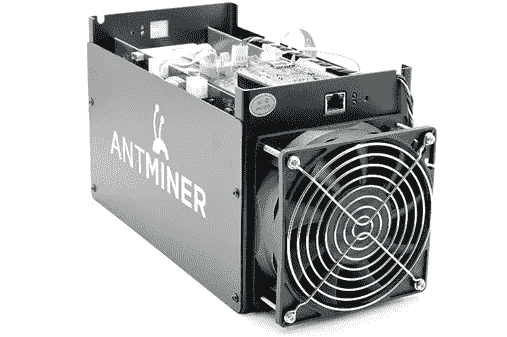

# 为什么区块链对环境不友好

> 原文：<https://medium.com/coinmonks/why-blockchain-is-environment-unfriendly-35fbeb329470?source=collection_archive---------59----------------------->

由于其不变性，区块链技术，一个数字账本，提供了许多问题的解决方案。它支持多种用例，包括供应链管理、数字货币和金融。然而，所有的积极因素都有一些缺点。比特币因其价格波动、在非法活动中的使用以及交易所盗窃而受到批评。由于它使用了大量的电力，这也引起了争论。许多人声称区块链技术对环境有害，有一天可能会导致气候变化。

使用剑桥大学的[在线工具](https://www.cbeci.org/comparisons/)估算比特币网络的能耗，并与其他实体进行比较。据发现，比特币每年消耗约 61.76 太瓦时(TWh)的电力，这比许多其他国家都多，约占世界总用电量的 0.28%。

Source: University of Cambridge

为了更好地理解它，让我们了解技术是如何工作的，我们将考虑加密货币的用例。

> 加密货币开采是一个高度耗能的过程。什么是采矿？挖掘是使用复杂的计算机来验证区块链交易的合法性的过程。**交易验证过程的设计方式使用** [**大量能源**](https://www.investopedia.com/nfts-and-the-environment-5220221)**——网络依赖于数千台矿机的计算能力。**比特币和 Etherium 使用工作共识证明导致高能耗。我将在另一篇文章中详细介绍它。

假设价格和用户接受度继续波动，比特币挖矿使用的能源量很可能会随着时间而变化。 ***为了赢得奖励，成千上万的矿工在加密货币开采过程中相互竞争。*** 开始采矿的激励随着区块奖励的价值而增加。加密货币价值越高，加密货币网络消耗的能量就越多。在比特币早期(2008 年至 2009 年)，人们使用笔记本电脑开采比特币。由于采矿需要大量的能源，而且竞争非常激烈，矿工们使用复杂的 ASIC 设备，这些设备可以产生极高的计算能力。

ASIC Device used by Miners

一些主要的加密货币正在试图实施技术措施，以减少其对环境的负面影响。比特币开发者正在研究[闪电网络](https://en.wikipedia.org/wiki/Lightning_Network)。目标是通过从区块链中移除大部分交易来降低网络的能量需求。

以太坊一直致力于从[工作证明](https://www.investopedia.com/terms/p/proof-work.asp#:~:text=Proof%20of%20work%20(PoW)%20describes,launching%20denial%20of%20service%20attacks.)到[利益证明](https://www.investopedia.com/terms/p/proof-stake-pos.asp#:~:text=Proof%2Dof%2Dstake%20is%20a,and%20keeping%20the%20database%20secure.)算法的过渡。有人担心电网的风险，但据称这将减少 99%的电网能源需求。

> 交易新手？尝试[加密交易机器人](/coinmonks/crypto-trading-bot-c2ffce8acb2a)或[复制交易](/coinmonks/top-10-crypto-copy-trading-platforms-for-beginners-d0c37c7d698c)