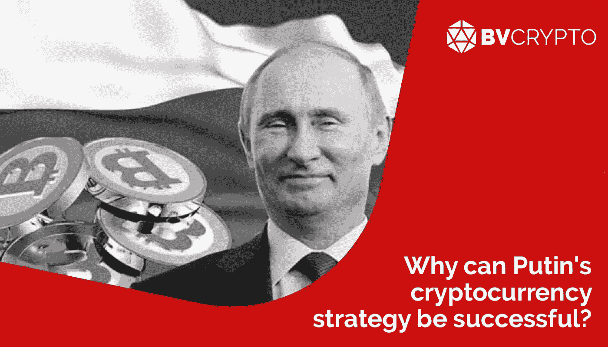
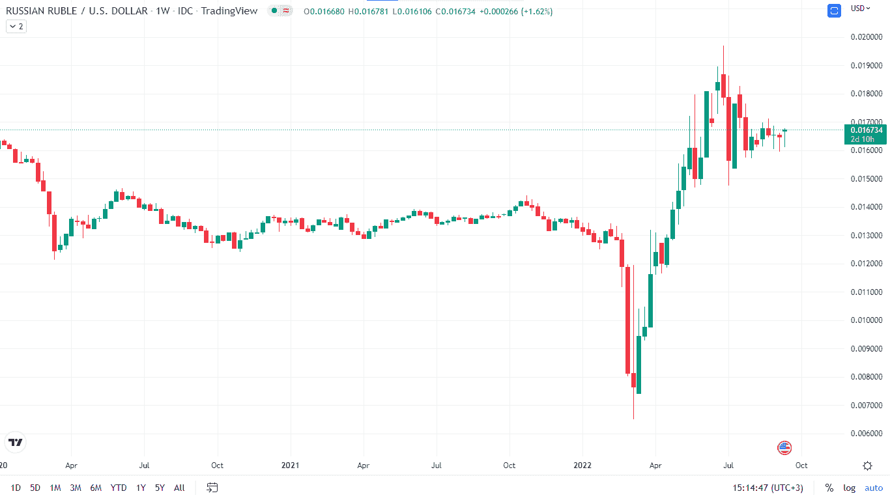
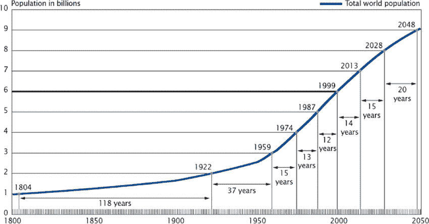

# 普京的加密货币战略为什么能成功？

> 原文：<https://medium.com/coinmonks/why-can-putins-cryptocurrency-strategy-be-successful-12beaadca80f?source=collection_archive---------27----------------------->

为了应对乌克兰战争后对俄罗斯的制裁，俄罗斯玩起了能源武器，使战争的影响变得全球化，导致通货膨胀和能源价格严重上涨。通过这场战争，我们见证了俄罗斯采取的行动，这些行动可能对全球经济体系，尤其是美元的地位产生更大的影响。这些举措中最重要的是，俄罗斯的经济政策转向了硬资产，如供应有限、需求过剩的大宗商品。俄罗斯宣布将在国际支付中使用加密货币，这可能是该国迄今为止为这一新系统建立基础设施的最大举措。因为，要建立的体系离美国霸权很远，而且还能实现本币贸易。印度、中国和伊朗等国与俄罗斯一起采取的 CBDC 或加密友好举措表明，其他国家已经为这一系统建立了基础设施。

在本文中，我们将结合俄罗斯当前的经济基础和系统规划，对所有这些消息的含义进行整理和解读。祝你阅读愉快

**人造财富**

总结俄罗斯对全球经济的批评和建议，可以从上面普京的讲话中直接看到。让我们来看一下重点:

*   普京提请注意一个事实，即发展中国家质疑他们为什么以美元和欧元出售自己的商品，同时强调这些国家的货币不断贬值。
*   他指出，美元和欧元创造的人造财富取代了硬资产。
*   他强调，如果美国和欧盟不赞成一个国家的政策，他们可能会限制该国储备中美元和欧元的使用或获取，俄罗斯央行已经因战争而经历了这一点。由于这个原因，据说发展中国家质疑他们为什么以美元和欧元持有储备。
*   据预测，各国将转向硬资产(商品等)。)并将停止持有法定货币作为储备。

在比特币的意识形态中，完全按照中央银行的要求无限制印刷法定货币是最受批评的因素之一，这也是 BTC 的价值所在。可以说，普京对法定货币的批评也有类似的理由。当然，在这里，人们会想到，卢布是一种法定货币，俄罗斯也处于类似的境地。然而，俄罗斯要求石油和天然气以卢布支付，这不仅在理论上，而且在实践中确保了卢布与石油和天然气的安全。一种高需求商品与法定货币的指数化可以被视为战争中俄罗斯货币严重升值的最重要原因。因此，从这个方面来说，可以说卢布已经不同于其他法定货币。

理论上，每一种法定货币实际上都是由该国的各种资产担保的，但在实践中，情况并非如此。普京对人造财富的强调尤为重要。因为美国保护全球美元需求的最重要政策关系到国家形象。

我们已经多次看到，每当最初规定石油贸易以美元结算的石油美元体系在该地区开始恶化时，美国就会毫不犹豫地在中东发动重大战争，以控制石油贸易。因此，第一个形象是“铁拳”形象，这是基于美国陆军不会允许因石油而造成系统中断的事实。然而，对于像美国这样的国家来说，光靠石油贸易是不够的，这个国家的媒体价值也很重要。尤其是有了互联网，美国在各个领域全球化自己的文化，总是让国家的吸引力保持在首位。此外，美国最重要的技术发展的出现以及该国创造品牌的能力是保持高吸引力的重要因素。总之，所有这些因素表明，美国的铁腕政策和形象政策都很强大，因此确保了美元霸权将继续存在的信念。欧洲也是最大的吸引中心之一，这一事实确保了欧元的类似形象政策。

俄罗斯目前正在通过中断天然气和石油运输来制造不稳定，这是美国不允许的。美国不太可能直接干预这种不稳定，因为由于核武器的相互威慑，两国开战的可能性非常低。最有效的解决方案是针对俄罗斯经济崩溃的政策，停止石油和天然气运输会给俄罗斯带来经济损失。在这一点上，俄罗斯需要一个独立于美国霸权的贸易基础设施，用加密货币进行国际支付的决定正好满足了这一需求。

**无论是本地货币还是比特币**

俄罗斯在国际贸易中使用加密货币的决定表明，俄罗斯央行和经济部在长期中断后达成了共识，该问题的紧迫性增加了。可以说，该系统非常灵活，因为它规定，“可以用当地货币与友好国家如中国和土耳其进行贸易，如果需要，也可以使用加密货币如 BTC”。由于该系统将包括加密货币，它很可能依赖于令牌化基础设施。为此，即将成为成员的国家也应该关注 CBDC 的发展，以便能够以当地货币进行贸易。

我们来看看与俄罗斯的加密货币声明并行的其他国家的加密货币新闻。

*   中国宣布将在与俄罗斯的天然气贸易中使用人民币和卢布，这打击了石油美元体系。中国可以在 CBDC 以最舒适的方式与俄国进行贸易。因为中国的数字人民币项目已经开始在大城市进行试点应用测试。
*   8 月 9 日，伊朗首次宣布以加密货币支付 1000 万美元，以换取进口。后来，半私营报纸 Tasnim 宣布，进出口中与加密货币支付相关的法律基础设施已经准备就绪，甚至私营部门现在也可以在汽车[进口](https://www.tasnimnews.com/en/news/2022/08/29/2765709/iranian-admin-enforces-regulations-on-cryptocurrency-trading)中使用加密货币支付。由于廉价的电力，伊朗最近已成为吸引 BTC 矿商的中心。在俄国将要建立的体系中，伊朗可能会在 BTC 交易，也许不会在 CBDC 交易。
    在川普时代恢复对伊朗的制裁(在奥巴马时代有所软化)引起了欧盟的反应，当时欧盟和伊朗之间开发了一种叫做 [INSTEX](https://www.dw.com/en/instex-europe-sets-up-transactions-channel-with-iran/a-47303580) 的特殊支付基础设施。因此，考虑到欧盟也对美国对伊朗的制裁感到不安，欧盟可能会在乌克兰战争结束后加入这一体系。
*   印度中央银行会见了 4 家公共银行，要求对 CBDC 进行测试。由于印度的加密货币政策极不确定，因此很难将该国归类为加密友好国家。然而，考虑到印度与俄罗斯的密切关系，可以认为俄罗斯对 CBDC 问题的进展具有影响力。
*   最后，众所周知，土耳其寻求以本币与俄罗斯进行贸易，预计土耳其未来将专注于 CBDC，并遵循相对更有利于加密的政策。

**人口问题与需求收益**

普京在文章开头的视频中基于商品等实物资产而成功回归经济基本面的概率，实际上是直接基于全球人口的快速增长。让我们看看人口增长如何影响原材料、劳动力和形象控制。

随着第二次世界大战的结束，世界人口开始激增。虽然战前分别用了 118 年和 37 年才达到 10 亿人口增长，但战后看到每 13-14 年就有 10 亿人口增长。加上医疗技术的发展，由于核武器的威慑，全球大国不能直接相互干预，降低了战争风险，因此二战后时期被称为战后繁荣。

随着人口的增加，个人消费也在增加。每隔 13-14 年，生产必须增加，以应对 10 亿人口消费的增长，必须为新增人口提供足够的资金。首先，如果我们从增加产量开始，每 13-14 年增加 10 亿人的生产能力，会导致产品质量下降和从需求中获利的政策。然而，生产中使用的原材料储备是有限的，如果没有发现新的储备或现有储备被耗尽，就可能逐渐无法满足新人口的需求。这不仅包括工业产品，还包括食品，食品问题已经开始显现。因此，原材料丰富的俄罗斯正变得越来越强大，因为常规的人口增长使得原材料变得更加稀缺和珍贵。因此，无论有多么成功的铁腕或形象政策支持的法定货币，一旦发生原材料危机，大宗商品转变为可靠的储备产品也就不足为奇了。

其次，人口增加需要增加货币供应量，造成通货膨胀。然而，这种通货膨胀是可以控制的，因为人口的增长也带来了国家贸易的增长，而且劳动力成本由于劳动力的参与而下降。也就是说，虽然货币的价值降低了，但价值可以被创造出来作为回报，因为需求增加了。然而，冠状病毒、2008 年危机和乌克兰战争等因素使得有必要印刷剩余货币。因此，购买力的急剧下降对收入水平低的人影响最大，很难说额外印刷的钱到达了这些人手中。从人数上来说，可以说低收入群体相对于高收入群体是相当占优势的。在这种情况下，美元和欧元的吸引力下降，我们在文章的开头提到，这是用来保护他们的货币价值的最重要的形象管理工作之一。随着低收入群体的贫困化，人才加速流向富裕国家，显著改变了这些国家的人口结构和文化，导致它们逐渐失去作为吸引中心的地位。

最后，我们生活在一个互联网时代信息流量极大，但获取正确信息同样困难的时代。尽管通过社交媒体进行的认知管理目前由西方国家主导，但中国已经表明，这种主导地位可以通过 Tiktok 的例子得到动摇。因此，随着来自东欧集团的流行社交媒体平台的出现，可能会产生反对美元和欧元的看法，并损害形象政策。由于所有这些原因，随着人口的增加，以商品为基础的经济政策似乎有可能取得成功。

— — — — — — — — — — — — — — — — — — — — — — — — — — — — — — — — — — — -

到目前为止，我们已经看到大型经济体的国家总是对加密货币采取疏远的立场，尽管他们在 CBDC 采取了积极的行动。俄罗斯首次宣布，希望通过将比特币归类为数字商品或货币，在贸易中使用比特币。随着俄罗斯的这一举动，伊朗、印度和土耳其等发展中国家的加密货币政策极有可能得到积极塑造。

由于发行的基础是原材料，因此可以预期，该系统将执行商品令牌化，并实现对商品令牌的借用和储备持有等功能。所有这些发展都可以比预期更快地实现，因为俄罗斯财政部金融稳定部门负责人 Ivan Chebeskov[解释说](https://bitcoinmagazine.com/business/-russia-eyes-bitcoin-for-international-trade-in-2023)加密货币支付可能在 2023 年开始。因此，随着经济建立在代币基础上，我们对货币的看法将发生变化，BTC 获得储备资产地位的未来似乎并不遥远。

**编制人:** [**贝凯**](https://twitter.com/AybeyBerkay)

*此处表达的观点和评论属于*[*BV Crypto*](https://twitter.com/BVCryptoFund)*。BV Crypto 对基于此帖子的任何金融交易概不负责。每一次投资和交易都有风险。当你做决定时，你应该自己做调查。*

> 加入 Coinmonks [电报频道](https://t.me/coincodecap)和 [Youtube 频道](https://www.youtube.com/c/coinmonks/videos)了解加密交易和投资

# 另外，阅读

*   [BigONE 交易所评论](/coinmonks/bigone-exchange-review-64705d85a1d4) | [电网交易 Bot](https://coincodecap.com/grid-trading)
*   [氹欞侊贸易评论](https://coincodecap.com/anny-trade-review) | [CoinSpot 评论](https://coincodecap.com/coinspot-review)
*   [新加坡十大最佳加密交易所](https://coincodecap.com/crypto-exchange-in-singapore) | [购买 AXS](https://coincodecap.com/buy-axs-token)
*   [投资印度的最佳加密软件](https://coincodecap.com/best-crypto-to-invest-in-india-in-2021) | [WazirX P2P](https://coincodecap.com/wazirx-p2p)
*   [西班牙 5 大最佳文案交易平台](https://coincodecap.com/copy-trading-spain)