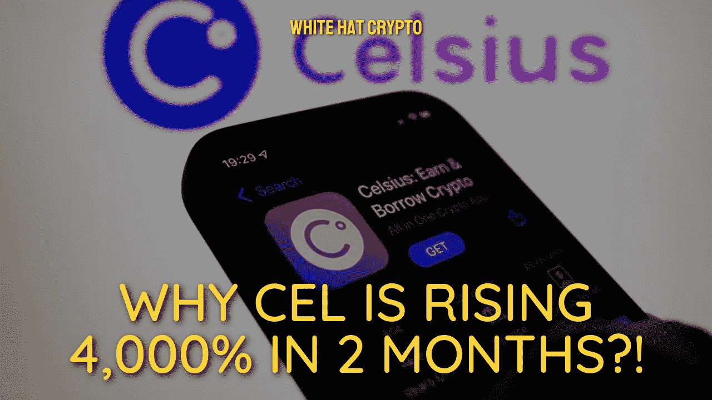

# 为什么 CEL 在 2 个月内涨了 4000%？！

> 原文：<https://medium.com/coinmonks/why-cel-is-rising-4-000-in-2-months-776c7f225e58?source=collection_archive---------34----------------------->

尽管 Celsius Network 已经破产，但 CEL token 还在继续上涨！

Celsius Network 的资产负债表显示有 12 亿美元的缺口，其中大部分债务都是欠用户的。再者，公司已经申请破产，所以前途未卜。

尽管如此，Celsius Network 的加密令牌 CEL 在过去两个月中已经上涨了 4，100%以上，从 6 月中旬的 0.093 美元的低点上涨到 8 月 13 日的约 3.93 美元。

相比之下，领先的加密货币比特币(BTC)和以太网(ETH)在同一时期分别上涨了 40%和 130%。

在这里，我将回顾一下最近上升的两个最可能的解释，然后简单讨论一下摄氏温度的下一步！

# 收购传闻:

从统计数据来看，价格飙升使 CEL 在 8 月初成为一枚被高估的硬币，当时其相对强度指数(RSI)升至 70 水平以上。

收购猜测似乎正在推动 CEL 的上升势头。值得注意的是，据路透社 8 月 10 日援引一位未透露姓名的消息人士称，Ripple 希望收购 Celsius Network 的资产。

消息传出后，CEL 的价格上涨了一倍多。

7 月，有传言称高盛计划以 20 亿美元左右的价格收购 Celsius Network。大约在那个时候，CEL 的交易价格只有 0.39 美元。

# 细胞短挤压:

在过去的两个月里，一大批交易员似乎也在推动加元大幅上涨。

为了最大限度地降低 CEL 的负面潜力，一些交易商已经形成了空头挤压。当一项资产的价格意外上涨时，就会出现卖空交易，迫使卖空者以更高的价格回购该资产，以完成他们的头寸。

由于 CEL 的流通供应量减少，主要由于 Celsius 网络令牌传输的冻结，短暂的紧缩是可行的。

令人惊讶的是，FTX 在 8 月 13 日拥有约 510 万 CEL 代币，几乎占总交易所流通量的 90%。与此同时，该交易所的未平仓头寸数量约为 266 万塞尔，而 8 月 11 日的月度高点为 296 万塞尔。

换句话说，仅在两天内，空头交易员就平仓了约 30 万份 CEL 头寸。

# CEL 的下一步是什么？

短暂的挤压很难持续很长时间，正如 T2 的历史所显示的。

这种预期使 CEL 在未来几周或几个月面临大幅下跌的危险。如前所述，令牌已经超买，这有助于熊市。

因此，在加入任何这样的涨潮之前，现在小心谨慎和消息灵通是至关重要的！

这篇文章中提供的内容不是赞助的，据我所知是正确的。这篇文章不是金融建议，我们不对针对这篇文章采取的任何行动负责！

请随时查看我们的社交平台，了解每日加密更新，或通过以下渠道联系我们:

[YouTube](https://www.youtube.com/channel/UCjfinzatswbVaRd89zn5kJQ/featured)

[推特](https://twitter.com/whitehatcrypto)

[Instagram](https://instagram.com/white.hatcrypto?igshid=YmMyMTA2M2Y=)

[Gmail](http://cryptowhitehat@gmail.com/)

信息来源:舒雅戈拉电讯报

> 交易新手？尝试[加密交易机器人](/coinmonks/crypto-trading-bot-c2ffce8acb2a)或[复制交易](/coinmonks/top-10-crypto-copy-trading-platforms-for-beginners-d0c37c7d698c)