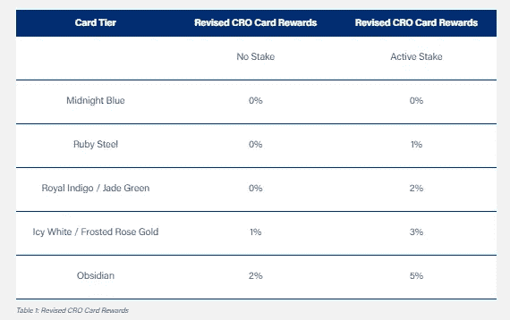
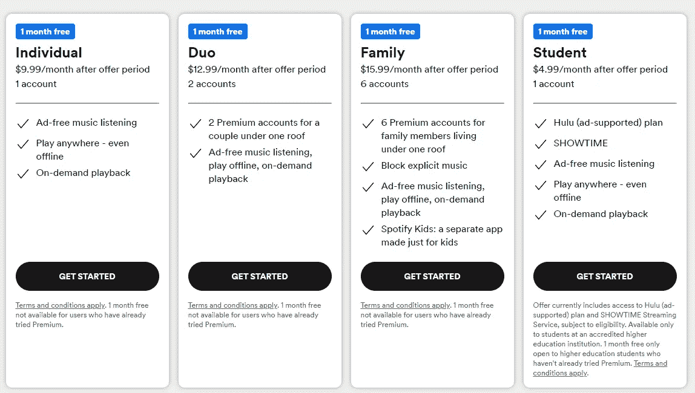

# 为什么 Crypto.com Visa 卡越来越差

> 原文：<https://medium.com/coinmonks/why-crypto-com-visa-cards-are-getting-worse-4407f0dba9b6?source=collection_archive---------3----------------------->

嘿，伙计们，如果你关注我有一段时间了，你会知道我已经剖析了 Crypto.com 的预付费 visa 卡几次了，但是当我在收件箱里看到这个时，我认为它值得再看一眼:

我一会儿将进入 10%的背景材料，但我认为最好做一个简短的纲要，说明是什么使 Crypto.com 的卡独一无二，以及我们在过去几个月中看到它们经历了哪些变化。

# 每张牌都有赌注要求，赌注的回报就是牌的好处

无论你想申请哪种等级卡，你都必须有最低的$CRO 赌注才能申请该卡。更具体地说，你必须把你的 CRO 美元放在“CRO 股份”中，而不是“CRO 收入”中通过 CRO 赢取，您可以从您的$CRO 中获得每年 6%的收益，而通过 CRO 赢取，您不会累积任何$CRO，相反，您的$CRO 赢取的收益等同于您有资格获得以下卡等级:

如果你从上图中注意到，当前的赌注要求都与法定货币挂钩，而不是$CRO，但这并不意味着如果$CRO 的价格迅速下降，你将自动失去当前等级的资格。假设在你承诺的时候你有足够的$CRO，你将被锁定在 6 个月的时间里，无论价格发生什么变化。

# 卡福利(他们没有削减的福利)

最初，用户可以赚取并积累$CRO，同时将它用于他们的卡层，但不幸的是，这些好处[在 5 月份被削减了。](https://crypto.com/product-news/crypto-com-visa-cards-update)同样，您可以从购买中获得的 CRO 美元奖励的百分比也显著降低，对于中低端产品，这些奖励要么有上限(红宝石 25 美元，靛蓝/翡翠 25 美元),要么全部削减:

保留的权益是订阅权益，包括以下内容:

我假设大多数读者不会考虑将 500，000 美元甚至 50，000 美元锁定在替代硬币中，因此出于我的分析目的，我甚至不会深入探讨黑曜石或玫瑰金/冰白色，但即使我浏览了中端的红宝石/翡翠-Ingo 卡，我认为很明显这些卡都没有以前那么有价值了。

那么让我们深入研究一下这些卡片，好吗？

# 红宝石钢

因此，假设我最大限度地发挥了红宝石钢卡的所有优势，并坚持使用一整年，我每个月将获得最多 25 美元的现金返还(实际上是$CRO ),或者一年内总计价值$300 的$CRO。为了每月获得价值 25 美元的 CRO，你需要每月花费大约 2500 美元，或者每年花费 30000 美元。

此外，[虽然这项优惠将于 2023 年 1 月 23 日](https://help.crypto.com/en/articles/2742447-crypto-com-visa-card-rewards-benefits)对用户取消，但你可以获得 Spotify 会员资格的报销——每月最高 13.99 美元，但我只会把它算作每月 12.99 美元，因为考虑到当前的定价选项(至少在美国)，这可能是你能获得的全部:

假设你获得了未来两个月的 Spotify 会员资格，这将节省 25.98 美元。

总之，对于价值约 30，000 美元的年度支出，现金返还/储蓄的神奇数字将是 325.98 美元(其中大部分在 CRO)，包括 400 美元的 CRO 锁定不赚取利息。

与许多[无年费的信用卡相比，你可以获得真正的(不依赖于一些替代硬币)2%的返现率](https://www.fidelity.com/cash-management/visa-signature-card)，每年花费 30，000 美元，你可以获得至少 600 美元的返现。因此，如果你持有红宝石钢卡，你将失去价值约 250 美元的返现。

# 皇家靛蓝/翡翠绿

再往上一层，持有价值 5000 美元的 CRO，皇家靛蓝/翡翠绿色持有者可以每月获得价值 50 美元的 CRO 现金返还，或每年 600 美元，每年总支出价值 3 万美元(每月 2500 美元)。除了从 Spotify 节省的价值 25.98 美元的费用，Indigo/Jade 持有者还将获得 2 个月的网飞(因为这也将于 2023 年 1 月到期)和一整年的休息室钥匙使用权。网飞最高报销额相当于每月 13.99 美元，或两个月 27.98 美元。贵宾室钥匙的使用有点棘手，因为我不认为你可以直接购买贵宾室钥匙会员资格，即使对于你可以购买的项目，你也会发现简单地开一张信用卡通常更有益。你可以通过一些大型年费卡获得无限制通行证和客人的休息室通行证，但对大多数人来说，更有意义的是开放 95 美元的年费[Hilton Surpass American Express](https://www.americanexpress.com/en-us/credit-cards/referral/prospect/personal/E27EA34E617E920A9A3376F169EE0BC440C8ACA40308FBF73AD8900CBF5BDBCD42F5FB1476008E14745AB6471DAE7D2673F501BE36D97281008FC056383469A4CE7B5B0F76F09012A05E6C556AAC2268BEA42553B29591751B20BD4F76026AF8036391720C73212993A987A3DD51F5CA8CFB648C3991689B01A6FD3AB85D21A499E3BA4DC74F667D2168A7B77A38E4459C4080DA1FA3AF21?CORID=J~A~M~E~S~K~L~k~p~l-1664571314752-451192455&GENCODE=349992952175915&extlink=US-MGM-USEFULLINKS-copypaste-1131-201279-GEWI%3A0001&mpt=v0&xl=cp19)，其中包括 10 次免费参观的优先通行证(我个人认为该计划比 Lounge Key 好得多)，以及 13 万积分的注册奖金。

总的来说，由于希尔顿的年费大约为 100 美元，我计算出优先通票的价格大约为 100 美元，因此 Indigo/Jade 总共节省了大约 753.96 美元的 CRO 费用。与普通的 2%返现卡挣 600 美元相比，这还不算太糟。

# 额外的“高达 10%的返现”优惠

通过所有不同的 Crypto.com 预付借记卡，他们宣布与 [Dosh](https://www.dosh.com/) 合作，在那里你可以在选择的商家赚取高达 10%的返现。这听起来可能很诱人，但我不明白的是，为什么你不干脆开一个免费的 Dosh 账户，用你链接的任何信用卡/借记卡来享受这些好处。据我所知，拥有这些返现奖励的唯一好处是，你不必开设一个单独的 Dosh 账户，因为它会自动与你的 Crypto.com 卡关联。此外，考虑到我们看到的$CRO 的价格波动，我更愿意购买菲亚特作为回报:

这种另类硬币定价引导我进入下一部分…

# 要考虑的其他因素

正如我之前提到的，如果你打算购买 Crypto.com 卡，而不是普通的 TradFi 借记卡/信用卡，我认为你必须考虑一些明显的缺点:

几个月前，我考虑购买价值 400 美元的$CRO，期待开通 Crypto.com 红宝石卡，只是为了 Spotify 的好处。然而，在那个时候，如果我以 0.4 美元一个代币的价格购买了价值 400 美元的 CRO，我的 400 美元投资现在将价值大约 170 美元，或者 0.17 美元一个代币。这意味着我的 Spotify 会员资格实际上每月要花费我将近 40 美元。

**机会成本损失:**如果我有价值 4000 美元的 USDC 被锁在像[迈达斯](https://midas.investments?p=0191)这样的平台上，我一年大概能赚 500 美元的利息。然而，如果我有价值 4000 美元的 CRO 赌注，我将一无所获。因此，我认为重要的是要考虑到，虽然 Crypto.com 为你提供了一些很酷的好处，如进入休息室——这些“酷”的好处是有成本的，大约至少价值 500 美元的利息，你本来可以赚取其他东西。

**TradFi 卡/支票账户有注册奖励，Crypto.com 没有:**对 crypto . com 的信用来说，技术上没有年费，但有大量的信用卡优惠可以提供价值 100 美元的里程/积分注册奖励。我认为 Crypto.com 卡的唯一安慰是没有年费。

# 上层卡片(即冰白色/玫瑰金/黑曜石)怎么样？

这些可能比红宝石/靛蓝/翡翠卡更划算，但是机会成本和价格波动因素应该被更多地权衡。同样，如果我有价值 500，000 美元的$USDC 而不是$CRO，我可以轻松地从一年的利息中获得 63，000 美元，如果是$CRO，500，000 美元可能会变成 212，500 美元。#rekt 如果你能在一个地方存下那么多钱，我会认真重新评估一下 Crypto.com 卡的额外福利值多少钱。或者换句话说，它们真的值 63000 美元吗？

# 结论

我真的不明白为什么像 Crypto.com 这样的大公司，拥有如此精明的营销人员，却不能生产出一种更有竞争力的产品，并与一些基本的 TradFi 产品保持一致。在简单的返现比较中，我认为 Jade/Indigo 这样的卡可能值得考虑，但我仍然觉得他们通过让潜在客户买入并锁定疯狂的$CRO 金额来吸引潜在客户。

公平地说，我确实使用 Crypto.com(不是他们的 Crypto.com 卡)，但我确实认为这是一个好产品，我认为他们通过使东西成为主流并易于公众获取，为密码行业做出了巨大贡献。但是对于他们的卡…我只是看不到它的价值。

如果你现在是 Crypto.com 预付借记卡持有人，并且你强烈反对我的分析，我很想听听你为什么选择 Crypto.com 而不是别的什么…真的是别的什么。你超级看好 Crypto.com 吗？你是马特·达蒙的超级粉丝吗？请在下面的评论中告诉我。

如果你以前没有使用过 Crypto.com，并且很想尝试一下，我建议不要通过任何人的推荐链接，因为通过[swagbucks.com](https://www.swagbucks.com/register?rb=10826501&cmp=72&cxid=1200-twitter)有更好的注册服务:

你所要做的就是购买任何至少 15 美元的加密货币，你就可以获得 3000 英镑，可以通过 paypal 兑现 30 美元。另外，如果你还不是 swagbucks 的会员，考虑使用我的推荐链接，你可以[通过注册](https://www.swagbucks.com/register?rb=10826501&cmp=72&cxid=1200-twitter)额外获得价值 10 美元的 swagbucks。

感谢阅读，请一如既往地在 twitter 上关注我，阅读我的所有最新发现和更新:【https://twitter.com/CryptosWith

声明:这些信息都不是财务建议，只是我在网上随便找的一个人的推测。请考虑这纯粹是教育和娱乐的目的。像往常一样，请做你自己的研究或联系财务顾问，找到什么投资可能最适合你。

> 交易新手？尝试[加密交易机器人](/coinmonks/crypto-trading-bot-c2ffce8acb2a)或[复制交易](/coinmonks/top-10-crypto-copy-trading-platforms-for-beginners-d0c37c7d698c)