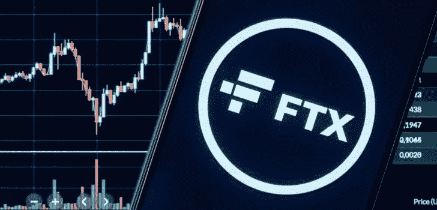
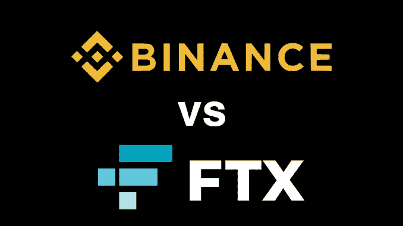

# 为什么密码市场下跌了？FTX 戏剧解释！

> 原文：<https://medium.com/coinmonks/why-crypto-market-went-down-the-ftx-drama-explained-3d5b7ae3d0b0?source=collection_archive---------2----------------------->

Image Source: Crypto Daily

随着 FTX 交易所最近发生的事件，加密世界已经完全陷入混乱。比特币和替代币的整体市场遭遇了平均超过 20%的价格暴跌，由于 FTX 是主要投资者，索拉纳币的价格在一天内暴跌了 45%。

FTX 是美国第二大加密交易所，由于其戏剧性的行动，它面临着流动性紧缩，它与币安的竞争导致了加密市场的可怕状态，使散户投资者遭受这一混乱。

但是是什么导致了如此戏剧性的市场崩溃呢？我分享一些见解，并简化我们正在见证的加密货币历史上最近的黑事件的案例。

## FTX 交易所的故事:

故事从阿尔梅达研究公司开始，该公司由山姆·班克曼·弗里德(Sam Bankman Fried)于 2017 年创立，是一家加密货币的自营交易公司。阿尔梅达公司通过买卖加密货币赚钱。

后来，为了扩大他们的商业兴趣和野心，Sam Bankman Fried 创办了 FTX 交易所，帮助零售客户和金融机构在加密交易中提供流动性。他们的商业模式侧重于通过促进加密交易和收取最低处理费来赚钱。那些在加密技术上下了大赌注的人得到了平均利率为 10%的贷款。

商业模式对他们有利，使 FTX 成为全美领先的密码交易所之一。为了促进其业务，FTX 推出了名为 **FTT、**的代币，承诺**提供优惠功能，如低息贷款保证金和手续费。**

> 如果对 FTT 令牌进行深入思考，那么它的用例存在于交换生态系统中，**缺乏** **内在价值，如通过其区块链**提供更广泛服务的密钥替代币。此外，FTT 被凭空创造并提供价值，这后来成为交易所崩溃的原因。

一切都在按照商业计划进行。从 2017 年开始，随着时间的推移，FTT 令牌在其 FTX 交易所为用户提供有吸引力的利益方面表现出良好的表现。此外，像其他替代硬币一样，FTT 有一个及时的硬币燃烧机制，创造了通缩供应，从而推动其价格上涨。

在整个时间表中，超过 80%的 FTT 代币股份由阿尔梅达研究和币安整体持有。由于阿尔梅达一开始就以低价拥有 FTT，较高的 FTT 价格后来增强了其资产负债表。

在拥有更多的钱的基础上，阿尔梅达借了更多的贷款，提供 FTT 代币作为抵押，这就是 FTX 和阿尔梅达交易所在后期开始出现混乱的地方！

## 戏剧开始的时候是这样的:

> FTX 崩溃的确切原因是复杂的，但许多加密社区的投资者相信 FTX 崩溃的几个关键原因。

你看，FTX 已经向客户提供贷款来交易加密货币。同样，阿尔梅达从 FTX 交易所和其他机构获得贷款，在这些机构中，阿尔梅达提供 FTT 代币作为抵押品。

> 据推测，FTX 交易所贷出的真正货币是客户存款。

另一方面，2019 年 12 月，FTX 和币安同意建立战略合作伙伴关系，开发加密货币，其中币安获得了 FTT 代币公司 20 亿美元的股份，用于投资 FTX。

随着加密行业监管压力的增加，人们认为 FTX 与币安分道扬镳，旨在在加密领域击败币安。

Image Source: Block-builders

在这场最终的较量中，FTX 交易所指控币安交易所首席执行官赵昌鹏(又名 CZ)和他的公司币安在市场上获得政府监管优势。另一方面，FTX 以用户验证的名义拒绝了密码世界 Defi 项目的想法，这遭到了整个密码社区的反对。

最后，当有人在 2022 年 11 月初泄露了阿尔梅达研究公司的资产负债表时，全球用户的泡沫破裂了。它显示欠 FTX 80 亿美元的债务，而且没有足够的流动现金储备。此外，对币安和 CZ 的指控加剧了交易所的竞争。

币安交易所出售并清算了 FTT 代币的主要股份，为了稳定 FTT 的崩溃价格，FTX 出售了资产负债表上的大量资产，包括索拉纳、以太坊和 USDT 储备。

> **他们报道了**——“截至 6 月 30 日，公司资产达 146 亿美元。其最大的单一资产:36.6 亿美元的“解锁 FTT”。“会计分类账资产端的第三大分录？价值 21.6 亿美元的“FTT 抵押品”。
> 
> 在其 80 亿美元的负债中，还有更多 FTX 代币:2.92 亿美元的“锁定 FTT”(负债主要是 74 亿美元的贷款。)"
> 
> 他们说——阿拉米达必须向他们的贷款人支付 80 亿美元。但是大部分资产都在 FTT——其价值可能会迅速下跌。如果它的价值真的下跌，那么阿拉米达将会和 FTX 一起陷入困境。

目睹这一幕，投资者要求撤回资金。由于 FTX 没有足够的真金白银来偿还，它在压力下崩溃了。

## 要吸取的教训:

保护客户的钱应该是任何密码交易所的首要责任。它不应该被滥用，当突然撤资发生时，必须有实物资产支持。

由于 Almeda 的资产负债表中 FTT 代币的比例高于真实货币，在偿还客户和交易所债务时，它无法一次付清，这是风险管理不善的一个例子。

作为一个加密投资者，任何交易所都必须有真实的资金和储备证明作为支持，正如币安所说，该国目前正在努力提高加密领域的透明度。

> 在那之前，[安全投资](/coinmonks/cryptocurrency-secrets-for-happy-trading-and-investment-knowing-the-mindset-74b48300d416),了解你正在考虑或计划投资的交易所，以获得秘密利润。

 [## Prajwal Barate -培养基

### 阅读 Prajwal Barate 在媒体上的文章。学生、山地自行车手、加密货币分析师和有抱负的内容…

medium.com](/@barateprajwal25) 

> *感谢您阅读这篇文章，更多更新和见解，请点击上面的链接关注我的个人资料，并为下面的努力鼓掌。*
> 
> 交易新手？试试[密码交易机器人](/coinmonks/crypto-trading-bot-c2ffce8acb2a)或[复制交易](/coinmonks/top-10-crypto-copy-trading-platforms-for-beginners-d0c37c7d698c)