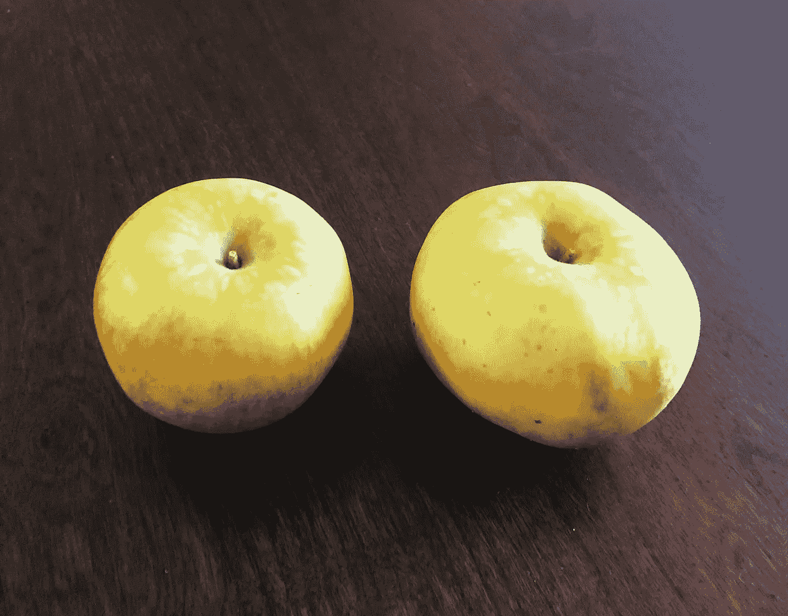

# 为什么密码不是证券(第一部分)

> 原文：<https://medium.com/coinmonks/why-cryptos-are-not-securities-part-1-9371339eeaf5?source=collection_archive---------21----------------------->

让我们把密码比作一蒲式耳的苹果。

如果我种了一些苹果(即软件开发人员),我以 100 美元的价格向你赠送或出售一蒲式耳的苹果(加密货币),并为自己保留一些，我们每个人都有一些我种的苹果。其他苹果所有者可能是交易、购买或接受我的多汁美味苹果的人。

现在，你选择吃，卖，保留，扔掉，变成苹果酱，无论什么，你拥有的那些苹果。这不关我的事，也不应该关任何人的事。我回到我的苹果园，继续改良它，杂交一些树让苹果更甜，灌溉果园，施肥，清洗和抛光我已经摘下的苹果，无论我选择做什么。

你知道我是一个很好的种植者(即开发者)，你会想，嘿，如果 Rob 不断改进这些苹果，也许有一天有人会因为怀旧或者我的苹果有多棒的消息已经传出，或者出于其他任何原因，愿意付给我比我支付的更多的钱。

底线是你只会有一蒲式耳的苹果。不多不少。苹果的数量并没有奇迹般地增加。一蒲式耳=一蒲式耳。没有收获的期望，也没有承诺，因为这只是一蒲式耳的无生命物体。他们不能自我欣赏。如果他们对法定货币升值，那就不在我们的控制之内，也无关紧要。

如果美元对那蒲式耳苹果贬值怎么办？如果你现在能以 200 美元的价格出售它们会怎么样？嗯，从技术上讲，如果你以 200 美元出售它们，你将获得 100 美元的应税收益。好吧。但是我们之间有投资合同吗？那一蒲式耳的苹果怎么会产生现金流呢？分红？苹果数量的增加？什么样的协议被给出或者甚至暗示苹果会值更多的钱？对于你所拥有的任何东西，如果美元相对于该资产或物品正在贬值，这不是一些隐藏的“投资合同”在使你购买的完全相同数量的“任何东西”以美元计算升值。

那些苹果并不代表我的果园(即开发团队)的所有权。他们没有预期或盈利能力。此外，它们本身并没有创造价值，即使你今天可以把它们卖得更高。美元相对于一蒲式耳苹果的价值可能已经下跌，因此你和市场会对同样的一蒲式耳要求更多的美元。我把这归咎于美国政府，以及他们挥霍无度的支出和货币创造，因为任何特定的东西在未来都会比他们的法定货币更值钱。

也许苹果的法定货币价值有明显的升值，但这仅仅意味着美元对你的商品在贬值。你仍然只有一蒲式耳苹果。它只是一个无生命的物体，它的 DNA 中包含了一组属性。

这篇文章是关于大多数一般加密的。密码可以被专门设计成像证券一样运作，或者在数字区块链上代表现有的证券，但那是另一回事。我将不得不把它分成几部分来写，因为这是一个非常简单的概念，但同时也会变得非常复杂和令人困惑。简单地说，密码，因为大多数是发行和交换的，不是证券。一旦这个生态系统发展到你永远无法进出法定货币系统的地步，它将变得非常明显，加密货币从来都不是证券，除非被隐含地设计成一种证券。接下来还有更多。

> 交易新手？试试[加密交易机器人](/coinmonks/crypto-trading-bot-c2ffce8acb2a)或者[复制交易](/coinmonks/top-10-crypto-copy-trading-platforms-for-beginners-d0c37c7d698c)