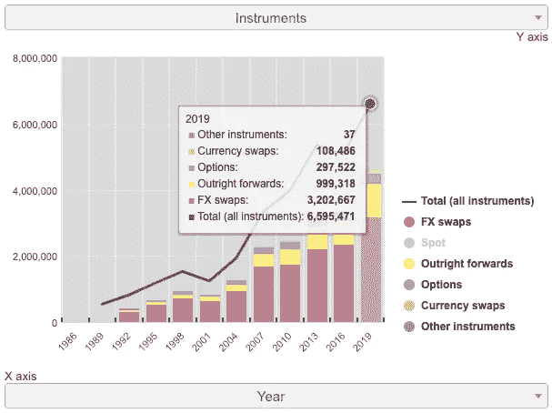
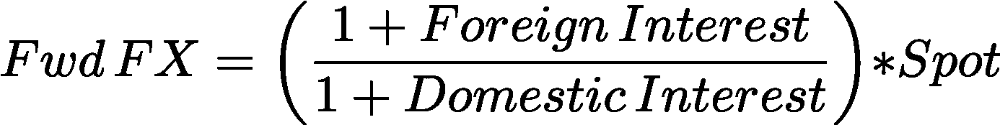

# 为什么货币远期市场很重要？

> 原文：<https://medium.com/coinmonks/why-currency-forward-market-is-important-68b0fe41f79?source=collection_archive---------23----------------------->

## 来自前高盛外汇和衍生品交易员的观点

我在高盛做了 14 年的外汇期货和衍生品交易员，在加入担保金融之前，我在对冲基金做了 3 年的投资组合经理。我想分享我对外汇对冲市场的必要性及其运作方式的看法。

# 每天有超过 4，600 亿美元的货币对冲产品交易

如果你从未在传统金融公司工作过，你可能不知道它是如何运作的，也不知道为什么拥有‘货币对冲市场’如此重要。事实上，这个市场的规模是如此巨大。根据国际清算银行三年期报告，2019 年 4 月外汇掉期、直接远期、期权和货币掉期的日均交易量超过 46，000 亿美元，这些都是典型的远期对冲工具。该报告还显示，自 2004 年以来，交易量增长了两倍多。

[Global FX market turnover from BIS report 2019](https://www.bis.org/statistics/rpfx19.htm)

## 是什么推动了如此巨大的交易量？

我们生活在一个满足的时代，这个无国界的世界充斥着商品和服务。跨国公司通过利用国家间不同的劳动力、资源和融资成本在其他地方提供产品。这些都有助于丰富人们的生活。

例如，丰田 2021 年在全球销售了 1050 万辆汽车，其中 80%在日本以外。然而，丰田不能以他们获得的货币保留收益，因为他们向股东支付股息，并以当地货币日元发布收益报告。

这些全球性的大公司不希望有货币波动风险，所以他们及时兑换回他们的基础货币。这就是对冲需求迅速增加的原因。

## 什么是“外汇远期”？

根据来自国际互换和衍生产品协会(ISDA)的一篇[论文](https://www.isda.org/a/O2EDE/redline-fx.pdf#:~:text=One%20of%20the%20most%20common,specified%20date%20in%20the%20future.)，外汇远期合约(“FX Forward”)是**一份以交易日设定的汇率购买一种货币并交割另一种货币的协议，用于在未来某个特定日期**进行结算。你可以用这份合同对冲你未来的现金流。例如，丰田有下个月在美国的销售预测，他们可以使用远期外汇，根据当前的理论价格，在一个月内卖出美元兑日元的合约。

Photo by [PiggyBank](https://unsplash.com/@piggybank?utm_source=medium&utm_medium=referral) on [Unsplash](https://unsplash.com?utm_source=medium&utm_medium=referral)

## 我如何获得“远期外汇”的理论汇率？

期货外汇的理论汇率是如何确定的？这取决于无套利定价理论。未来的汇率将代表在相同的经济条件下你选择的任何一种货币。

例如，您有 100 美元或 13，000 日元，当前美元日元即期汇率为 1 美元= 130 日元，而 1 年期美元利率为 3%，日元利率为 0%。1y 之后，因为可以赚取每种货币的利率，所以会有 103 美元和 13000 日元。因此，1y 外汇远期价格将被设定为 13，000/103 ≒126.21，作为您可以在即期汇率为 130.00 时买入或卖出的理论汇率。

这显然取决于即期外汇价格，但更重要的因素将是两国之间的利率差异。

## 为什么重要？

由于真实的经济需求和投机，货币市场每天都在波动。当我们将当前价格与一年前相比时，美元兑日元可能会波动 20%以上。如果你没有对冲任何东西，在转换成你自己的货币后，你可能会获得额外的 20%以实现总收益的 120%或损失部分销售的 80%。预测外汇走向并不容易，因此在全球经营或投资海外的公司倾向于至少部分对冲其货币风险。“外汇远期”是货币对冲的常用产品之一，因此交易需求保持快速增长。

最后，对冲或未对冲的外汇风险是个人观点，但了解并拥有对冲工具来保护您的资产是有益的。

加密货币的波动性要大得多，拥有对冲工具甚至更为关键。在下一篇文章中，我将介绍在加密中对冲货币风险的方法，再见。

关注我们
[**网站**](https://secured-finance.com/) **|** [**推特**](https://twitter.com/financesecured) **|** [**不和**](https://discord.gg/Rs72HJSFJg) **|** [**电报**](https://t.me/securedfinance)**|**[**Github****|**](https://github.com/Secured-Finance)[**Docs**](https://github.com/Secured-Finance/secured-finance-docs/tree/master/basics)

> 交易新手？尝试[加密交易机器人](/coinmonks/crypto-trading-bot-c2ffce8acb2a)或[复制交易](/coinmonks/top-10-crypto-copy-trading-platforms-for-beginners-d0c37c7d698c)