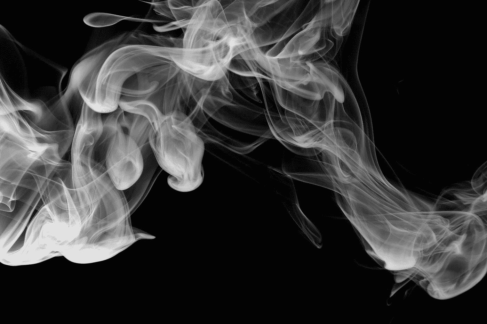

# 为什么德菲在抽烟

> 原文：<https://medium.com/coinmonks/why-defi-is-smoking-49376b5c7a17?source=collection_archive---------17----------------------->

Photo by [Pascal Meier](https://unsplash.com/@zhpix?utm_source=medium&utm_medium=referral) on [Unsplash](https://unsplash.com?utm_source=medium&utm_medium=referral)

债券触及 4%，而 Defi 触及 0.01%！那么为什么 Defi 不再工作了呢？

为了吸引更多的资金投入资金池，无论是债券还是 Defi，你都需要找到其他投资，这些投资可以提供比你支付给投资者的回报更多的回报。

Defi 曾经是成功的，因为加密市场似乎无限上升到月球。