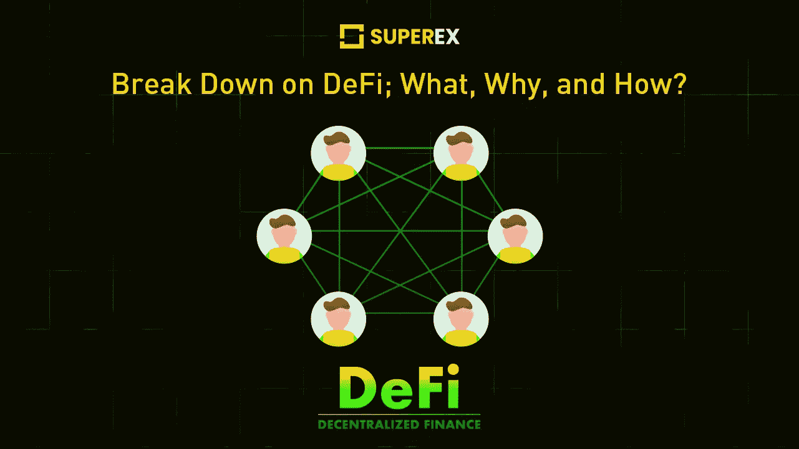

# 为什么 DeFi 在密码行业中脱颖而出？

> 原文：<https://medium.com/coinmonks/why-defi-stands-out-in-the-crypto-industry-284d5c94a50f?source=collection_archive---------12----------------------->

www.superex.com

DeFi 代表分散金融。分散金融或 DeFi 是一种金融系统，它通过消除中介来重新想象金融交易，并基于区块链技术，通常是以太坊。【DeFi 的“智能合约”可在特定条件下执行各种金融交易。

**有了 DeFi，你可以做银行支持的大部分事情——赚取利息、借款、贷款、购买保险、交易衍生品、交易资产等等——但它更快，不需要文书工作或第三方。**它具有加密、点对点(直接来自两个人，而不是来自一个集中的系统)、匿名、对所有人开放的性质。

**DeFi 采用了加密的基本前提，创造了华尔街的整个数字替代方案。然而，为金融集团节省了所有相关成本。** DeFi 有潜力创造更加开放、开放和公平的金融市场。任何有互联网连接的人都可以连接到它。

打开:你不需要涂抹任何东西。你可以在钱包里找到它。

**化名**:不需要提供任何个人信息。

**灵活**:你可以随时随地移动你的资产，不需要征得同意，也不需要排很长的队。

**快:**利率会及时更新，回报率会非常高。

**透明:**交易记录完全可访问。私营企业很少允许这种情况发生。

## 它是如何工作的？

用户通常通过 Dapps，即分散式应用程序来参与 DeFi，其中大部分运行在以太坊区块链上。与传统银行不同，用户不必填写表格或开立账户。

**出借:**用户可以借出他们的密码来获得利息和每分钟的奖励。

**获得贷款:**不填表获得贷款，包括传统金融不包括的“闪贷”。

**交易:**在没有任何中介的情况下进行点对点的密码交易。

**为未来储蓄:**将密码存入你的账户以获得利息。

**购买衍生品:**押注于多头或空头加密资产。

## 缺点是什么？

以太坊区块链不断波动的交易利率意味着活跃的交易会变得昂贵。

根据您使用的应用程序，您可能会经历高波动性。

出于税务目的，您必须保留您的记录。各地的规定可能有所不同。

更多密码相关内容、市场分析、superex 更新，请转到 medium 页面。( [**【你的故事】【medium.com】**](/me/stories/drafts)**)**它会以不同的内容迎合你每周的隐秘品味；你将能够阅读文章写得简洁，充满了加密更新。学习密码，掌握未来金融知识。

[www.superex.com](http://www.superex.com/)

**SuperEx 是第一个拥有完整 DAO 社区治理的分散式加密交易所。SuperEX crypto exchange 在其交易区拥有数千个代币，使用户能够进行从现货到杠杆和衍生品的不同交易。没有 KYC 条款是超级交易所的焦点，它对用户资产进行终极保护和严密防御。该交易所在建立其高清钱包的发展过程中取得了指数级的突破，这保证了加密服务的轻松访问和分散安全性。超级链预计将于 2022 年第三季度推出，将 ET 令牌迁移到其链中。**

为了与项目方和应用服务保持密切联系，我们建议用户访问 SuperEx [**官方页面**](http://superex.com/) 。新的空投活动，项目后续，相关的加密新闻，以及伙伴间的讨论欢迎在官方 [**电报群**](https://t.me/SuperExOfficial) 中。在**接收商务邮件、合作建议、问题报告。用户可以进入**[**官方 Twitter 页面**](https://twitter.com/SuperExet) 查看最近上市的代币和不同的空投活动或后续营销公告。****

> ****加入 Coinmonks [电报频道](https://t.me/coincodecap)和 [Youtube 频道](https://www.youtube.com/c/coinmonks/videos)获取每日[加密新闻](http://coincodecap.com/)****

# ****另外，阅读****

*   ****[如何购买 Monero](https://coincodecap.com/buy-monero) | [IDEX 评论](https://coincodecap.com/idex-review) | [BitKan 交易机器人](https://coincodecap.com/bitkan-trading-bot)****
*   ****[CoinDCX 评论](/coinmonks/coindcx-review-8444db3621a2) | [加密保证金交易交易所](https://coincodecap.com/crypto-margin-trading-exchanges)****
*   ****[红狗赌场评论](https://coincodecap.com/red-dog-casino-review) | [Swyftx 评论](https://coincodecap.com/swyftx-review) | [CoinGate 评论](https://coincodecap.com/coingate-review)****
*   ****[Bookmap 评论](https://coincodecap.com/bookmap-review-2021-best-trading-software) | [美国 5 大最佳加密交易所](https://coincodecap.com/crypto-exchange-usa)****
*   ****[如何在 FTX 交易所交易期货](https://coincodecap.com/ftx-futures-trading) | [OKEx vs 币安](https://coincodecap.com/okex-vs-binance)****