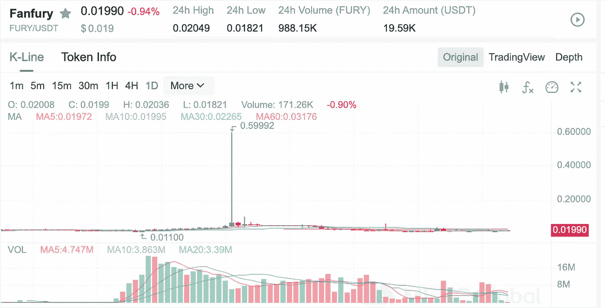
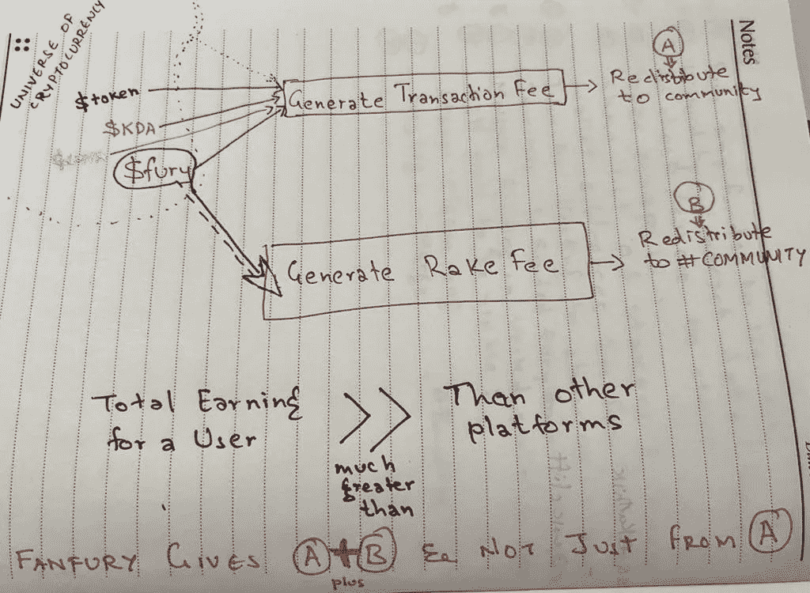

# 我为什么选择# HODL $弗瑞？

> 原文：<https://medium.com/coinmonks/why-did-i-choose-to-hodl-fury-2ca8c268414d?source=collection_archive---------34----------------------->

项目 [Fanfury](http://app.fury.fan) (之前被称为 crypto11)在区块链上有一个简单但不存在的日常幻想应用。Fanfury Dapp 虽然不是游戏行业中最好的，但肯定是最令人期待的。

该项目在 2022 年第一季度从零到百万美元的公开募集资金。同年第二季度(随着 UST 的崩溃)，该指数也跌至低点。

然而，他们本月宣布推出 Juno 系列，这令人难以置信。虽然[价格](https://www.mexc.com/exchange/FURY_USDT)已经是 2022 年 5 月 forge 活动中公开报价的 50%。

如果你仔细观察过$fury 是一个在其平台上有 100%效用的东西。这种效用的范围可以从拥有一个粉丝俱乐部到下赌注到购买 NFT 等等。它还有一个以稳定货币形式产生平台费用的机制。

这些收益在下图中被描述为“A”和“B”。然而，我看到大多数代币只是根据其税收/平台费用的收取来分配利润。在 Fanfury 这里，通过参与赌注或俱乐部所有权向系统提供流动性以获得更多$fury 的持有人有额外的好处。

我不确定 APR/APY，但我确定的是，如果该平台有每日活跃用户，那么在当前的市场趋势中，肯定没有更好的 APR 提供平台。

## 声明:这是作者的观点，与项目没有直接或间接的联系。这个信息是一个 NFA。

> 交易新手？试试[密码交易机器人](/coinmonks/crypto-trading-bot-c2ffce8acb2a)或[复制交易](/coinmonks/top-10-crypto-copy-trading-platforms-for-beginners-d0c37c7d698c)