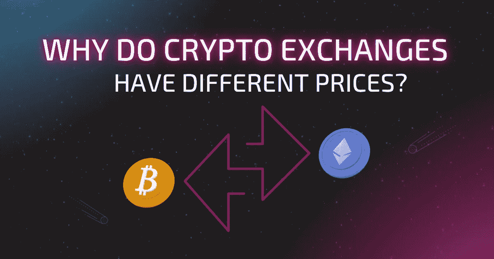

# 为什么加密交换有不同的价格？

> 原文：<https://medium.com/coinmonks/why-do-crypto-exchanges-have-different-prices-a78fe3283f74?source=collection_archive---------22----------------------->

为什么加密交换有不同的价格？这是大多数密码爱好者经常问自己的一个问题。大多数人认为价格差异是由于快速的加密货币运动。它解释了为什么不同交易所的某些资产成本不同。在这篇文章中，我们将讨论为什么密码交易所有不同的价格，以及如何利用你的优势。

# 主要原因

## 资产流动性

流动性是交易所的一个重要因素。为了维持和平衡基础设施和行政责任，交易所必须相当活跃。交易者总是被交易所所吸引，因为在那里他们可以得到高效快捷的服务。

当一个人由于缺乏流动性而导致订单延迟时，这是非常令人沮丧的。因此，交易所中特定代币的需求和供给水平对买卖价格起着重要作用。买价和卖价的差额就是价差，因此，流动性越高，价差越低，价格也就越低。

## 分散

就像比特币一样，个人的 altcoins 也有一个单一的网络。没有受管制的或集中的定价系统。不同交易所的比特币价格是基于供求关系的经济和交易因素。

对于交易所来说，这些因素可能会随时变化，尽管变化总是在给定的范围内。这解释了为什么你总是会听到交易者谈论特定加密货币的平均价格。

## 交易成本

目前，在密码行业中有几个交易所，参与者总是参与交易所间的交易。交易总是伴随着费用，有时费用会很高，这取决于交易的水平和金额。

这种情况确实给交易所带来了财务负担，必须以某种方式加以平衡。目前最理想的方法是将成本分摊到产品定价中。

## 交易量

在大多数情况下，交易量是有限的，因为所有被开采的硬币都有网上交易所的报价，这些报价只占被开采的硬币总数的一小部分。

人们从来没有充分利用套利。不同交易所的加密货币价格是基于交易的，从来没有一个既定的定价方法，因此，没有人知道货币的成本。

成本通常在一个人愿意交易的价格和另一个人为了得到同样的货币愿意放弃的价格之间进行平衡。当价格的上限和下限被确定后，价格的交易就发生在两个人之间。价格是在那之后决定的。

# 我可以利用密码交易所的价格差异吗？

可以肯定的是，你永远不会花那么长时间去发现，利用两个交易对之间的加密交换价格差异是一个财务上可行的想法。这就是我们所说的套利，有几个人每天都在不同的市场上这样做来赚钱。

在任何给定的时间，不同平台上的特定资产之间有时会有几美分甚至更多的秘密差价。然而，在大多数情况下，由于交易量较低，低价值资产往往具有较大的价格波动，这一点值得注意。

要达成这样的交易，网上有几个工具可以帮你实现。当你查看不同的加密货币聚合网站时，在大多数情况下，他们会在交易所部分为你列出数据。

每一枚代币或硬币都将有交易所，它当前在列表中交易，条目旁边将是当前交易量和该资产上次在平台上交易的成本。

你可以在一个交易所以较低的价格购买密码，然后在较高价格的市场上转手获利。但是，大多数情况下，利润会很少。每个代币你只会赚几分钱，但主要的想法是为交易做足够的工作，以确保它们增值。

说起来容易，做起来难，因为其他几个人也在寻找这些交易。这将意味着抛硬币的机会非常小，除非你想帮助他们更长的时间。在一些传输速度慢的交易所，这可能有点棘手。当你确认用你的钱购买硬币时，很有可能其他人已经把它们拿走了。

在这里，速度是游戏的名称，如果你有兴趣玩套利游戏，你必须花一些时间来学习如何选择伟大的交易，并确保你总是在正确的时间在正确的地方好好利用它们。

这是由你作为一个投资者来决定是否值得你花时间的方法，虽然它总是一种可能性。当你喜欢观察市场上的便宜货时，这将是给自己赚点小钱的好方法。

然而，当你不喜欢看交易信息时，这将总是一个令人筋疲力尽的努力，在这种情况下，你可能会对购买和持有一些硬币感兴趣，并忘记整个混乱。不是每个人都能利用密码交易所的价格差异。

# 结论

为了得到最好的加密交易所价格，强烈建议你总是看不同的交易所。你应该在购买任何加密货币之前这样做。有了这个，你就可以一直确保为资产支付公平的市场价值，而不是虚高的价格。如果你想学习如何有效地处理交易的这一重要方面，就从这本关于[寻找最佳加密货币交易所](https://swapzone.io/learn/how-to-find-the-best-crypto-exchange)的好书开始吧。

> 交易新手？试试[密码交易机器人](/coinmonks/crypto-trading-bot-c2ffce8acb2a)或者[复制交易](/coinmonks/top-10-crypto-copy-trading-platforms-for-beginners-d0c37c7d698c)