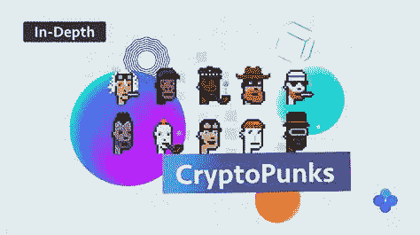

# 为什么密码朋克 NFT 这么贵？

> 原文：<https://medium.com/coinmonks/why-do-cryptopunks-nft-cost-so-much-a48db6b769d6?source=collection_archive---------9----------------------->

Source photo [CryptoPunks — Search Images (bing.com)](https://www.bing.com/images/search?view=detailV2&ccid=I4IqlakF&id=64B7337D79E23FE60E525FF853D15B297AB791D9&thid=OIP.I4IqlakFycir31TARr0DowHaEJ&mediaurl=https%3a%2f%2frootzones.net%2fwp-content%2fuploads%2f2021%2f07%2fCryptoPunks.png&cdnurl=https%3a%2f%2fth.bing.com%2fth%2fid%2fR.23822a95a905c9c8abdf54c046bd03a3%3frik%3d2ZG3eilb0VP4Xw%26pid%3dImgRaw%26r%3d0&exph=895&expw=1600&q=CryptoPunks&simid=607999676948185073&FORM=IRPRST&ck=CFC798A56E43DC259053A9718120170A&selectedIndex=9&ajaxhist=0&ajaxserp=0)

## 什么是加密朋克？

为了理解 NFT，我们必须首先定义它们。术语“不可替换的令牌”(NFT)指的是附加到文件上的信息，它充当独一无二的签名。它可以是图片、文件、歌曲、推文、网站上的一段文字、实物或任何其他数字表示形式。