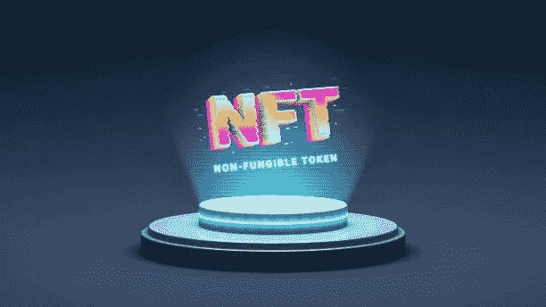

# NFT 为什么要实现区块链技术？

> 原文：<https://medium.com/coinmonks/why-do-nfts-implement-blockchain-technology-3d5814e25108?source=collection_archive---------41----------------------->

当谈到 NFT 时，它们要么被视为一件艺术品，要么只是电脑屏幕上的一个图像。如果只是 JPEG 格式，为什么 NFT 要用区块链的技术？

真实性、所有权和智能合同集成都可以在 NFTs 中使用区块链技术进行验证。如果没有区块链，NFTs 就不会存在。作为一个数字分布的、去中心化的公共分类账，区块链是 NFTs 的天然选择。

出于同样的原因，无论在不同的区块链上使用什么样的智能合同，NFT 都需要区块链技术。

> 交易新手？试试[加密交易机器人](/coinmonks/crypto-trading-bot-c2ffce8acb2a)或者[复制交易](/coinmonks/top-10-crypto-copy-trading-platforms-for-beginners-d0c37c7d698c)

# NFTs 是如何工作的？

区块链技术是不可替代令牌的基础，这种令牌通常被称为 NFT。这些虚拟表示代表游戏、艺术品、收藏品等资产。由于它们独一无二的特性，它们只能被拥有一次。每笔投资、交易和交易都需要在线验证和认证。因此，它提供了高度的安全性和可靠性。

现实世界中没有与你做生意所用的 NFT 等同的东西。NFT 没有实物价值，所以你只能得到一张所有权证书作为补偿。这是一个巨大的优势，因为没有人能以任何方式改变数据。此外，证书必须保存在安全的数字位置，以备将来使用。

当购买在线活动门票、游戏或服装时，NFT 就派上了用场。此外，他们遵守为交易和交换智能合约而建立的规范和准则。另一方面，NFT 在一些国家还不合法，但是我们将很快了解到管理它们的新立法。爱好者将因此被鼓励参与 NFT 交易。区块链是所有这些服务的底层技术，也是 NFT 背后的驱动力。

# NFT 为什么要利用区块链？

在数字时代，区块链是一个分散的公共账本，分布在许多计算机上。如果你有上网的态度，你就不会把握 NFTs。因此，您需要理解区块链技术是如何与 NFTs 结合使用的。让我更详细地解释这些术语，以提供一个完整的视角。

当我们谈到数字分销(区块链)时，我们指的是通过数字分销平台管理的材料交付或交易。

“分散”一词指的是一家公司不控制任何事情(区块链)，例如谷歌的情况就是如此。另一方面，区块链依赖于由许多个人而不是单个实体支持的分布式网络。这让我们想到了下一个问题:如果谷歌的平台今天因为某种原因关闭，我们都将无法访问它。

记录在公共分类账中的账户和交易对任何进入该系统的人都是可用的。在私人分类账中，只有你有权查看你的交易细节和账号。另一方面，区块链对公众开放。你的交易将提供给我，我将能够检查你有什么资产，以及它们是如何转移给其他人的。公众可以使用这种公开的分类账在透明的网络中进行交易。

因为 NFT 反映、验证和证明其他资产的所有权，所以它们位于区块链。这是因为它们是独一无二的数字令牌。

你知道，区块链赋予了 NFT 力量。在 NFT，它是驱动力。如果在网上可以看到，非专利技术可能很容易被截屏，无法确认其合法性或证明其所有权。当使用区块链技术时，可以确定谁是 NFT 的所有者，以及谁是最初生成它的人，以及它从一开始就在谁之间转移。在 NFTs 中使用区块链技术就是这一事实的结果。

# NFTs 的意义是什么？

不可替代的代币(NFT)在加密货币用户和企业中获得了很大的吸引力，因为它们改变了游戏和收藏品行业。自 2017 年 6 月以来，已有 250 亿美元用于 NFT，另有 210 亿美元来自二级销售。

NFT 允许游戏玩家和收藏家成为游戏中物品和其他独一无二的资产的永久所有者，并能够在虚拟世界中建造和货币化设施，如赌场和主题公园。这对游戏和收藏社区来说是一个激动人心的新领域。

在二级市场上，玩家还可以转售他们通过游戏收集的数字对象，如服装、头像和游戏内货币。直接向国际观众销售数字作品，而不是通过拍卖行或画廊，可以让艺术家保持可观的销售收入。

当一件数字艺术作品售出时，艺术家会得到一定比例的销售价格，这笔钱可以嵌入作品本身。

2020 年，因在《星际迷航》中扮演柯克船长而闻名的威廉·夏特纳推出了数字收藏品业务，并在蜡像区块链上发行了 9 万张数字卡片。每转卖一张卡，都会给沙特纳带来被动版税，沙特纳最初以每张 1 美元的价格出售这些卡。

# NFTs 有什么特别的？

资产的价格受供给和需求的影响，就像任何其他商品一样。人们愿意花大价钱购买 NFTs，因为它们很稀有，而且游戏玩家、收藏家和投资者对它们的需求很大。

有一些 NFT 能够让他们的主人发大财。例如，分散土地虚拟土地平台的一个用户决定购买 64 块地产，并将它们合并成一个地产。它被称为“Satoshi 茶园的秘密”,仅仅因为它吸引人的位置和道路交通就卖了 8 万美元。

另一位 F1 Delta Time 投资者支付了 222，000 美元购买了数字摩纳哥赛道的一部分。如果你拥有一个由 NFT 代表的数字赛道，你有权从那里举行的所有比赛中获得 5%的收益，包括注册费。

# 底线

NFT 在未来可能会有广泛的有用应用，但目前，它们主要用于[数字艺术](https://tech.eimanbj.com/the-most-effective-tools-for-artists-to-use-in-the-creation-of-nfts/)。

真实性、所有权和智能合同集成都可以在 NFTs 中使用区块链技术进行验证。如果没有区块链，NFTs 就不会存在。作为一个数字分布的、去中心化的公共分类账，区块链是 NFTs 的天然选择。