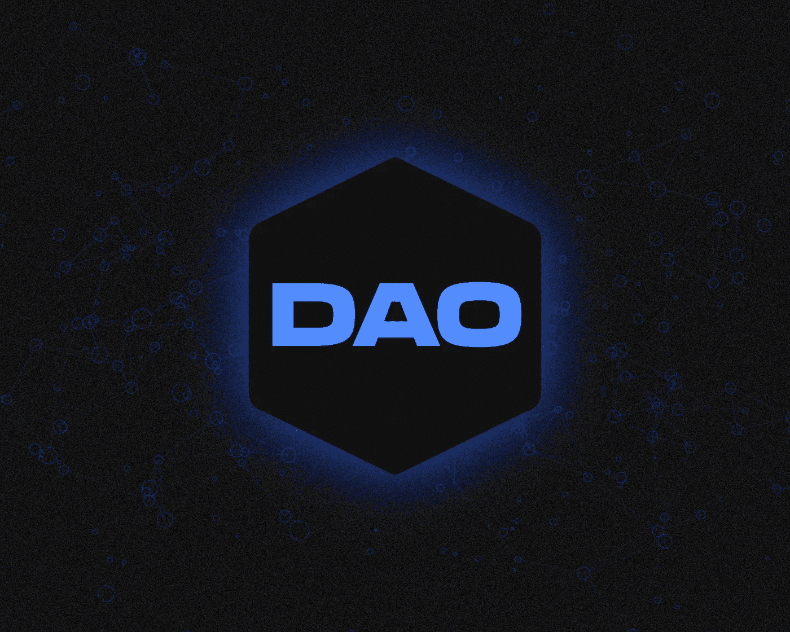
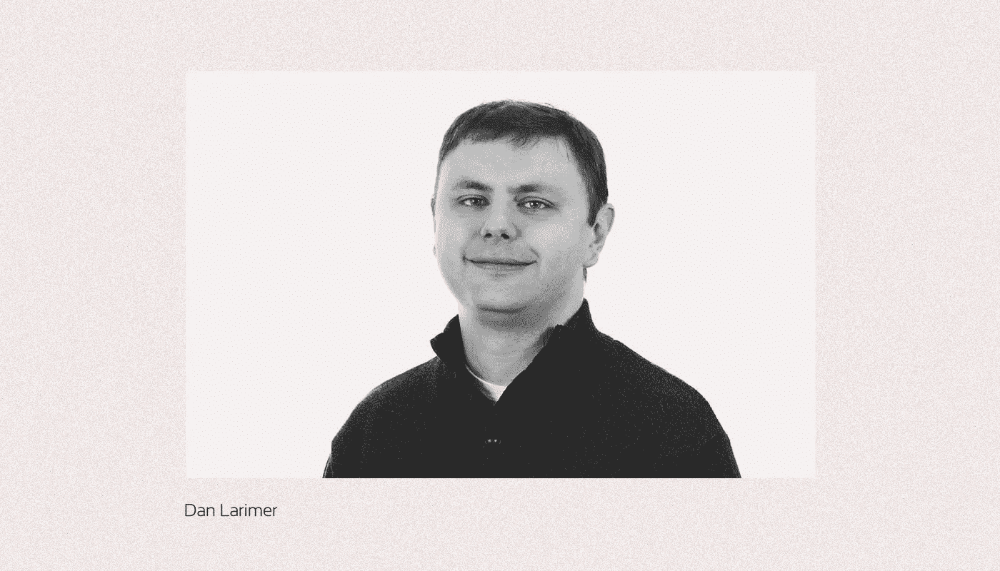
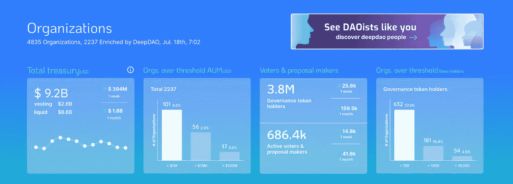
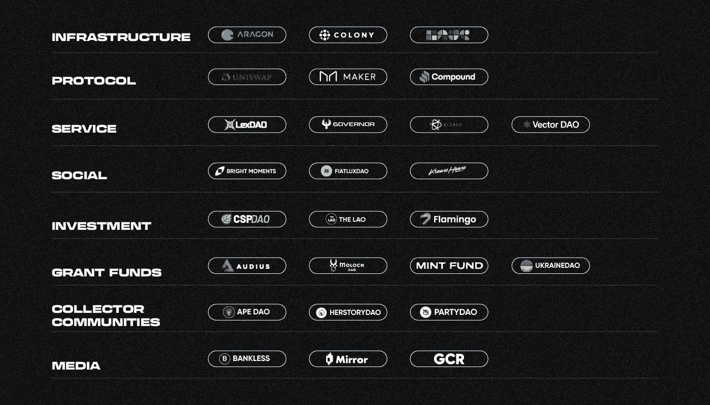
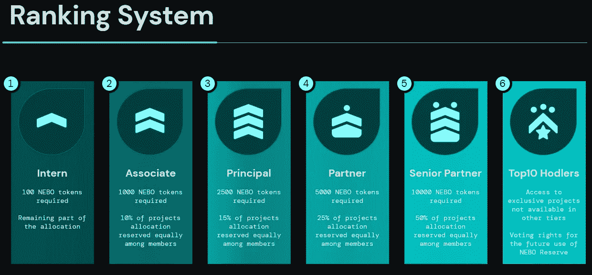
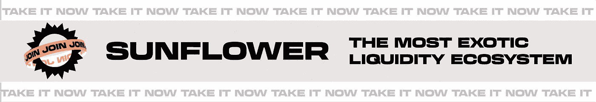

# 我们为什么需要刀？

> 原文：<https://medium.com/coinmonks/why-do-we-need-dao-971ca7b6e6d1?source=collection_archive---------23----------------------->

***DAO 是一个分散的自治组织，使用智能合约进行管理。你想知道人们为什么创造刀吗？让我们来了解一下！***

智能合同负责投票、财务管理和工作流组织的功能。

越来越多的加密货币社区对此类结构感兴趣。几乎每天都有新的 Dao 出现。为了加入他们，人们[辞掉高薪工作，在这个领域投资数百万美元。](https://www.coindesk.com/layer2/2022/01/31/were-freaking-daoing-it-the-people-who-think-daos-are-the-future-of-work/)

# 分权治理的起源

“道”的概念是大约 9 年前创立的，当时 EOS 区块链公司的创始人**丹·拉里默** [引入了](https://letstalkbitcoin.com/is-bitcoin-overpaying-for-false-security#.UjtiUt9xy0w)术语“去中心化自治公司”。他将它描述为一个具有“由源代码决定的”宪章的结构。

Vitalik Buterin 提出代码库可以决定一个组织的运营活动、使命和实现使命的方式，从而发展了这一思想。

在最初的[以太坊白皮书](https://whitepaper.io/document/5/ethereum-whitepaper)中，他写道:

> “去中心化组织”的一般概念是一个虚拟实体，它有一定数量的成员或股东，可能占 67%的多数，有权花费实体的资金和修改其代码。成员们将集体决定该组织应如何分配其资金。分配“道”资金的方法可以从奖金、工资到更奇特的机制，如奖励工作的内部货币。这实质上复制了传统公司或非盈利组织的法律外衣，但只使用加密区块链技术来执行。”

若干年后，第一把刀出现了——刀。这是一个分散式的众筹平台，一个由所有投资者共同管理的自主风险基金。一家德国初创公司是 Slock.it 项目开发的幕后推手。

道预先确定了现代道的主要特征。它有四个重要特征:

*   **参与者的公正选择**。任何人都可以加入普通基金的管理。唯一的条件是 DAO 标记的所有权；
*   **柔性结构**。投票系统使得支持任何性质的提案成为可能——从有针对性的投资和慈善到创造对组织有用的产品；
*   **可用的盈利方式**。本组织可以从其倡议中获益。它直接用于项目的开发，或者简单地转换成一个 DAO 并分发给参与者；
*   **公平管理模式**。道令牌持有者有权在与组织管理或内部项目相关的重要决策过程中投票。

道[筹得](https://blog.bitmex.com/revisiting-the-dao/)**1150 万 UTH** (按当时汇率约 1.5 亿美元)，约为以太坊总供应量的 **14%** 。它的故事失败了——由于代码中的一个错误，这个项目损失了超过 5000 万美元。然而，这个道为这个概念的进一步发展提供了基础。

# 这么多刀

DeepDAO 跟踪的 **1076** 分散机构管理的资金总额为**100 亿美元，**其参与人总数超过**170 万**

Source: [DeepDAO](https://deepdao.io/organizations)

道模式的追随者相信，自我组织的社区可以在没有集中领导的情况下提供一种新的社会协调水平。

在 DAO 中，人们在一个共同使命的框架内被分组来创建、分发和接收资源。该任务可能包括广泛的目标:从更有效地管理 DeFi 协议到收集 NFT。

所有分权组织名义上分为两大类:面向技术的和面向社会的。

第一批侧重于建设数字基础设施、协议管理和行业服务的发展。他们倾向于使用区块链来协调参与者的行动。

第二个的主要目标是团结人们，寻找他们之间互动的新方式。这样的组织也可以在分散的网络之外进行管理。

根据利益区，道可分为八个集团:

*   基础设施；
*   **协议；**
*   **服务；**
*   **社交；**
*   **投资；**
*   **补助资金；**
*   **收藏家团体；**
*   **媒体**

DAO classification

**基建道** 这些组织允许人们创造自己的道。他们提供模板、框架、现成的智能合同和 API 来简化区块链的运营流程。

换句话说，得益于这样的项目，即使是技术能力有限的用户也可以组织一个分散的社区。

市场上有超过 20 种基础设施 Dao，为组织不同网络中的社区提供各种解决方案。该领域最杰出的代表包括:

*   Aragon 是一个开源项目，提供了一系列基于以太坊、Polygon、Metis Andromeda 或 Harmony 创建和管理 DAO 的解决方案；
*   **殖民地**是一个专门在以太坊网络上运行的区块链平台。该项目提出的智能合同集是为团队设计的——它确保遵守某些规则，而不提供等级结构；
*   **DAOhaus** 是一种用于分散组织的浏览器，允许你加入现有的社区，并基于 [Moloch](https://daohaus.club/docs/users/intro-moloch/) 框架创建自己的社区。该项目适用于各种网络——从多边形到以太坊以及相应的 L2 解决方案。

**协议 DAO** 协议 DAO 的主要目标是将项目管理移交给社区。组织发行数字令牌，其持有者可以提议、投票和修改协议机制。

这种结构通常引入各种模式的流动性开采和有利可图的耕作，以吸引新用户和增加权力下放。

DAO 协议还包括:

*   [**Uniswap**](/sunflowercorporation/what-is-uniswap-2ab17b51b63b) 是基于自动做市商机制的[最大的](https://www.coingecko.com/en/dex)分散式交易所。项目开发的向量由 UNI 管理令牌的持有者设置。
*   **MakerDAO** 是一个基于以太坊区块链的 DeFi 平台，允许发行由数字资产担保的 DAI stablecoin。管理令牌是 MKR，它也参与了 DAI 可持续发展机制。
*   [**复利**](/@SunflowerCorpAdmin/what-is-compound-4b2614031ef5) 是一个分散的落地协议，利率是根据供求关系通过算法形成的。也是基于以太坊网络。

**服务道** 如上所述，分散组织管理着总价值 100 亿美元的资产，代表着加密货币行业的一个重要部门。服务道是 B2B 细分市场。他们在其能力范围内为其他分布式社区提供服务。

在某些司法管辖区，Dao 可以获得法律实体的地位，而在其他司法管辖区，它们需要一个附属的传统结构来与传统公司和合作伙伴进行互动。这就产生了对法律领域专家服务的需求。

在大多数情况下，DAO 接受建议。根据这些法律，这些问题由法律顾问解决。然而，在某些情况下，智能合同可以提供法律方面的服务。

像 LexDAO 这样的分布式组织提供 DAO 可以使用的工具，而不是昂贵且通常无法获得的法律服务。

此外，还有一个发展中的部门'[分权法院](https://www.frontiersin.org/articles/10.3389/fbloc.2021.564551/full)。如果两个 Dao 之间发生纠纷，可以求助于 Kleros 这样的平台，这是一种仲裁服务。组织内部的冲突可以用类似的方式解决。

还有更多种类的服务 DAO:从外包服务(Vector DUO)到委托项目管理(Governor DAO)。

**社交道** 社交道可以认为是论坛和群聊进化的产物。首先，这样的社区专注于人们的社会互动，因此可以围绕他们的共同爱好来创建。

例如，明亮时刻项目是一个以道为组织形式的美术馆。要加入这个社区，用户需要从[加密公民](https://opensea.io/collection/cryptocitizensofficial)集合中购买一个不可互换的令牌。

FiatLuxDAO 是加州大学伯克利分校的毕业生社区。道专注于科技创新融资。

KrausHaus 是一个篮球迷协会，他们决定创建一个 DAO 来筹集资金，购买和管理一支 NBA 联盟球队。

**投资道** 这个群体的第一个代表就是道。这类组织专注于盈利——它们的参与者将资本、知识和经验结合起来，根据共同目标形成投资组合。

这种 Dao 可以在开发的早期阶段为分散的项目融资，或者投资于数字代币。

CSP DAO 专注于使用区块链技术的开发团队。该结构通过 NEBO 代币进行管理，代币也负责投资份额的分配。

CSP DAO investment rating system. Source: [CSP DAO](https://cspdao.network/)

老是道的精神继承人。这是一个专注于以太坊生态系统的风险基金。该组织于 2020 年 4 月成立，其投资组合中有 30 多个项目。

所有社区成员[签署](https://docs.thelao.io/organization.html)一份运营协议。与传统机构的互动由 OpenLaw 提供——它负责准备税务报告并执行各种管理功能。像传统基金一样，老挝收取管理费。

一些投资 Dao 专注于行业的特定部分。例如，Flamingo 策略仅限于不可互换的令牌，包括碎片化的 NFT。

**授道** 这类组织的参与者通过合并资本来实现共同的目标，但不以利润最大化为目的。

在大多数情况下，这些是“分布式”资助计划，重点是维护特定协议的生态系统:

*   奥迪赠款为奥迪生态系统的项目和倡议提供资金；
*   MolochDAO 是一个社区，其成员资助 EIP 的发展。

然而，还有其他的例子——薄荷基金的受资助者是对创造 NFT 感兴趣的数字艺术家。道对发放代币的费用(汽油佣金)进行补贴，并提供咨询和其他支持。

**收藏家道** NFT 市场的快速发展和数字艺术品价值的增长导致了分散式组织的出现，这些组织的目的是收集不可互换的代币。这种 Dao 的参与者通常拥有社区金库的一部分。

一些 Dao 专注于特定的集合。比如 APE DAO 支持百无聊赖的 APE 游艇俱乐部生态系统。其他人基于不同的原则选择收藏品——herstoryDAO 收购黑人女性的数字作品。

也有一些组织购买 NFT 的目的是为了分割它们以及随后的部分所有权。PartyDAO 就是这种结构的一个例子。

还有其他一些 Dao，它们是为购买实物或资助任何公共活动而创建的。因此，在 2022 年 2 月，阿桑奇岛筹集了超过 3200 万美元，以帮助维基解密创始人朱利安·阿桑奇从监狱中获释。

**媒体道** 这些分散组织的目的是传播新闻和其他信息。

一些媒体 Dao 类似于社区驱动的传统媒体。例如，无银行组织的银行代币持有者有权将各种提案和倡议付诸表决，并成为内容作者，前提是相关技能得到确认。

像 Mirror 这样的组织是社区拥有的博客平台。他们允许作者发布材料和货币化内容。

该组织的另一个代表是 Global Coin Research，它是一个由专注于 Web 3.0 行业的作者和投资者组成的混合社区。GCR 管理令牌的持有者可以访问联合投资平台和独特的分析内容。它的创造者赚取代币写作材料。

> 就追踪更新而言，订阅我们的 [Medium feed。](https://medium.com/sunflowercorporation)敬请期待！
> 你也可以在我们的平台上尝试使用加密货币[向日葵公司](https://sunflowercorp.com)

# 综上

道组织正在变化和发展。因此，在未来，我们将会看到更多的分散协作的选择。面向社会的结构在这方面更有活力，因为它们依赖于用户的社会互动。

在以技术为导向的 Dao 中，巨额资金往往处于危险之中，因此这些组织极其“笨拙”——对资本的责任需要链上管理，具有提交和批准提案的强制性系统。

分权结构提供了一种不同的管理和发展模式，在某些条件下，这种模式可能比传统机制更有效。然而，由于法律和其他问题，创建 DAO 并不总是合理的，有时传统的管理结构更可行。

> 交易新手？尝试[加密交易机器人](/coinmonks/crypto-trading-bot-c2ffce8acb2a)或[复制交易](/coinmonks/top-10-crypto-copy-trading-platforms-for-beginners-d0c37c7d698c)