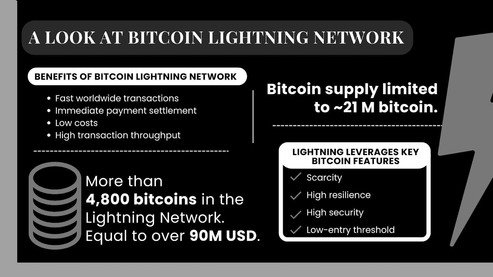

# 我们为什么需要比特币闪电网络？

> 原文：<https://medium.com/coinmonks/why-do-we-need-the-bitcoin-lightning-network-55b09a7f4780?source=collection_archive---------48----------------------->

## 这一系列专题文章将着眼于 LN 的基本原理。重点将放在围绕其功能、用例以及其当前重要性和未来的问题上。

*本帖是由* [*etonec*](https://www.etonec.com/) *和 Simple Crypto 制作的专题系列的一部分。*

比特币闪电网越来越受欢迎。闪电的传播正在无情地进行:现在闪电系统中有超过 4800 个比特币，相当于超过 9000 万美元。

此外，围绕闪电的机构活动也有所增加。例如，Lightning 协议的主要贡献者 Lightning Labs 在今年早些时候获得了 7000 万美元的 B 轮融资。

## 比特币作为全球支付系统？

作为一个分散支付系统，比特币提供了许多优势，通过它，资金可以在没有中介的情况下在全球范围内转移。其中最主要的是参与者的准入门槛低:世界上任何拥有互联网设备的公民都可以使用比特币协议。任何人都不能被排除在外，这对金融包容性产生了积极影响。此外，比特币代表了一种稀缺的数字资产，一种“数字黄金”。每个比特币可以分成一亿个 satoshis，就像你可以把一个欧元拆分成 100 美分一样。与法定货币不同，根据比特币协议，货币供应量被限制在大约 2100 万比特币。因此，通过稀释比特币贬值是不可能的。

尽管有上述优势，但该技术目前的状态也有局限性。对于通过比特币区块链的交易，网络的显著分散化是以交易吞吐量为代价的，即每秒可以进行的交易数量。每秒钟最多可以通过比特币网络确认七笔交易(“链上”)。

作为支付系统，这种低交易吞吐量是不够的。成熟的支付服务提供商，如 Visa 或 Mastercard，每秒可处理数千笔交易，因此规模更大——即使完全集中。比特币网络上的交易通常需要更长的时间窗口，直到它们被确认(“挖掘”)，因此不适合日常支付交易。另一个限制是通过比特币进行小额支付。每笔交易都会产生基于其存储大小的费用。使用的存储空间越多，支付的费用就越贵。

平均而言，无论交易量如何，今天的交易成本约为 1 美元。在需求不断增加的时候，如 2017 年，交易费达到峰值，超过 60 美元。对于大额支付，交易费可能看起来相对便宜；然而，由于交易成本相对较高，小额支付通常不经济。

## 闪电解决了比特币的缺点

闪电开发的目标是让比特币作为一种支付手段适合日常使用。当务之急是在不集中化的情况下提高支付吞吐量，而集中化是支付网络的基础，如 Visa 或 Mastercard。更具体地说，这意味着以更低的价格支付更多的费用。

虽然中本聪早在 2008 年就发布了比特币的白皮书，但闪电网络的想法可以追溯到 2015 年。首批实施始于 2016 年。2018 年，第一批用户开始使用 Lightning 实现。从那以后，技术和网络发展迅速。然而，尽管交易量很大，最近在采用方面取得了进展，但它在 2022 年仍处于起步阶段。

闪电如何解决交易吞吐量低，交易费用相对较高的问题？并非所有付款都记入区块链(即“链上”)。大多数支付是在“链外”进行的，只有在极端情况下或当两个网络参与者之间的财务关系终止时，它们才会被写入区块链(“结算”)。

因此，用户的付款可以实时处理，成本较低。通过闪电汇款的用户不用等挖矿；付款被直接处理并立即完成。

## 闪电网络一般是如何工作的？

为了理解闪电网络是如何工作的，考虑以下真实世界的例子。假设你和几个朋友去酒吧度过一个愉快的夜晚。你想请他们喝酒，但是每次喝酒都要分开付钱，对你来说负担太重了。因此，你把你的信用卡留给酒保来开账单。每次你或你的一个朋友点了一杯酒，酒保都会记账。晚上结束时，酒保关闭标签，给你最后的账单进行支付。这种酒吧标签付款在美国和英国是一种常见的做法。

酒吧选项卡的例子类似于闪电网络:个人通过所谓的闪电渠道(链外)向其他个人或商家发送借条。他们打开一个“支付通道”，就像一个人和一个酒保“开酒吧账单”一样。理论上，双方可以交换无限量的借条。在某些时候，支付最终以比特币结算(链上)。请注意，这个示例有些不完整，因为闪电网络可以做得更多:它不需要信任另一方。您也可以通过所谓的路由向您没有直接维护支付渠道的人付款。您可以在以后的文章中了解/阅读更多关于这些主题的内容！

## 树立新标准

闪电网络是比特币的下一个进化步骤。比特币可以在没有中介的情况下实现全球交易，但通过比特币区块链结算所有支付有局限性。闪电可以显著提高支付吞吐量，这是比特币作为支付系统被广泛使用的必要条件。有了 Lightning，小额支付只需很小一部分成本，为整个微支付经济奠定了基础。我们将在本系列文章的第二部分详细讨论 Lightning 网络是如何工作的。

如果你还没有订阅，可以考虑在这里注册[。](https://blog.simple-crypto.app/#/portal/signup/free)

块高度#755779

🧡 [阅读我们的博客](https://blog.simple-crypto.app/why-do-we-need-the-bitcoin-lightning-network/)

# 关于作者

【Jonas Gross 博士是 etonec GmbH 的数字资产和货币主管。Jonas 拥有拜罗伊特大学(德国)的经济学博士学位，主要研究领域是央行数字货币、稳定货币、加密货币和货币政策。此外，Jonas 是数字欧元协会(DEA)的主席，德国播客“比特币，菲亚特，&摇滚”的共同主持人，以及欧洲区块链观察站和论坛的专家小组成员。你可以通过[jonas@etonec.com](mailto:jonas@etonec.com)联系乔纳斯。

Jonathan Knoll 是 etonec GmbH 的创始人兼总经理。他在[支付](https://www.linkedin.com/feed/hashtag/?keywords=payment&highlightedUpdateUrns=urn%3Ali%3Aactivity%3A6947468774417563648) & [银行](https://www.linkedin.com/feed/hashtag/?keywords=banking&highlightedUpdateUrns=urn%3Ali%3Aactivity%3A6947468774417563648)和[区块链](https://www.linkedin.com/feed/hashtag/?keywords=blockchain&highlightedUpdateUrns=urn%3Ali%3Aactivity%3A6947468774417563648)行业拥有超过 25 年的工作经验，曾在 Sun Microsystems、PayPal/易贝和 Libra/Diem 等创新公司担任战略合作伙伴主管。在 etonec，他对在加密、支付&银行和监管的交叉领域构建解决方案感到兴奋。你可以通过 jonathan@etonec.com 联系到乔纳森。

Yannic Fraebel 是 App-Learning GmbH 的总经理。Yannic 拥有慕尼黑应用科技大学(德国)的信息系统硕士学位。他写了一篇关于“闪电服务提供商是 neobanks 的替代品吗？”。他的主要兴趣在于比特币、网络安全和经济学。此外，Yannic 是区块链创始人集团(BFG)的顾问，也是 DeFi 人才计划的前导师。你可以在 yannic@app-learning.com 的[找到扬尼克。](mailto:yannic@app-learning.com)

作者感谢 [René Pickhardt](https://ln.rene-pickhardt.de/) 和 [Denis Scheller](https://www.linkedin.com/in/denisscheller/) 的大力支持和反馈。他们的见解和评论对这篇文章的实现至关重要。

> 交易新手？试试[加密交易机器人](/coinmonks/crypto-trading-bot-c2ffce8acb2a)或者[复制交易](/coinmonks/top-10-crypto-copy-trading-platforms-for-beginners-d0c37c7d698c)