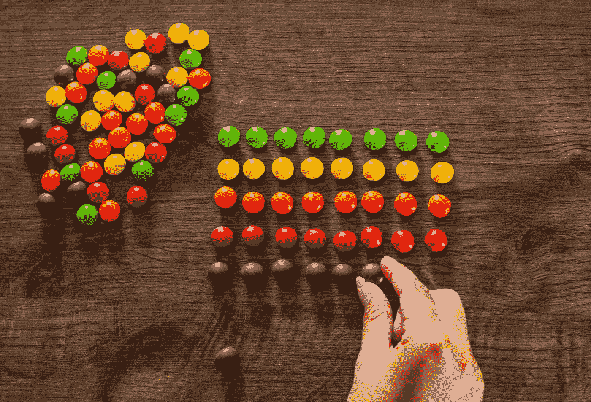

# 我们为什么要学习计算机科学中的排序和搜索？

> 原文：<https://medium.com/coinmonks/why-do-we-study-sorting-and-searching-in-computer-science-1a64e2d673d5?source=collection_archive---------34----------------------->

在学习数据结构和算法的时候，我花了几年时间去理解，但最终，我明白了。如果你想通了，这就是啊哈时刻。

算法是标题(DSA)的一部分，通常包括最基本的算法，如快速排序、合并排序、冒泡排序、二分搜索法等。我经常想知道为什么我们要研究排序和搜索这些概念，这个原因非常有趣，它让数据结构和算法的世界变得一清二楚。本文试图阐明我们为什么要研究基本算法及其应用。一旦你搞清楚了这一部分，DSA 的一些灰色地带也就迎刃而解了。

排序是许多算法的核心，排序数据是任何算法设计者在追求效率时应该首先尝试的事情之一。

排序的行为更像是一种数据结构，而不是一种算法，然后我们来看看基本的算法，如堆排序、合并排序、快速排序和分布排序。

我们研究排序和搜索的原因

*   排序是构建许多其他算法的基础，通过理解排序，我们可以获得解决其他问题的能力。
*   algo 设计中使用的大多数思想都出现在排序的上下文中，例如分而治之的数据结构和随机化算法
*   计算机花在分类上的时间比什么都多。
*   分类在实践中是组合的
*   排序是计算机科学中研究得最透彻的问题。

排序的应用

一个重要的算法设计技术是使用排序作为基本的构建模块，因为一旦一组项目被排序，许多其他问题就变得容易了。

考虑下面的应用

*   搜索——二分搜索法测试一个条目是否在 O(log n)时间内出现在字典中，假设所有的关键字都已排序，搜索预处理可能是排序最重要的应用。
*   最接近的一对-给定一组 n 个数字，如何找到它们之间差异最小的一对数字，一旦这些数字被排序，最接近的一对数字必须在排序顺序中彼此相邻。
*   元素唯一性——在给定的一组 n 个元素中是否有重复的元素，现在我们可以检查相邻的元素对
*   频率分布——如果对数据进行排序，我们可以很容易地找到中间的数字或最低的数字
*   selections —如果对项目进行了排序，并且要求我们找出数组中第 k 个最大的元素，我们可以在常数时间或中位数内完成
*   凸包-一旦对 x 坐标进行了排序，就可以从左到右将点插入到凸包中，排序完成后，总时间是线性的。

> 交易新手？试试[加密交易机器人](/coinmonks/crypto-trading-bot-c2ffce8acb2a)或者[复制交易](/coinmonks/top-10-crypto-copy-trading-platforms-for-beginners-d0c37c7d698c)