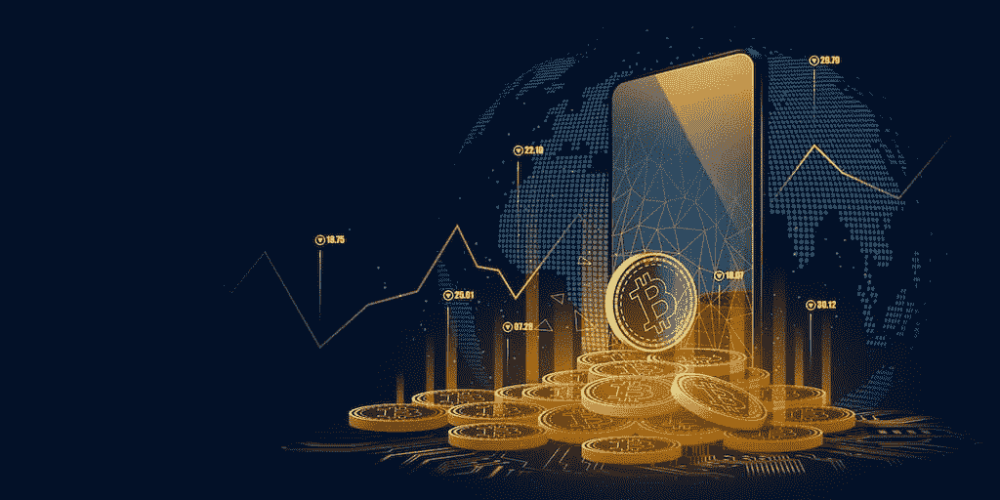

# 去中心化的交易方式为什么需要 P2P 加密货币交易所？

> 原文：<https://medium.com/coinmonks/why-do-you-need-a-p2p-cryptocurrency-exchange-for-a-decentralized-way-of-trade-91afd2740892?source=collection_archive---------20----------------------->

**P2P Cryptocurrency Exchange**

对等交换是一种交换加密货币代币的分散方法，它使买方和卖方能够在代币被转移之前就代币价格达成一致。根据 CoinMarketCap 的数据，目前有超过 9000 种加密货币在使用，市值超过 2 万亿美元。全球投资者渴望在这个快速扩张的市场进行交易。结果，一系列区块链交易所应运而生。

点对点交流平台以其透明、高度安全、分散的网络而闻名。如果你想了解更多关于加密货币交易所的信息，你可以参考这篇文章。

此外，本文将涵盖点对点交换的各个方面，以及它可能如何使您的业务受益。

# 对等交换是如何工作的？

一个 [**对等加密货币交易所**](https://bit.ly/3UBPhMd) 使得经过验证的买方和卖方之间的资产交易更加便捷。顶级匹配引擎用于匹配买家和首选卖家。买方或卖方可能会为对等方考虑额外的功能，以便平衡他们的交易需求。由于 P2P 交易所将加密货币的买家和卖家联系在一起，一些人将它们比作 Craigslist 或 Facebook Marketplace 等在线市场。该平台涉及两方，它们共享相关数据。P2P 加密货币交易模式使市场参与者能够直接交易，而不需要中介来处理交易或保留资金，而不是使用指令簿来配对买卖订单并控制平台的资产。

**P2P cryptocurrency exchange**

> **为了更好地理解这个观点，考虑下面的例子。**
> 
> 假设约翰下了一个 3 BTC 的订单。相比之下，亨利订购了 3 台 BTC。一个对等交换平台将约翰和亨利匹配起来，使他们能够在没有第三方帮助的情况下订立合同。在他们就交易条款达成协议之前，智能合同驱动的托管持有亨利的 3 BTC。所需资金由约翰转到亨利的账户上。一旦亨利接受了付款，第三方托管将释放 3 个 BTC，并将它们发送到约翰的钱包地址。

## 提高 P2P 密码交换效率的因素

> 得益于许多功能，P2P 加密交换比传统加密交换更有效。

## 以下是几个在该类别中脱颖而出的例子:

👉低交易成本

👉灵活的价格

👉隐私

👉没有第三方参与

👉无与伦比的安全性

👉交易审查

👉更易接近

## P2P 交易平台的工作流程

✪用户注册

✪ KYC/AML 验证

✪下订单

✪创建钱包地址

买卖双方的✪订单匹配

买卖双方的✪订单确认书

✪:将要出售的资产由智能合约托管。

✪购买者为所购买的物品付款。

✪对卖方付款的确认

✪保管暨代付款服务发放物品，并将款项存入买家账户。

✪资产被买家放在一个冰冷的钱包里

## 点对点交流平台开发流程

S **tep 1**

根据你的商业模式，进行研究，收集需求，准备你的交换。

STEP 2

基于交易所公司地理位置的 UX/UI 增强的安全性和法律遵从性是至关重要的技术集成。

STEP 3

安装交易引擎。

S **tep 4**

将不同的区块链整合到平台中

S **第五步**

硬币和代币的清单。

STEP 6

平台的部署

**P2P Exchange Development Platform**

## P2P 交易开发平台

P2P 交易平台的开发将变得容易。可以从头开始构建，也可以使用白标解决方案[**。有了从零开始构建的，您可以一个一个地划分您的需求，然后等待部署。如果您使用白标解决方案，您可以获得现成的平台，然后对其进行相应的修改。但是，如果您想减少工作或娱乐，请致电平台服务提供商，然后进行部署。**](https://bit.ly/3E9SHil)

那么，这个平台有前途吗？有了这样一个平台，就有了一个美好的未来，这就是为什么你需要去做一个没有中介的直接交易的生意。

## 点对点交流的前景如何？

由于支持多种货币、快速清算、更好的隐私和安全性等优势，区块链技术目前完全是去中心化的，这加速了去中心化交易所的采用。尽管存在一些缺点，如用户友好性和所有权悬念，P2P 交易所有望取代传统交易所，成为未来交易加密货币的首选方法。

## **结论**

P2P 交易所是未来成功的关键。在平台服务商的帮助下，你可以做一个像未来一样工作的平台。借助[**P2P 密码交易所，你可以成为一个成功的创业者。**](https://bit.ly/3UBPhMd) 所以，是时候用这样的平台来点运气了。

> 交易新手？尝试[加密交易机器人](/coinmonks/crypto-trading-bot-c2ffce8acb2a)或[复制交易](/coinmonks/top-10-crypto-copy-trading-platforms-for-beginners-d0c37c7d698c)