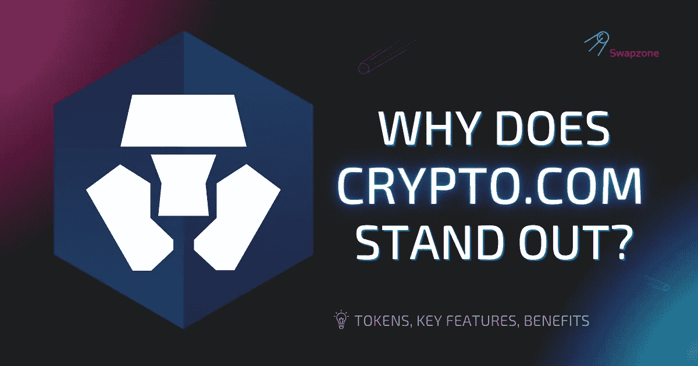

# 为什么 Crypto.com 脱颖而出？

> 原文：<https://medium.com/coinmonks/why-does-crypto-com-stand-out-b2c40954b44f?source=collection_archive---------16----------------------->

如今的交易所已经接受了创建自己的令牌的想法，这在大多数情况下主要是为交易所提供动力。Crypto.com·CRO 硬币背后的想法是一样的。交易所[Crypto.com](https://www.forbes.com/advisor/investing/crypto-com-review/)本身是一个在线网络，使投资者、用户和交易者能够投资和交易包括 CRO 代币在内的密码。让我们来看看 Crypto.com 平台和它的本土 CRO 令牌有什么特别之处。

# 什么是 Crypto.com？

Crypto.com 交易所和支付网络是你交易和投资密码的地方。其主要目标是促进加密货币的广泛采用。该平台成立于 2016 年，是满足您所有加密需求的一站式窗口，无论您的交易水平如何。它有 90 多种密码可供居住在美国的人获取奖励并使用。该网站的另一个有趣的特点是，用户可以对他们持有的 CRO 加密硬币感兴趣。

你赚取的利息可以用 Crypto.com 提供的预付 Visa 卡消费。此外，Visa 借记卡允许您在平台上使用代币进行消费。在 Crypto.com 平台上，交易费用结构是做市商-接受者费用框架，这意味着你的交易费用的多少取决于你是接受者还是做市商。现在你明白了什么是 Crypto.com，让我们继续它的代币系统。

# Crypto.com 代币

Crypto.com 的网络上有两种硬币，它们是 CRO 和 MCO。在 2017 年 5 月 18 日至 2017 年 6 月 18 日期间，向公众出售了 MCO 令牌，并通过以下方式在 Crypto.com 平台上使用。

*   通过下注 MCO 加密硬币，你可以订购金属签证卡。
*   使用 MCO 支持的卡，你每次消费都能获得 5%的 MCO 代币返现。
*   通过下注更多的 MCO 硬币，您可以在平台上将您的 MCO 借记卡升级到更高的等级。

另一个 Crypto.com 令牌是 CRO 加密货币，将在下一节讨论。

# CRO 是如何工作的？

Crypto.com 交易所的 CRO 硬币是双重代币系统的一部分。它也是 Crypto.com 区块链的本土硬币，旨在使更快更便宜的支付和交易成为可能。在宣布将被转移到 Crypto.com 本地连锁店之前，CRO 代币最初是一个 [ERC-20 代币](https://ethereum.org/en/developers/docs/standards/tokens/erc-20/)。自发行以来，CRO 硬币的市值一直在逐渐增加。

Crypto.com 硬币 CRO 是驱动 Crypto.com 链被称为克罗诺斯。Cronos 的目标是提供一种非常容易获得和负担得起的在线支付方式，CRO 帮助使支付更容易。与此同时，CRO 加密公司旨在消除老区块链的传统问题，如比特币，其中包括可扩展性。

CRO 硬币充当 Cronos 链的跨资产中间令牌。CRO 代币可以在大约 22 个全球交易所交易。

> 交易新手？试试[加密交易机器人](/coinmonks/crypto-trading-bot-c2ffce8acb2a)或者[复制交易](/coinmonks/top-10-crypto-copy-trading-platforms-for-beginners-d0c37c7d698c)

# 关键特征

Crypto.com 交易所、chain 及其 CRO 加密硬币的主要特点包括:

*   **是 EVM 兼容的**

Cronos chain 建立在 Ethermint 之上，这意味着它允许智能合约和 DApps 从 EVM 兼容的区块链和以太坊本身快速移植。

*   **高度可扩展，专注于绿色能源**

Cronos 被设计为每秒处理比以太坊链更多的交易，它的目标是到 2030 年实现绿色化。

*   **互操作性**

它是可互操作的，使用内部区块链通信协议来创建 Cronos 和其他区块链之间的链接，具有类似 Cosmos Hub 的协议功能。

*   **它使用** [**权威证明【POA】共识**](https://en.wikipedia.org/wiki/Proof_of_authority)

PoA 是一种更具可伸缩性和精简的共识机制，它在提供可伸缩性的同时确保了高水平的安全性。

CRO 硬币有它自己的主要功能，比如:

*   结算大宗交易费用。
*   用于奖励节点在网络上的工作。
*   跨资产货币结算。
*   使用 CRO 硬币进行交易可以减少交易费用。
*   用 Crypto.com 硬币 CRO 购买加密货币在交易平台上吸引 50%的折扣。
*   CRO 硬币也可以让你进入辛迪加，这是一个为最有潜力的加密项目筹款的计划。

# CRO 硬币的好处

Crypto.com 好吗？根据我们对什么是 CRO 加密的理解，这些是使用 Crypto.com 及其 CRO 加密的一些好处。

它以较低的价格提供即时结算。CRO 加密货币的主要目标是通过引入可扩展的网络来促进快速支付解决方案。我们的目标是能够支持高达 50，000 TPS，这远远高于我们在比特币和以太坊网络上的数据。

由于 Crypto.com 开发商一直致力于确保整合 CRO 区块链网络非常容易，因此商户支持得到了改善。CRO token 最近发布的专用软件开发套件(SDK)进一步证明了上述观点。该版本将允许几乎没有技术知识的商家在 CRO 区块链网络上集成解决方案。

此外，通过将其交易确认和网络活动分布在计算机的几个节点上，该平台通过分散化来防止单点故障，从而使网络上发生数据盗窃和黑客事件更加困难。

# CRO 硬币的缺点

目前，在 Crypto.com 网络之外，CRO 硬币的使用是有限的。这个劣势和项目还处于起步阶段有很大关系。此外，像 CRO 加密货币这样的新项目容易受到技术不完善、流动性低和用例少的影响。然而，随着时间的推移，Crypto.com·托肯·CRO 可能最终会在更广泛的密码行业中为自己开辟一个利基市场。

# Crypto.com 的独特之处是什么？

Crypto.com·区块链主要致力于通过 CRO 硬币为 Crypto.com 的用户创造效用。在 Crypto.com，CRO 代币持有者可以通过下注代币来验证交易，从平台上处理的交易中赚取费用。此外，他们下注的 CRO 硬币越多，他们获得的奖励就越多。

当您在 Crypto.com 支付应用程序中使用代币结算商户时，您还可以使用 CRO 币在 Crypto.com 交易所支付交易，赚取 20%的佣金。使用 CRO 购买礼品卡和进行 P2P 交易还有 10%的返现。

当您在 Crypto.com 应用程序上为选定的代币列表向 CRO 下注时，您可以获得代币奖励。此外，将你的 Crypto.com 硬币押在 Crypto.com 金属 Visa 卡或 Crypto.com 交易所应用程序上可以为你赢得 10-12%的 APY。

# CRO 透视

从目前的情况来看，CRO 的未来看起来令人鼓舞。它的效用类似于币安硬币。根据专家对未来 Crypto.com 硬币 CRO 价格的预测，价格预计将在一年内上涨到 0.229 美元，这是 Walletinvestor 的数据。 [GOV Capital](https://gov.capital/crypto/cryptocom-coin/) 表示，仅在一年内就可能超过这个数字，达到 0.4708 美元。

# 如何在 Swapzone 上兑换 CRO？

你可以在[交换区](https://swapzone.io/)将你的资产交换给 CRO，如果你想看看它是如何运作的。为了您的方便，请遵循以下详细指南:

1.  打开 [Swapzone](https://swapzone.io/exchange/btc/cro) 网站。
2.  现在，在 ***【选择对】*** 选项卡中，选择比特币(BTC)，输入想要兑换的 BTC 金额。
3.  在**部分，选择 Crypto.com 币(CRO)。**
4.  **一旦你输入上述所有信息，你应该看到网站上显示的汇率和多个报价。**
5.  **在这里，您可以根据各种参数(如价格和交易时间)对报价进行排序。**
6.  **选择你能找到的最佳报价，然后点击 ***【交换】*** 。**
7.  **输入相关钱包详情，点击 ***【进行兑换】*** 完成交易。**
8.  **等待兑换服务处理存款，兑换完成。**
9.  **别忘了给交换伙伴评分并留下评论，这样我们可以为未来的用户收集更多关于交换的信息。**

> **加入 Coinmonks [电报频道](https://t.me/coincodecap)和 [Youtube 频道](https://www.youtube.com/c/coinmonks/videos)了解加密交易和投资**

# **另外，阅读**

*   **[CBET 评论](https://coincodecap.com/cbet-casino-review) | [库库恩 vs 比特币基地](https://coincodecap.com/kucoin-vs-coinbase) | [拜比特 vs 比特币基地](https://coincodecap.com/bybit-vs-coinbase)**
*   **[折叠 App 回顾](https://coincodecap.com/fold-app-review) | [LocalBitcoins 回顾](/coinmonks/localbitcoins-review-6cc001c6ed56) | [Bybit vs 币安](https://coincodecap.com/bybit-binance-moonxbt)**
*   **[加密保证金交易交易所](/coinmonks/crypto-margin-trading-exchanges-428b1f7ad108) | [赚取比特币](/coinmonks/earn-bitcoin-6e8bd3c592d9) | [Mudrex 投资](https://coincodecap.com/mudrex-invest-review-the-best-way-to-invest-in-crypto)**
*   **[WazirX vs CoinDCX vs bit bns](/coinmonks/wazirx-vs-coindcx-vs-bitbns-149f4f19a2f1)|[block fi vs coin loan vs Nexo](/coinmonks/blockfi-vs-coinloan-vs-nexo-cb624635230d)**
*   **[比斯勒评论](https://coincodecap.com/bitsler-review)|[WazirX vs coin switch vs coin dcx](https://coincodecap.com/wazirx-vs-coinswitch-vs-coindcx)**