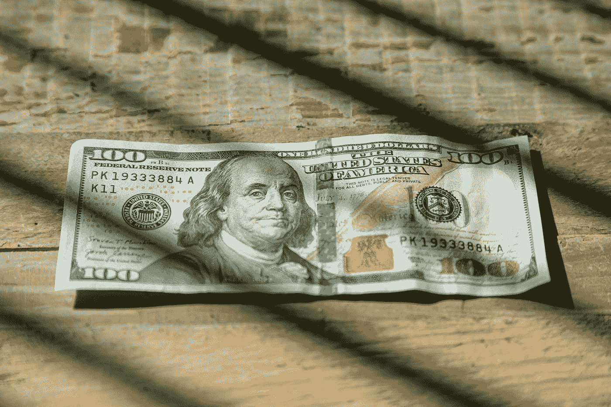

# 为什么平均成本是最好的投资策略

> 原文：<https://medium.com/coinmonks/why-dollar-cost-averaging-is-the-best-investment-strategy-234f8ad93827?source=collection_archive---------19----------------------->

许多人不知道什么是平均成本，它是如何工作的，也不知道他们为什么想要这样做。在本文中，我们将讨论美元成本平均法的基础，并解释它如何帮助投资者在市场低迷时期避免重大损失，以及提供长期稳定的回报。

[这篇文章最初来自我的网站组合中心](http://www.portfolio-hub.co.uk/)

Photo by [Live Richer](https://unsplash.com/es/@gobankingrates?utm_source=medium&utm_medium=referral) on [Unsplash](https://unsplash.com?utm_source=medium&utm_medium=referral)