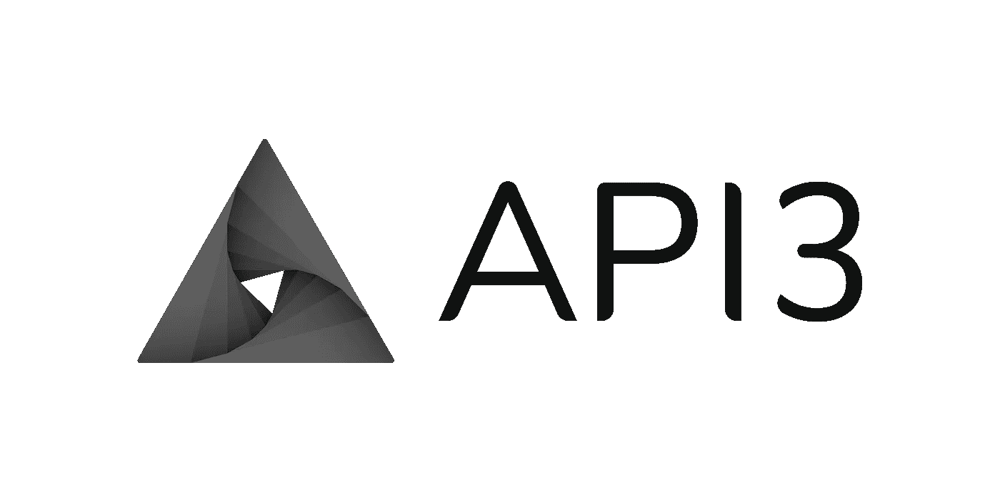

# 为什么不了解 API3？

> 原文：<https://medium.com/coinmonks/why-dont-you-know-about-api3-69919f63b1?source=collection_archive---------18----------------------->

## TL；DR — API3 不是您的标准 oracle。

API3 旨在通过消除 API 提供商和 Web3 开发者之间的中间人，将 Web2 上可用的数据的广度引入区块链。

API3 独特的第一方 oracles 将支持 Web3 自己的 API 经济，为 dApp 开发者和 API 提供商带来新的机遇。

# Web3 API 经济问题(是 oracle 的问题)

随着近 25，000 个 API 在 [ProgrammableWeb](https://www.programmableweb.com/apis/directory) 上列出，Web2 API 经济正在蓬勃发展，但要实现这种类型的 API 经济，需要激励 API 提供商加入 Web3 运动。

不幸的是，通过智能合约访问非区块链数据的标准方法是通过使用第三方 oracles，其架构消除了 Web2 API 提供商的大部分利润激励。

他们不仅必须设置和维护验证器节点(由于需要专门的技术团队进行操作和更新，这是非常昂贵的)，而且还必须为他们必须为其服务收集的数字资产实施新的会计实践。

> 如果第三方 oracle 基础架构希望直接服务于 Web3，则需要 API 提供商来扩展其业务范围。

正因为如此，API 提供商通常将这项工作外包给第三方 oracle 提供商，但是通过外包，API 提供商放弃了很多价值。oracle node 通常会捕获大部分信息，这只会增加中间商税的成本(本文将对[进行深入描述)。](/api3/first-party-vs-third-party-oracles-13b4b9b4db8e#:~:text=attack%20when%20desired.-,Middleman%20tax,-In%20order%20to)

对于许多实体来说，这些障碍超过了回报，限制了智能合约可访问的真实世界数据。([API 供应商访谈研究](/api3/where-are-the-first-party-oracles-5078cebaf17#:~:text=Talking%20to%20API,break%20the%20law.))

# 可持续的 Web3 API 经济

API3 通过解决 [API 连接问题](/api3/the-api-connectivity-problem-bd7fa0420636)而不是 Oracle 问题，将 API 提供商带入 Web3 经济。

> oracle 问题是数据源、oracle 和链上数据消费者的三体问题，而 API 连接问题将数据源直接连接到链上消费者——数据源和 Oracle 是同一个东西。

通过这种[直接连接](/api3/airnode-the-api-gateway-for-blockchains-8b07ff136840)，API 提供者能够将 Web3 整合到他们现有的业务模型中，而数据消费者(Web3 开发者)能够访问源代码透明、高质量的机构级数据。

> 在本文中，我们将详细介绍第一方相对于第三方 oracles 的区别和优势[。](/api3/first-party-vs-third-party-oracles-13b4b9b4db8e)

# 最后的想法

API 是天然的分散器，决定如何将技术应用到创新发生的边缘。

随着越来越多的数据提供商加入 [API3 联盟](https://api3.org/alliance)、[免费访问 QRNG](https://api3.org/QRNG) ，以及新的 [API3 市场](http://market.api3.org)——web 3 API 经济有了一个良好的开端。

## 关于 API3 的附加阅读

> [了解 Airnode，从 API 到 Web 的直接连接 3](https://medium.com/api3/airnode/home) (系列)
> 
> [QRNG 是什么，为什么对 Web3 有好处？](/coinmonks/qrng-makes-web3-a-richer-ecosystem-8cd8b45ed42b)
> 
> [获取区块链上的 API](https://medium.com/api3/getting-apis-on-the-blockchain/home)(系列)

> 如果你从这篇文章中学到了什么:
> 
> []为它鼓掌
> 
> []与另一颗好奇的心分享。
> 
> []在这里和 Twitter 上关注我。
> 
> 交易新手？尝试[加密交易机器人](/coinmonks/crypto-trading-bot-c2ffce8acb2a)或[复制交易](/coinmonks/top-10-crypto-copy-trading-platforms-for-beginners-d0c37c7d698c)