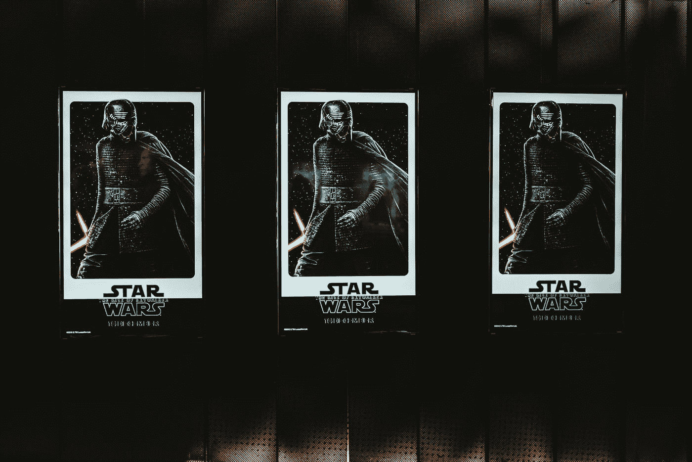

# 为什么龙之任务 11 激励我在绝地大师难度下玩星球大战绝地堕落

> 原文：<https://medium.com/coinmonks/why-dragon-quest-11-motivated-me-to-play-star-wars-jedi-fallen-order-on-jedi-master-difficulty-2ef3fedb9da1?source=collection_archive---------18----------------------->

当你想要挑战却在别处找不到时！

Photo by [Claudio Schwarz](https://unsplash.com/@purzlbaum?utm_source=medium&utm_medium=referral) on [Unsplash](https://unsplash.com?utm_source=medium&utm_medium=referral)

你知道，你可以玩一个游戏很长时间，然后到达一个点，游戏中的敌人不再对你构成挑战，即使这个挑战已经接近尾声，也就是说应该被压倒。