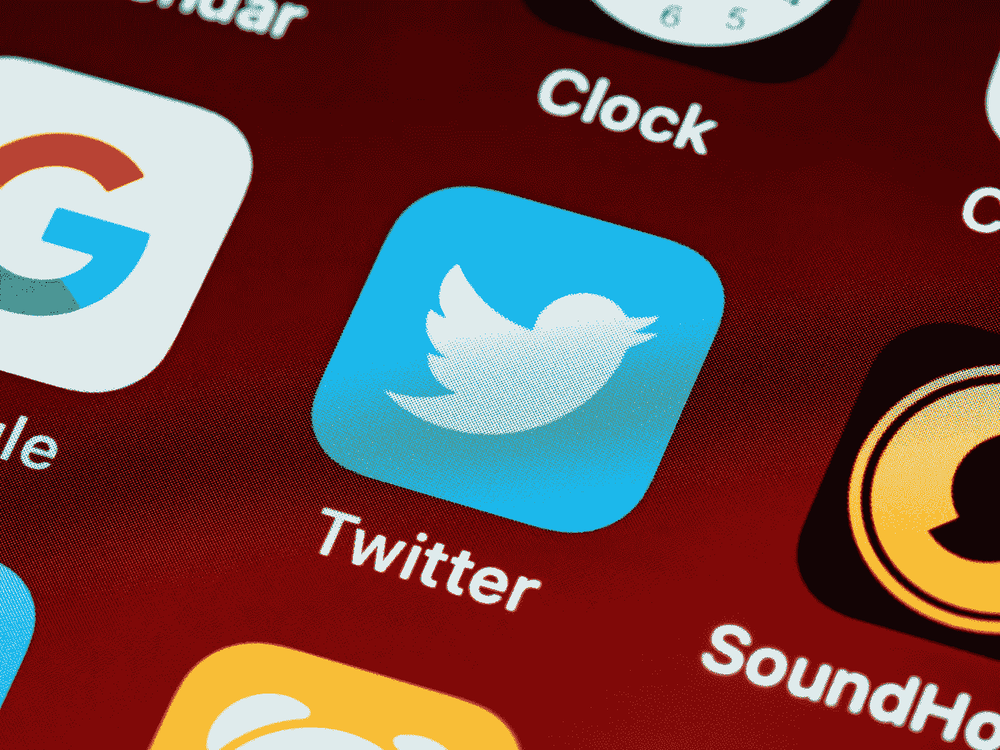

# 为什么埃隆·马斯克收购 Twitter

> 原文：<https://medium.com/coinmonks/why-elon-musk-bought-twitter-a20f2fe52607?source=collection_archive---------57----------------------->

作者:[克里斯托弗·h·卢，医学博士](https://www.drchrisloomdphd.com/book-online)

Photo by [Brett Jordan](https://www.pexels.com/photo/red-blue-and-yellow-textile-5417837/)

***注:*** *我的看法。不是投资建议。*

随着 Twitter 交易的结束和埃隆的接管，公司将会发生什么，Twitter 的未来将会怎样？

“Twitter 是事实上的*[城市广场](https://www.outlookindia.com/business/-twitter-has-become-kind-of-de-facto-square-here-s-how-elon-musk-plans-to-change-twitter--news-191654)”—埃隆·马斯克。*

*这是名人，有影响力的人和大众聚集分享想法，传播…*