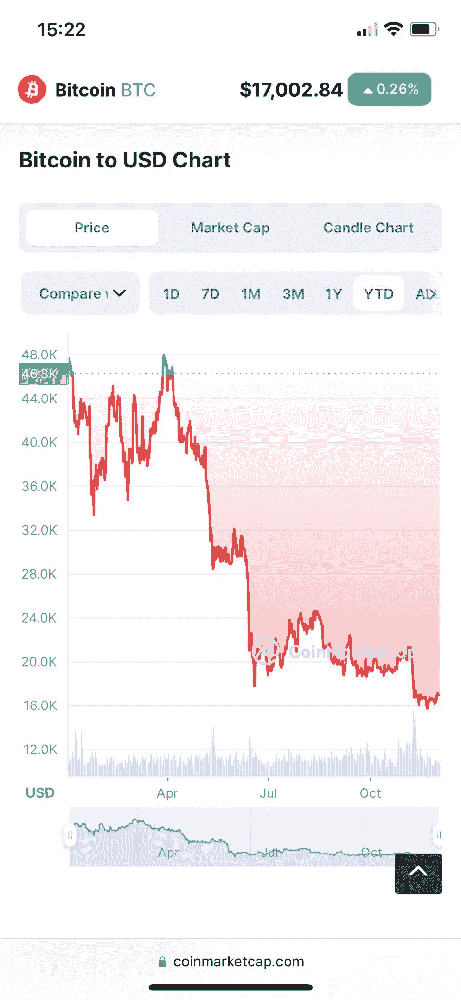
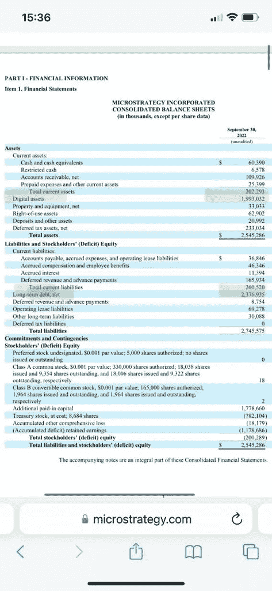
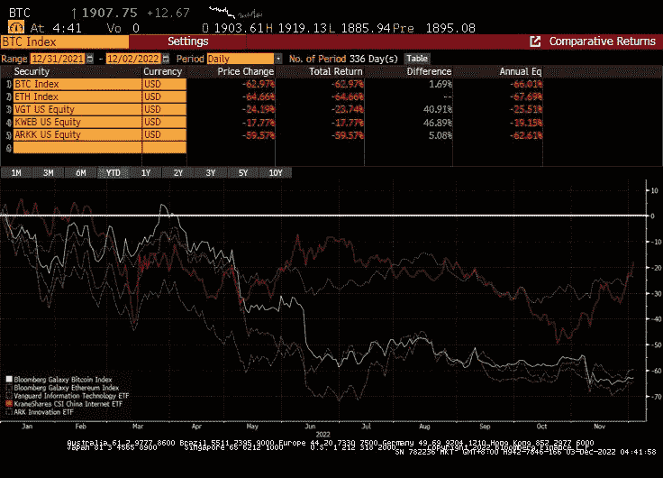

# 为什么 ETH 和 BTC 拒绝继续走下去？

> 原文：<https://medium.com/coinmonks/why-eth-and-btc-refuse-going-down-further-1b018b316b1b?source=collection_archive---------10----------------------->

# 去杠杆化、低收益率和低流动性之旅

你可能会认为，在所有的 CeFi 实体清算之后，crypto 会走下坡路。在一定程度上，的确如此。ETH 和 BTC 都比 11 月 21 日的峰值下降了 75%。然而，它们的价格几乎没有对最近 FTX 和 BlockFi 的崩溃做出反应，似乎也没有计入灰度公司 GBTC 的潜在问题。那么，怎么回事？

以下是一些论点:

- **去杠杆化趋势目前看来已经耗尽**。随着 Anchor-Terra 的破产，加密去杠杆化已经在 5 月 22 日开始，目前杠杆已经完全解除，所有的 DeFi 借款利率都很繁重，贷款风险偏好降至最低。无抵押贷款协议已经停止发放新贷款，或者说它们应该停止发放新贷款，而复利等有抵押贷款协议也在抑制流动性。在某种程度上，这与更高的真实世界贷款利率相关，这使得 DeFi lending 对所涉及的合同风险完全没有吸引力。

——**作为占位符的蓝筹币**。ETH 和 BTC 的持有者现在没有其他地方可去，因为 DeFi 中的分配机会非常少。目前，这些蓝筹加密资产扮演着更安全的占位符角色。相对而言，它们的交易水平仅在一年前出现过，现在被抹去的只是夏天的狂热。总体而言，持有人可能是为高波动水平做好了准备，并没有对最近的崩盘感到恐慌。

——**对 ETH 和 BTC** 的叙述不变。作为首发，ETH 或者 BTC 的效用价值并没有消失。ETH 上的交易仍然需要 gas 来处理，以太坊每天仍然收入 200 万美元。由于其他一些第一层连锁也有自己的问题(#SOL，# Algorand)，可以肯定以太坊作为连锁领导者的角色会一直存在。EIP-1559 最近的成功和合并证明了连锁店交付，并有一个令人信服的前瞻性的价值主张。另一方面，BTC 缺乏可组合性，但仍然统治着加密安全领域。它作为加密黄金的角色仍然毫发无损。简而言之，瑞士联邦理工学院和 BTC 都有很强的价值主张，当其他地方的信任度较低时，这种价值主张甚至会更强，而资产保值是关键。

- **鲸鱼和机构不在当前水平平仓，不制造进一步的清算**。截至 9 月 22 日，迈克尔·塞勒的微观策略持有 13 万 BTC，平均成本为 30，639 美元。这个位置现在大约 45%在水下。在这一点上，你要么保持无杠杆状态，直到母牛回家，要么拼命追加保证金，直到你再也不能这样做。看看 Microstrategy 的 Sep22 [资产负债表](https://www.microstrategy.com/content/dam/website-assets/collateral/financial-documents/financial-document-archive/form-10-q_11-01-2022.pdf)，20 亿美元的 BTC 资产面临着 24 亿美元的债务，看起来它们应该在追加保证金的范围内。考虑到他们的业务在过去两年一直处于亏损状态，不确定追加保证金的现金将从何而来。这个例子看起来很典型，是秘密“对冲基金”在这个领域运作的杠杆多头头寸。

表格 10Q — 30Sep22

- **许多资本仍在稳定的资本市场保持观望，等待投资的有利时机。稳定的资本享受了最近的牛市。它们现在代表了 1400 亿美元，约占硬币总价值的 30%，高于 4 月 22 日的 10%。**

- **ETH 和 BTC 是风险资产，其价格随着全球风险资产的下跌而下跌**。利率上升的环境对风险资产不利。美国科技股年初至今下跌 24%，而中国科技股下跌 18%，从 10 月 22 日下跌 50%的低点反弹。虽然 crypto 仍然陷入了自己的冬天，但人们高度期待，当威胁消散时，它们将重新跟踪科技风险资产。

BTC，瑞士联邦理工学院对美国科技(VGT 美国)，中国科技(KWEB)，方舟基金(ARKK 美国)——彭博

- **卷目前已经消亡**。在没有资金流入 crypto 的情况下，无论是来自风险投资、借贷柜台还是直接投币人，流动性都会枯竭，波动性会减弱，市场会变得平坦。虽然风投在 21 年和 22 年初投入了数十亿美元，但公平地说，这些资金在未来几个月里已经减少到了涓涓细流。总的来说，承担风险的欲望被搁置，资金流消失了。

关于 BTC 和 ETH 的发展方向和价值，它告诉了我们什么？

ETH 保留了其高收入产生的基本价值，以及对协议开发者的价值主张。在信任度较低的环境中，BTC 的安全性更高。底部只是生态系统中剩余杠杆的一个函数，我们假设这个函数还没有完全解开。缺乏新的资金流入加密，无论是在直接的硬币定位，风险投资，还是贷款，都是问题的一部分，因为没有什么支撑新的向上推动。我们将继续关注这些领域的活动水平，这将决定未来 6 个月的市场方向。

**关于—**

*360 咨询有限责任公司是一家总部位于波士顿的 RIA 公司，管理投资，包括加密*

👉[上午 9 点至 30 点](https://twitter.com/930AM2)🐰🕳

**来源—**

👉[https://www.capitalfundlaw.com/blog/crypto-funds-strategy](https://www.capitalfundlaw.com/blog/crypto-funds-strategy)

👉[https://www . Bloomberg . com/news/articles/2022-11-22/genesis-balance-sheet-reveals-web-of-loans-cross-silbert-empire-DCG](https://www.bloomberg.com/news/articles/2022-11-22/genesis-balance-sheet-reveals-web-of-loans-across-silbert-empire-dcg)

> 交易新手？尝试[加密交易机器人](/coinmonks/crypto-trading-bot-c2ffce8acb2a)或[复制交易](/coinmonks/top-10-crypto-copy-trading-platforms-for-beginners-d0c37c7d698c)