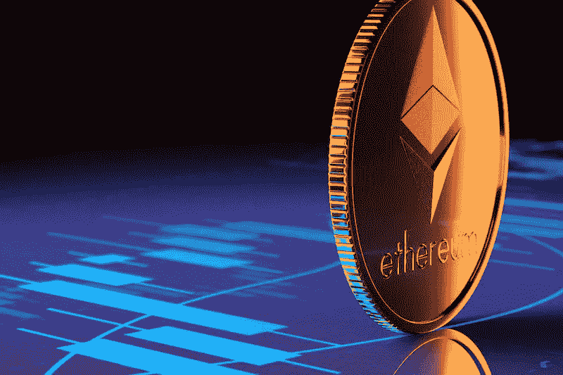

# 为什么以太坊的合并没有解决任何问题

> 原文：<https://medium.com/coinmonks/why-ethereums-merge-didn-t-solve-any-problems-8e01c5d80b7d?source=collection_archive---------11----------------------->

上个月，区块链以太坊完成了期待已久且充满希望的[合并](https://bitnewsbot.com/ethereums-merge-will-change-the-cryptocurrency-space-forever-everything-you-need-to-know/)，这是其运营方式的一次技术变革。

它是世界上使用最广泛的数字宇宙之一，也是 Web3、 [NFTs](https://bitnewsbot.com/what-is-a-crypto-nft/) 和[去中心化金融](https://bitnewsbot.com/how-decentralized-finance-paves-the-way-for-financial-inclusion/) (DeFi)的主要平台。

然而，尽管“合并”对环境来说无疑是个好消息，但它也带来了其他问题。

提醒一下，[区块链](https://bitnewsbot.com/what-is-blockchain-technology/)是基于所谓的“共识机制”。在合并之前，以太坊使用“工作证明”共识机制，所谓的“矿工”使用大量电力为计算机供电，这些计算机解决复杂的数学问题，为区块链添加交易块。

然后，矿工的工作会得到加密货币的补偿。

比特币区块链仍然是这样做的。验证比特币交易比挪威这样的国家需要更多的精力。

在比特币大量开采的地区，当地居民饱受能源成本上涨和噪音污染之苦。

# 以太坊的转变

以太坊向“利益证明”协议的转变降低了这些环境成本。以太坊现在使用一种算法，随机选择一个人来创建一个新的区块添加到区块链。此外，越多的人在以太中下注，以太坊的本地令牌，他们就越有可能被选中来创建新的区块。

这就产生了获取越来越多以太网的动机，因此似乎有理由预测，任何基于股权证明协议的区块链都将交易处理能力“集中”在少数人手里。

根据数据提供商南森的说法，赌注已经是一项高度集中的业务，涉及到业内一些最大的公司，如比特币基地。更多的集权似乎是不可避免的。

然而，应该指出的是，拥有一个具有协商一致机制的区块链的全部意义在于避免由集中的中介机构来核实交易。没有有意义的去中心化，人们不得不怀疑是否所有其他与以太坊相关的问题都值得解决。

# 拥挤

例如，以太坊区块链因高峰时段的拥堵而受到许多批评，这表现在交易处理时间变慢和交易费用波动(被称为“汽油费”)。

在高峰期，对于试图完成较小交易的用户来说，燃气费可能令人望而却步(2022 年 5 月，日均燃气费达到近 200 美元)，合并并没有改变燃气费的计算或收费方式。

# 支付验证者

这种拥挤增加了另一个问题。用户可以向验证者支付更高的佣金，因为他们首先在一个块上执行交易。这是一个有利于较大验证者的成本，他们将被选中创建更多的区块，因此有更多的收入。

为了利用市场波动，验证者甚至可以在其他人之前输入自己的交易，这种做法被称为 MEV 或“最大出口价值”。

# 广泛的安全声明

合并也不会让区块链更加安全。声称它将这样做是假设合并将增加分权。但是，如果反过来是真的，就有风险。美国国防高级研究计划局的一份报告发现，如果验证器的数量太少，区块链可以被操纵。

# 法律不确定性

转向股权证明也增加了法律上的不确定性。在合并之前，美国参议员 Debbie Stabenow [提出了一项法案](https://www.agriculture.senate.gov/imo/media/doc/crypto_bill_text.pdf)，将以太列为不属于 SEC 管辖范围的“数字商品”的一个例子(在美国，证券由 SEC 监管，而商品期货交易则监督商品市场)。

所以现在，赌注者正在增加以太坊，希望通过以太坊区块链的天然气费得到补偿，美国证券交易委员会可能有话要说…

*原载于 2022 年 10 月 19 日*[*【https://bitnewsbot.com】*](https://bitnewsbot.com/why-changing-the-ethereum-page-didnt-solve-any-problems/)*。*

> 交易新手？尝试[加密交易机器人](/coinmonks/crypto-trading-bot-c2ffce8acb2a)或[复制交易](/coinmonks/top-10-crypto-copy-trading-platforms-for-beginners-d0c37c7d698c)