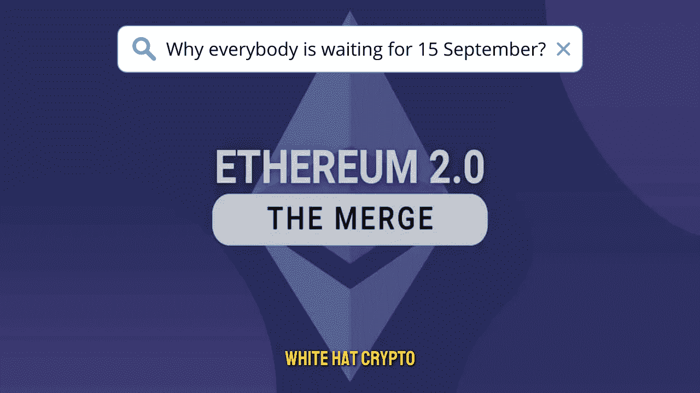

# 为什么每个加密员都在等 9 月 15 日？！

> 原文：<https://medium.com/coinmonks/why-every-crypto-guy-is-waiting-for-september-15-55b63a741a4?source=collection_archive---------35----------------------->

2022 年 9 月 15 日将会发生什么，它将如何永远改变 crypto？！

以太坊(ETH)的联合创始人维塔利克·布特林(Vitalik Buterin)宣布了备受期待的合并更新的新的可能日期。

Buterin 在 8 月 12 日的一条推文中声明，工程师已经设置了剩余待挖掘的哈希数；因此，转换可能发生在 9 月 15 日左右**。**

值得注意的是，以太坊开发者此前预测，向**利害关系证明(PoS)** 方法的过渡将在 9 月 19 日进行。然而，Buterin 表示，精确的迁移日期取决于哈希速率，尽管开发者已经将总终端难度设置为 58750 亿。

需要注意的是，以太坊开发者在 8 月 10 日成功完成了合并的第三个也是最后一个测试环境网络(testnet)。Goerli 的更新据说是合并的彩排。

尽管以太坊试图废除网络采矿，但值得一提的是，许多区块链玩家表示反对这一更新，怀疑他们可能会选择分叉，以保持**工作证明(PoW)** 状态。

另一方面，布特林建议矿工搬迁到其他类似的生态系统，如**以太坊经典**。再者，Buterin 觉得一个叉子对以太坊生态系统影响不大。

与此同时，以太坊的第二大矿池 **f2Pool** 已经声明支持合并更新的选择最终取决于矿业界。

总体而言，合并升级被视为以太坊的历史性事件，分析师预测排名第二的加密货币前景强劲。

它还将对整个密码行业产生影响，因为它将直接针对唯一目的是作为以太坊替代品的密码。

这篇文章中提供的内容不是赞助的，据我所知是正确的。这篇文章不是金融建议，我们不对针对这篇文章采取的任何行动负责！

请随时查看我们的社交平台，了解每日加密更新，或通过以下渠道联系我们:

[YouTube](https://www.youtube.com/channel/UCjfinzatswbVaRd89zn5kJQ/featured)

[推特](https://twitter.com/whitehatcrypto)

[Instagram](https://instagram.com/white.hatcrypto?igshid=YmMyMTA2M2Y=)

Gmail

资料来源:贾斯蒂娜·巴尔特鲁塞蒂斯·芬博尔德

> 交易新手？试试[加密交易机器人](/coinmonks/crypto-trading-bot-c2ffce8acb2a)或者[复制交易](/coinmonks/top-10-crypto-copy-trading-platforms-for-beginners-d0c37c7d698c)