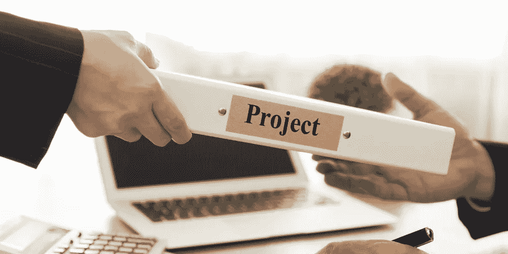

# 为什么每个人都在做副业，你也应该做

> 原文：<https://medium.com/coinmonks/why-everyone-is-doing-side-projects-and-you-should-too-b06fd0941c67?source=collection_archive---------24----------------------->

兼职项目已经成为一种流行的学习和成长方式。它们也有助于建立一个网络，改善身心健康，增加对和你做同样事情的人的责任感，并在工作之外创造你自己的身份。在这篇文章中，我将解释为什么每个人都在做兼职项目，你也应该这样做！

# 辅助项目是保持学习的一种方式

你不只是想赚钱，你也可以学习新的技能和技术，这对你的工作很有用。

如果你一直在关注行业的最新趋势，副业项目会让你有机会将它们应用到自己的业务中，而不必雇佣其他人，从而帮助你保持领先。

这也意味着，如果你对某项技术或技能感兴趣(比如机器学习)，那么在兼职项目中使用它可以让你在做更大的事情时有更多的自由，比如全职工作，甚至创办另一家公司！

# 辅助项目帮助你建立一个网络

兼职项目是你结识新朋友、学习新技能的方式，但也是让你掌握行业动态的绝佳方式。

你可以利用这些知识与你所在领域的其他专业人士建立关系，当他们需要寻找新员工或雇佣新员工时，他们可能会帮助你获得成功。通过与这些人保持联系，无论是通过咖啡约会还是电话会议(我们推荐视频聊天)，你将拥有比以往更多的机会！

# 副业可以增加你的身心健康

许多人做兼职项目是因为他们想学习新技能，建立一个网络，或者只是玩玩。但是副业的好处不止这些。它们还通过让你以新的方式参与和活跃来帮助你保持敏锐——如果这还不足以说服你，这里还有一些理由:

你可以创造一个对自己没有压力的环境，因为别人在做和你一样(或者更好)的事情。随着时间的推移，这将使事情保持新鲜和愉快！

无论是通过写博客还是从头开始建立网站，创造一些东西可以让你的朋友/家庭成员圈子之外的其他人知道你的独特之处——这也可以让他们更多地了解你！这种曝光往往会带来职业发展的机会！

# 在你自己之外创造责任

你不能想做就做。你必须为此腾出时间，这意味着对你自己和你的目标负责。如果你不这样做，你会在你的副业项目开始前就放弃它！

保持责任感的最好方法是制定一个时间表并坚持执行。例如，你可以在每周一晚上或周五早上留出两个小时来做你的兼职项目。

# 副业有助于你脱颖而出

你可以围绕你的副业建立一个品牌。这可以通过在所有与之相关的营销材料中使用您的名字和/或徽标，以及在潜在客户可能会看到它们的社交媒体平台上使用来实现。

你可以利用你的副业专业地推销自己。例如，如果你是一名艺术家或音乐家，想在休息一段时间后重新开始艺术创作，在此期间，他/她从事一份稳定的工作，而不是全职追求创造性的激情(甚至可能有孩子)，那么建立他/她的作品集是关键！

作品集本质上是一个在线画廊，艺术家们在这里互相展示他们的作品；感兴趣的人可以在这里找到更多关于每件作品的创作者的信息，然后决定他们是否也想要其他人制作的类似作品！如果有关于制作每件作品花了多少时间的信息，这也是有帮助的——这可以让访问者知道自己在制作这些作品时付出了什么样的努力，这样当他们考虑以后购买类似的作品时，他们就可以做出明智的决定，看它是否值得。

# 兼职项目有助于你在工作中更有策略

当你从事副业时，你不得不跳出框框思考。你必须想出与你白天做的事情没有必然联系的想法，这意味着当你工作中的下一个大项目到来时，你可能会对应该如何处理它有一个新的看法——甚至是首先需要解决什么样的问题！

*   兼职项目给你一个机会去做你日常工作之外的事情。
*   你可以利用从副业中学到的技能，在日常工作中做出更好的决定。
*   副业可以让你的日常工作更加有趣！

# 大家都在做，你也不妨开始做吧！

在过去的几年里，副业比以往任何时候都更受欢迎。大家都在做，你也不妨开始做吧！

对于如何开始自己的兼职项目，你有这么多不同的选择，没有理由不尝试一下。无论您是在寻找范围和规模上或大或小的东西(并且不在乎成本)，这里都有适合每个人的东西——即使是那些没有钱或时间的人。

# 不要害怕通过开始一个副业来追随你的激情

兼职项目是学习新事物、建立人际关系网、增进身心健康的好方法。另外，开始永远不会太晚！

如果你害怕承担太多或者在某件事情上失败(像我一样)，那就从一个小项目开始。如果事情进展顺利——它们经常如此——你就更有可能在以后接受更大的任务。

# 结论|附带项目

建议:不要害怕通过开始一个兼职项目来追随你的激情。兼职项目是学习新事物、建立人际关系网、增进身心健康的好方法。另外，开始永远不会太晚！如果你害怕承担太多或者在某件事情上失败(像我一样)，那就从一个小项目开始。如果事情进展顺利——事实也的确如此——你就更有可能在以后接受更大的任务。

> 交易新手？试试[加密交易机器人](/coinmonks/crypto-trading-bot-c2ffce8acb2a)或者[复制交易](/coinmonks/top-10-crypto-copy-trading-platforms-for-beginners-d0c37c7d698c)