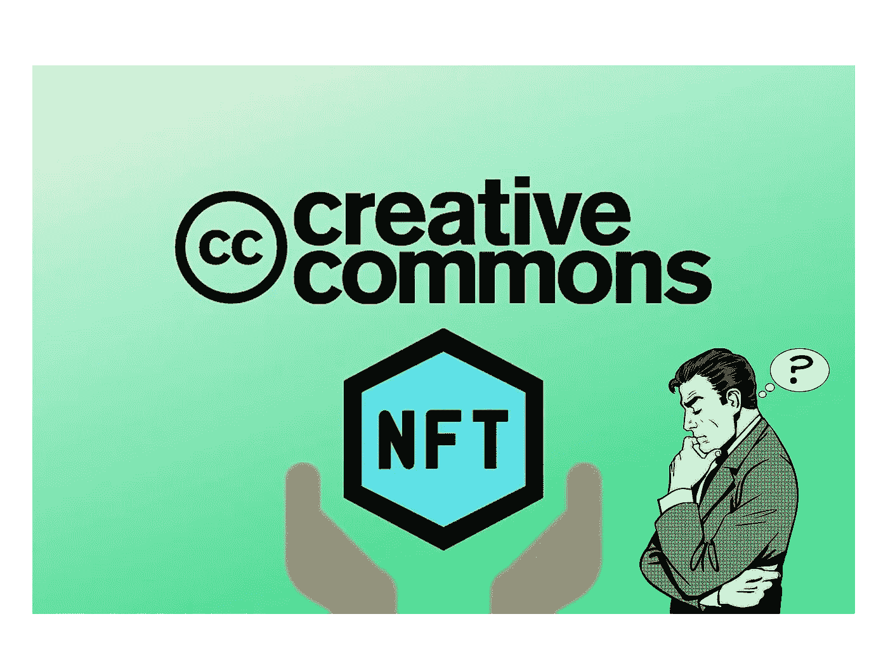

# 为什么大家对 cc0 NFTs 的看法都是错的。

> 原文：<https://medium.com/coinmonks/why-everyone-is-wrong-about-cc0-nfts-1067b93f26d4?source=collection_archive---------27----------------------->

# cc0 是什么？

cc0 代表**“知识共享零”**。通俗地说，基本上是指一件艺术品/内容的创作者没有保留任何知识产权。默认情况下，过了一定时间后会发生这种情况，但如果创作者决定立即放弃他们的知识产权，也会发生这种情况。你可能听说过一些东西是如何处于“公共领域”的，这意味着任何人都可以使用知识产权自由地创建内容。那只是内容是 cc0 的另一种说法。

我们看到越来越多的创作者决定从一开始就将他们 NFT 项目背后的知识产权公开。你可能会问为什么，这对于代币的创建者和所有者来说是不是一件好事。而答案是，像生活中所有好的答案一样， ***【看情况】*** 。

拥有 cc0 有好处也有坏处。在我看来，最大的优势是**如果我拥有 cc0 的 NFT，我就拥有*一切*** 。这并不是说我拥有 IP，相反，*没人拥有 IP* 。不是我，不是这个项目的创始人，不是艺术家，任何人。它不能被我或任何人买卖。剩下来要拥有的就是原始令牌/资产。

….但是价值在哪里呢？IP 不就是价值吗？是也不是。知识产权无疑有很大的价值。迪斯尼卖基于他们角色的玩具和游戏赚了很多钱。如果是 cc0，他们仍然可以这样做，但他们无法阻止其他人也销售使用这些角色的玩具，这可能会伤害他们的底线。迪士尼让他们的内容成为 cc0 真的没有意义，因为人们愿意付钱给他们许可他们的知识产权。

在 web3/NFT 领域，我们正处于品牌建设的初级阶段。cc0 的一个优点是，它给任何想利用内容建立品牌的人创造和商业自由。这本身就是一把双刃剑——它可以被创造者用来创造一些酷的、有价值的东西来增加宇宙的价值；也可能被不良演员拉拢，玷污品牌形象。基本上是免费的。

但是这有点像 web3 的本意，不是吗？全民免费？一个分散的、不可信的网络？我们真的不应该允许这些巨大的中央集权实体拥有如此大的权力，对我们的知识产权拥有如此多的所有权。他们可能会像 web2 巨头买卖我们的数据一样买卖我们的知识产权。

cc0“修复”了这个问题。不再有任何 IP 可供他们买卖。只有*我们的*代币，我们对这些代币拥有*真正的*所有权。

这并不意味着 cc0 没有价值，我们来举个例子:

> 这是已经公开的虚构作品和宇宙的列表:
> 
> ￲King 亚瑟
> ￲shakespeare
> ￲dracula
> ￲the 绿野仙踪
> ￲Moby 迪克
> ￲Peter 潘

这些例子一个有趣的地方是，他们负责的衍生作品很多都是 ***而不是*** 公有领域。

换句话说，仅仅因为亚瑟王*的基础和宇宙是*公共领域，并不意味着像《绿衣骑士》或者《石中剑》这样的改编作品*就是*。

尽管如此，这些改编还是有助于提高原作的整体意义。想象一个亚瑟王神话在区块链上开始的世界，它的组成部分被表示为标记。当然，证明一个人是神剑的创造者或拥有者是有价值的。

这个项目的衍生品不需要 cc0，你不需要承认创作者，你可以制作一个免费的商业艺术，你不需要与 cc0 项目的原创艺术家/公司分享利润。

让我们看看 cc0 项目的所有优点:

**￲Decentralizes 分布及意义:**衍生品被无根据地创造出来。每一个衍生产品都增加了原创产品的关注度和知名度。

**￲Aligns 兴趣:**创作者可以制作自我可持续的衍生品。他们受到激励去创造更多的*(希望是更高质量的)*衍生品。

**￲Simplifies 的事情:**再也不用担心权利，也不用回答什么是好，什么是不好的问题。一切都讲得清清楚楚，浅显易懂。我们可以专注于我们的工作，我们可以对社区所做的事情感到**惊讶** 。

***￲It's 土著。***

成为 cc0 也有自己的缺点，以下是其中一些:

￲No 专有权:无论是实体还是艺术家个人都和其他人一样拥有创作衍生品的权利。

**￲Bad 演员:**IP 可能被吸收或被巨魔、极端政治团体、邪教等玷污。

有些人认为知识产权是护城河，如果放弃了，艺术就没有什么意义了。

然而，这是一个有趣的方法，只有时间才能证明它是否可行。

如果你问我们的个人意见，它将一直是 cc0 夏天。

下一轮牛市将会看到很多 cc0 项目。

请在评论区告诉我们你们的想法。

如果这篇文章让你走了，给我们一个关注:“啊哈..从没这样想过..哼..”

> 交易新手？试试[加密交易机器人](/coinmonks/crypto-trading-bot-c2ffce8acb2a)或者[复制交易](/coinmonks/top-10-crypto-copy-trading-platforms-for-beginners-d0c37c7d698c)