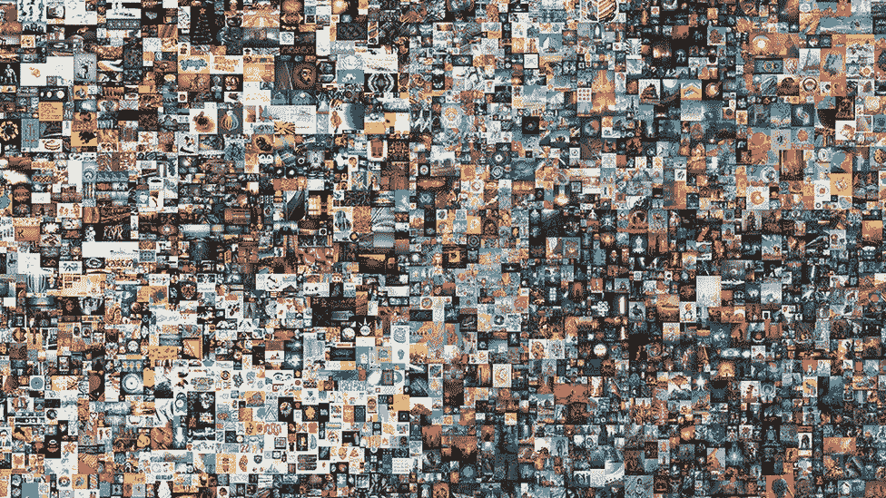

# 为什么翻转 NFT 不值得

> 原文：<https://medium.com/coinmonks/why-flipping-nfts-just-isnt-worth-it-92cee06ac6f0?source=collection_archive---------8----------------------->

随着社区准备推出世界上第一个自主 NFT 收藏家[*El collectooor*](https://www.elcollectooorr.art/)*，我们一直在想:翻转 NFTs 真的是一个快速盈利的好方法吗？你是否应该尽快处理掉这些碎片？*

# 介绍

如果说 NFT 席卷了整个世界，这是一种保守的说法。不可替代的艺术品已经卖出了超过 6000 万美元的价格；大品牌都在设计虚拟配件；名人已经花了几十万把他们的个人资料照片换成了打哈欠的猴子。​​

[名人海湾](https://boardroom.tv/wp-content/uploads/2021/12/CENTER-ALL-SUBJECTS-10-1.png)

去年，[NFTs 的总市值增长了 2650%,达到 220 亿美元](https://nftgo.io/analytics/market-overview)，4 月份达到 370 亿美元的峰值。这种增长背后的一个因素是，买家被高额回报的前景所吸引。“倒手”是指买入并快速卖出 NFT 作品获利。然而，大多数在 NFT 翻转游戏通常无法赚到一美元。深入挖掘 NFT 炒作背后的驱动因素，以及为什么 NFT 翻转看起来是一种很有吸引力的赚钱方式，我们探索了为什么它不值得的 3 个主要原因。这些原因是:

*   我们大多数人在倒卖 NFT 时都会赔钱
*   这比你想象的需要更多的时间和努力
*   如果只关注利润，你就会错过收藏的乐趣

# 翻转 NFT——有什么大惊小怪的？

# 不可替换的令牌

为了理解这种宣传，重要的是要认识到是什么使 NFTs 不同于其他加密资产类别。线索:在名字里。与比特币、以太币或 USDC 币等可替代货币不同，NFT 无法细分。比特币或以太可以被拆分，由无限数量的钱包持有。一个 NFT 只能住在一个。

因此，尽管 ETH 和 BTC 的价格是由大量市场参与者决定的，但 NFT 的价格实际上是由一个买方和一个卖方决定的。这意味着，从理论上讲，抬高 NFT 的价格只需要几个积极的竞标者竞争成为唯一可能的买家。在 Beeple 的“Everydays-First 5000 Days”拍卖期间，33 名活跃的竞标者相互竞争，将 NFT 的价格从 100 美元的起拍价提高到 6930 万美元。可能需要 33 个以上的普通钱包才能将比特币的价格提高 1%，更不用说 6900000%。

[每隔一天:前 5000 天](https://www.bbc.com/news/entertainment-arts-56368868)

# NFT 翻转:合法的收入来源？

非金融交易的不可替代性使得某些受欢迎的代币容易受到估值飙升的影响。这种品质使它们适合翻转。随着上面这样的故事成为主流新闻，NFT 翻转作为一种有前途的盈利方式获得了关注。关于 NFT 的鳍状肢将相对较少的[ETH 在短时间内转化为大量 ETH 的报道](https://twitter.com/CirrusNFT/status/1493281896226177024?ref_src=twsrc%5Etfw%7Ctwcamp%5Etweetembed%7Ctwterm%5E1493281896226177024%7Ctwgr%5E%7Ctwcon%5Es1_&ref_url=https%3A%2F%2Fcryptopotato.com%2Fheres-how-i-turned-2k-into-almost-500k-flipping-nfts-trader-shares%2F)证实了这一点，并提供了一个不可抗拒的关于 NFTs 轻松赚钱的叙述。一些帖子甚至把 NFT 翻转作为被动收入的来源。

新来者涌入市场，承诺快速获利。这增加了需求，不成比例地增加了某些非功能性交易的价格，反过来又吸引了新的注意力——接着是 jpegs 格式的轻松回报的叙事循环。

然而，事实是，倒卖 NFT 并不像想象的那样简单，也不像想象的那样有利可图，对于大多数市场参与者来说，这根本不值得。

# 为什么 NFT 翻转不值得

# 你很可能会赔钱

根据最近的调查( [Dexterlab，](https://dexterlab.com/why-people-buy-nfts-dexterlab-survey/) [Coingecko](https://www.coingecko.com/learn/nft-survey-2022) )，大多数人在交易 NFT 时没有赚到钱。事实上，由于非金融交易及其市场的特殊性，损失大量资金的风险很高。

其中一个特点是它们的不可替代性:非功能性信托的不可替代性意味着它们能够随着集中的需求而大幅增长；出于同样的原因，当需求消失时，它们就会崩溃。

另一个可能导致负回报的非金融交易的特点是市场相对不成熟。许多市场参与者只有不到 10 年的历史，他们是新手，很容易在骗局中损失资金，例如 [wash trading](https://nftnow.com/guides/scams-explained-what-is-an-nft-wash-trade-is-it-a-crime/) 或[rug pull](https://coinmarketcap.com/alexandria/glossary/rug-pull)。即使是最有经验的交易者也能看到他们的 NFTs 崩溃的底价，因为这个项目由于[创始人](https://beincrypto.com/milady-nft-prices-fall-55-founder-embroiled-scandal/)负面的公众关注而内爆。

[拉拽](https://miro.medium.com/max/800/1*KhGTaoMKrQDyOE2lZKD3EA.jpeg)

# NFT 翻转需要大量的努力和时间(以及运气)

尽管许多博主声称翻转 NFT 可以获得[被动收入](https://www.investopedia.com/terms/p/passiveincome.asp#)，但事实是，这一点也不被动。有几个 NFT 脚蹼实际上是成功的，但他们的成功来自于实际投入的时间。知道买哪些作品需要对空间有深入的了解。但是知道买什么并不保证你就能买。为了获得真正的便宜货，你需要不断地监控新的清单，密切跟踪潜在的白名单项目，和/或为项目做贡献，以便尽早进入造币厂。[其中一个策略](https://twitter.com/CirrusNFT/status/1493281896226177024?ref_src=twsrc%5Etfw%7Ctwcamp%5Etweetembed%7Ctwterm%5E1493281896226177024%7Ctwgr%5E%7Ctwcon%5Es1_&ref_url=https%3A%2F%2Fcryptopotato.com%2Fheres-how-i-turned-2k-into-almost-500k-flipping-nfts-trader-shares%2F)包括记住一个收藏的所有特征及其稀有程度，同时持续监控 OpenSea 的新列表。即使有持续的跟踪和对市场的了解，也有很强的运气因素影响翻盘成功的可能性。

# 你怀念收藏的乐趣

NFT 翻转的核心是一种金融实践。推动购买的唯一原因是利润。当然，这是一个合理的理由，但是收集 NFT 的意义远不止于此。

当你去除了经济方面的因素，你就向收集非物质文化遗产的审美和社会乐趣敞开了大门。随着所有关于作品售价的大肆宣传，我们经常忘记实际参与价格背后的艺术。

参与新艺术形式的创造可以带来巨大的乐趣。[艺术街区](https://www.artblocks.io/)就是一个很好的例子。在这个平台上，购买行为是作品产生的原因。NFT 的样子是由特定艺术家创造的算法决定的。铸造艺术品与其说是阻碍了 NFT 的金融交易，不如说是艺术交易。

[艺术街区](https://lh3.googleusercontent.com/5-KeOMqOlfC7D6etYVEcrEiPcRy_QB-KPS3uOeGu7hMsPorzvPNtJOVrQRb1rxjHFcFsyXEQmTdj7bvqlbAQD5foHQxbTEgb5GPaMLg=h200)

这个想法可以更普遍地应用到你在区块链收集的所有东西上。作为一个资助艺术家的收藏家，你正在参与新的文化艺术品的创作。这对于收入来源有限的新兴艺术家尤为重要。通过购买一个新兴艺术家的作品，你不仅认识到他们值得关注，而且你直接支持新作品的生产。

# 包扎

对于那些努力仔细研究市场的少数人来说，NFT 翻转可能是一项有利可图的工作。然而，对我们大多数人来说，这是不值得的。从长远来看，我们可能会损失大量的金钱和时间。这并不是说我们在 NFT 没有任何好处。相反，当我们去除经济动机时，我们可以从 NFT 收藏的美学和文化维度中获得新形式的乐趣。

如果你对收集 NFT 的更好方法感兴趣，可以看看[El collectooor](https://twitter.com/elcollectooorr)，世界上第一个自主 NFT 收集器。[了解更多信息，并在白名单开放期间立即抢占您的位置](https://www.elcollectooorr.art/)！

> *加入 Coinmonks* [*电报频道*](https://t.me/coincodecap) *和* [*Youtube 频道*](https://www.youtube.com/c/coinmonks/videos) *了解加密交易和投资*

# 另外，阅读

*   [有哪些交易信号？](https://coincodecap.com/trading-signal) | [Bitstamp vs 比特币基地](https://coincodecap.com/bitstamp-coinbase) | [买索拉纳](https://coincodecap.com/buy-solana)
*   [加密交易机器人](/coinmonks/crypto-trading-bot-c2ffce8acb2a) | [维护审查](https://coincodecap.com/uphold-review)
*   [如何给 MetaMask 钱包添加 Arbitrum？](https://coincodecap.com/how-to-add-arbitrum-to-metamask-wallet)
*   [KuCoin vs 北海巨妖 vs BitYard](https://coincodecap.com/kucoin-vs-kraken-vs-bityard)
*   [加密交易的最佳 VPNs】](https://coincodecap.com/best-vpns-for-crypto-trading)