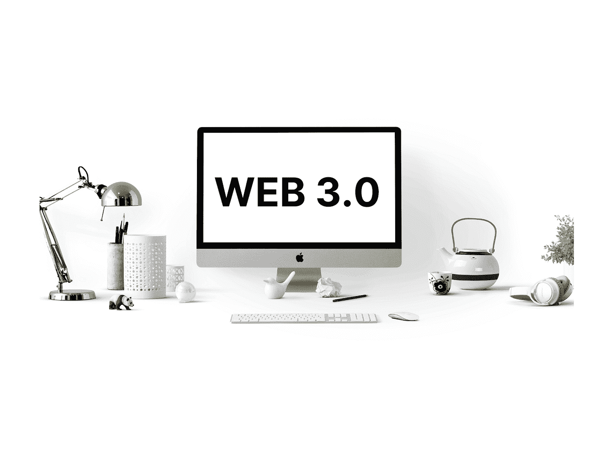
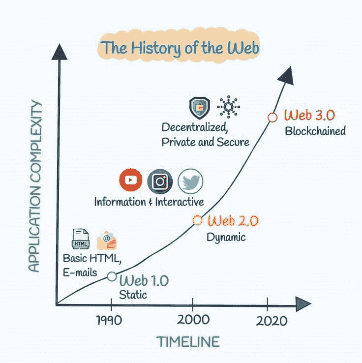

# 为什么关注 Web 3.0 是你在 2022 年能做的最好的事情

> 原文：<https://medium.com/coinmonks/why-focusing-on-web-3-0-is-the-best-thing-you-can-do-in-2022-c56337c32251?source=collection_archive---------35----------------------->

世界已经变了。我们现在生活在一个比以往任何时候都有更多选择的时代，我们能够更好地决定我们想要从生活中得到什么。随着这个新时代的到来，最重要的事情之一就是开发者如何通过构建简单、易用、可靠的应用来帮助人们实现他们的目标。Web 3.0 描述了一种 Web 开发方法，这种方法将数据优先于花哨的功能；用户体验胜过技术魔法；简单胜于复杂；标准高于创新——同时作为一名独立的开发人员忠于自己！

# Web 3.0 是 Web 开发的未来。

web 开发的未来是 Web 3.0，这是一种为 Web 开发的新方法，它将改变你对构建网站和应用程序的看法。这不是另一个流行语或时尚。只要我们继续致力于现有的为互联网创造内容的方法，我们就不能忽视这一点。在查看了大约 **50 万代码**库和**1.6 亿**提交量后，由 [**电资**](/electric-capital/electric-capital-developer-report-2021-f37874efea6d) 发布的报告确定，web 3 上的活跃开发者数量在 2021 年 12 月创下了历史新高**18416**。

# 什么是 Web 3.0？

Web 3.0 是 Web 2.0 的发展，是构建 web 应用程序的框架。它也是一套标准，开发人员可以用来构建自己的应用程序，以及他们在日常工作中可以使用的工具。

Web 3.0 从 2009 年**开始就已经存在，但是直到 2020 年**人们才开始意识到这项新技术对企业和消费者来说是多么强大！****

除了 [**以太坊**](https://ethereum.org/en/) 和 [**比特币**](https://bitcoin.org/en/) 之外，更多的生态系统正在吸引开发者的注意力。以下生态系统拥有至少 **250** 个月活跃开发者:

*   波尔卡多特
*   [宇宙](https://cosmos.network/)
*   [索拉纳](https://solana.com/)
*   [币安智能链](https://bscscan.com/)
*   [靠近](https://near.org/)
*   [雪崩](https://docs.google.com/document/d/1J2IKD-QDQZ8GJGFm5DTrD_99ym4Xao85tQlAw-2WdLU/edit#heading=h.v1yn1r6jd5et)
*   [泰佐斯](https://tezos.com/)
*   [多边形](https://polygon.technology/)
*   [卡尔达诺](https://cardano.org/)

# 简单是 web 3.0 的王道

Web 3.0 就是简单。用户的体验应该是流畅的，没有不必要的步骤或者打断他们下一步要做的事情。[根据一份报告，](https://www.smallbizgenius.net/by-the-numbers/ux-statistics/#gref) **88%** 的网上购物者表示，如果用户体验不佳，他们不会再光顾某个网站。

我们的目标是让他们尽可能地去他们想去的地方，这意味着这些目的所需的技术必须足够简单，即使对于我们最年轻的用户(或者至少是那些不喜欢使用键盘的用户)也足够简单，但对于其他人来说也足够强大！。

除了赏心悦目之外，web 3.0 技术也不需要偏离它们的预期目的——让用户毫不延迟地到达他们想要的地方！

# 为什么 WEB 3.0 对你很重要？

Web 3.0 将继续提高质量、用户体验和安全性的标准。

**质量** : Web 3.0 让用户更容易保护自己的数据免受黑客攻击，从而使每个网站更加安全。这包括使用加密，并通过要求在访问页面内容之前进行身份验证来防止欺诈性第三方的访问。

**用户体验**:随着微支付和小额支付的兴起，用户在特定类别(如服装)寻找符合自己需求的产品或服务时，可以期待更好的搜索结果。这意味着提高了企业和消费者的可用性，他们能够比以往任何时候都更快地找到自己需要的东西！

用户体验比以往任何时候都更加重要。在 Web 3.0 的世界里，用户体验(UX)是最重要的——这并不是因为我们被我们的技术霸主训练成那样思考。

UX 在 2022 年变得如此重要有很多原因:

用户比以往任何时候都更容易迷失在他们的应用程序和网站中；有如此多的工具唾手可得，我们很难在浏览它们时不迷路或被信息过载淹没。好消息是，随着时间的推移，语音识别等改进的工具已经大大减少了这个问题；然而，即使这些进步仍在取得(并可能进一步改进)，当具体涉及到这些工具的协同工作时，仍有改进的空间，这样每个人都可以在几秒钟内获得他们需要的东西，而不是几个小时后完全忘记它们，直到后来又有其他任务需要关注。

# 结论

web 开发的未来就在这里，而且会非常棒。我们在过去十年中看到的技术变化令人兴奋，但也可能势不可挡。如此多的新工具正在发挥作用——从人工智能到加密货币和区块链——即使是经验丰富的开发人员也可能觉得他们需要在构建下一个项目之前投入时间学习一切。但是，如果你从所有这些变化中退一步，把注意力放在最重要的事情上:你的用户，那么很明显，web 3.0 代表着向简单和质量的转变，而不是华而不实的东西。

作为一家希望将 web 3.0 产品集成到其应用程序中的公司，您需要投入精力、时间和专业知识来实现无缝集成。但是，如果有一种简单的方法可以在保持相同质量标准的同时做到这一切，那会怎么样呢？ [**在阿尔平实验室**](https://alpyne.tech/) ，我们提供了用户友好的 API 来帮助您轻松实现 Web 3 受众。忘记合规和 KYC 问题，我们已经涵盖了一切。请随时查看我们的上/下坡道解决方案。

要为你的 web3 产品找到最好的加密 API，你可以阅读我们的帖子

[https://medium . com/coin monks/why-you-need-a-crypto-API-FD 04 ddab 3 c 5b](/coinmonks/why-you-need-a-crypto-api-fd04ddab3c5b)

> 交易新手？尝试[加密交易机器人](/coinmonks/crypto-trading-bot-c2ffce8acb2a)或[复制交易](/coinmonks/top-10-crypto-copy-trading-platforms-for-beginners-d0c37c7d698c)