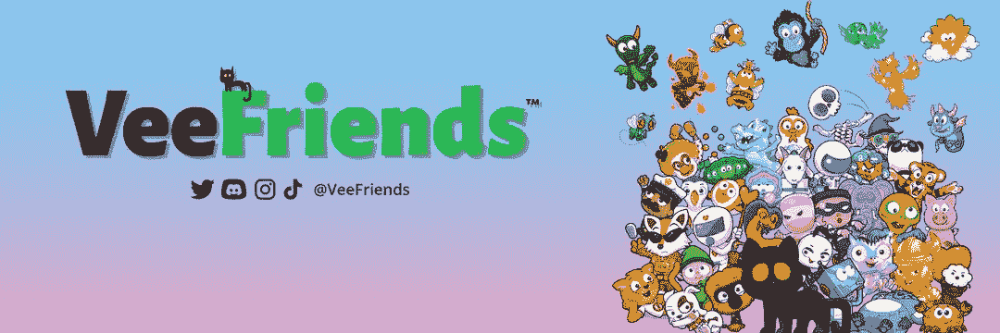

# 为什么 Gary Vee NFTs 成为巨大的创新。

> 原文：<https://medium.com/coinmonks/why-gary-vee-nfts-are-becoming-the-huge-innovation-e940e43083d9?source=collection_archive---------49----------------------->

## Gary Vee NTFs 正在打造一个全球品牌。

[https://aftermarq.com/wp-content/uploads/2018/03/Garyv.jpg](https://aftermarq.com/wp-content/uploads/2018/03/Garyv.jpg)

在过去的 3 年里，比特币、区块链、NFT 和人工智能等新技术改变了我们的商业和生活常识。

在本文中，我将讨论 Gary Vee 的 NFTs 项目。这个项目提高了 NFTs 项目的标准。如果您对 NFTs 感兴趣或者想了解更多关于 web3 行业的知识，那么这篇文章是为您准备的。让我们开始派对吧。

# 快速免责声明

> *这不是财务建议。自己做研究买 NFTs，比特币。*

# 什么是 NFT？

NFT 是不可替换令牌的缩写。NFT 是不可互换的数字令牌，代表唯一的项目。它们可用于表示艺术品、收藏品和游戏项目等项目。

# 谁是加里维？

加里·维纳查克是一位企业家、投资者、作家、演说家和互联网名人。他是现代媒体和通信控股公司 VaynerX 的董事长，也是 Vayner Media 的现任首席执行官，Vayner Media 是一家全方位服务的广告公司，在公司的四个地点为财富 500 强客户提供服务。

# 什么是 Garyvee NFTs？

[Gary Vaynerchuk (@garyvee) / Twitter](https://twitter.com/garyvee)

加里·维有一个名为“维友”的 NFT 项目。这个 NFT 由 233 个角色组成，一旦购买，你将可以访问所有的 Vecon 活动。Vecon 是一个讨论 Web3 和 NFT 的真实事件。Gary Vee 从这个项目中赚了超过 5100 万美元。

# 和其他项目有什么大的区别？

NFT 个人形象项目最严重的问题是没有人知道他们在做什么。他们在为项目做广告时向持有者提供公用设施。然而，公用事业的主要问题是他们可以在 web2 市场上降低价格。

***一些项目通过他们的 PFP 项目筹集数百万美元，然后创建交易工具或软件等 SAAS。***

然而，人们可能每月花费 15 到 20 美元在 web2 上创建这些工具或软件。这没有任何意义。而楼面价就到了底部。

项目创始人有大量投资人，投资人想赚钱。这样一来，项目创始人需要向持有人做一个巨大的公告，楼面价不变。

# 如何解决这个问题？

现在最常见的路线是把项目做成世界性的 IP 项目，比如动漫网甚至火影忍者或者像海贼王。

打造全球品牌的唯一方法就是

*   -漫画书
*   -电视连续剧
*   -电影
*   玩具
*   -默克

所有你能想到的。

# NFT 项目有什么问题？

一些大型项目，如志那都红豆，没有生产，完全依靠 NFT 和投资者的资金。投资者的预期在上升，但问题是“创始人能超越投资者的预期吗？”

志那都红豆艺术是非常高质量的，他们的网站绝对是梦幻般的。我担心楼面价会因为没有结果而跌到谷底。

但是 Gary Vee NFTs 正在创新。

# Vee friends 正在成为一个全球品牌。

Vee Friends 正在与美国最大的玩具公司 ToysRus 和 Macys 合作。

《我的朋友》中的角色出现在现实生活中的每一家商店、每一个货架和每一个剧院。

> 这对双方来说都很明智。

Vee Friends 可以在美国所有的玩具店展示角色，由于互联网的兴起，Toyrus 和 Macy's 可能会缩小规模。

# Vee Friends 玩具的细节是什么？

[https://blog.veefriends.com/veefriends-partners-with-macys-and-toys-r-us-for-official-figure-and-plush-collectibles-launch-34bd4e5dfbd0](https://blog.veefriends.com/veefriends-partners-with-macys-and-toys-r-us-for-official-figure-and-plush-collectibles-launch-34bd4e5dfbd0)

Vee friends 收集了 233 个角色，他们选择了 10 个角色作为他们的玩具。

**商店里的每个玩具都有一个二维码，可以获得一个带原创歌曲的动画心里话。**

**如果你拥有的 NFT 是这 10 个角色之一，你可以免费得到一个玩具。**

创建一个全球品牌的好处是，所有年轻一代都不需要了解非专利技术。有些人对新技术持怀疑态度，但创建一个全球品牌将大大有助于消除这些恐惧。

但是这需要几十年才能使它变得有价值。

例如，口袋妖怪卡片在 20 年前并不流行。但是二十年后，人们有了购买口袋妖怪卡片的欲望。

这就是我们的朋友们的样子。他们打算制作电视系列片、漫画系列片，让它成为更有价值的品牌。

Gary Vee 通过这个项目与消费者建立了真正的联系。

# Vee 友的策略特点是什么？

他们有 5 个特征来组成这个品牌。

*   -与全球品牌合作
*   -积累有价值的成果
*   -制定长期路线图
*   -与投资者建立紧密联系
*   -不仅为 NFT 大师打造产品

这是朋友战略的 5 个特点。和其他热门动漫，动漫品牌很像。

他们只是在 web3 中这样做。

# 总结一下。

漫威、迪士尼、海贼王，所有你能想到的流行品牌都不是一夜之间就能做成的。他们花了几十年时间打造这个品牌。他们总是有耐心，聪明的策略和强大的连接。

关于流行品牌，你最喜欢的故事是什么？你对 NFTs 有什么看法？

感谢阅读，下一篇文章再见。

社会化媒体

 [## @KZ 在这里| Linktree

### 数字创作者

linktr.ee](https://linktr.ee/kzishere) 

> 交易新手？尝试[加密交易机器人](/coinmonks/crypto-trading-bot-c2ffce8acb2a)或[复制交易](/coinmonks/top-10-crypto-copy-trading-platforms-for-beginners-d0c37c7d698c)